```mermaid
flowchart TB
    subgraph upstream["Dependants (1)"]
        P3["<b>📦&nbsp;GenAIDBExplorer.Console.Test.csproj</b><br/><small>net9.0</small>"]
        click P3 "#testsunitgenaidbexplorerconsoletestgenaidbexplorerconsoletestcsproj"
    end
    subgraph current["GenAIDBExplorer.Console.csproj"]
        MAIN["<b>📦&nbsp;GenAIDBExplorer.Console.csproj</b><br/><small>net9.0</small>"]
        click MAIN "#genaidbexplorerconsolegenaidbexplorerconsolecsproj"
    end
    subgraph downstream["Dependencies (1"]
        P2["<b>📦&nbsp;GenAIDBExplorer.Core.csproj</b><br/><small>net9.0</small>"]
        click P2 "#genaidbexplorercoregenaidbexplorercorecsproj"
    end
    P3 --> MAIN
    MAIN --> P2

```

```mermaid
flowchart TB
    subgraph upstream["Dependants (2)"]
        P1["<b>📦&nbsp;GenAIDBExplorer.Console.csproj</b><br/><small>net9.0</small>"]
        P4["<b>📦&nbsp;GenAIDBExplorer.Core.Test.csproj</b><br/><small>net9.0</small>"]
        click P1 "#genaidbexplorerconsolegenaidbexplorerconsolecsproj"
        click P4 "#testsunitgenaidbexplorercoretestgenaidbexplorercoretestcsproj"
    end
    subgraph current["GenAIDBExplorer.Core.csproj"]
        MAIN["<b>📦&nbsp;GenAIDBExplorer.Core.csproj</b><br/><small>net9.0</small>"]
        click MAIN "#genaidbexplorercoregenaidbexplorercorecsproj"
    end
    P1 --> MAIN
    P4 --> MAIN

```

```mermaid
flowchart TB
    subgraph current["GenAIDBExplorer.Console.Test.csproj"]
        MAIN["<b>📦&nbsp;GenAIDBExplorer.Console.Test.csproj</b><br/><small>net9.0</small>"]
        click MAIN "#testsunitgenaidbexplorerconsoletestgenaidbexplorerconsoletestcsproj"
    end
    subgraph downstream["Dependencies (1"]
        P1["<b>📦&nbsp;GenAIDBExplorer.Console.csproj</b><br/><small>net9.0</small>"]
        click P1 "#genaidbexplorerconsolegenaidbexplorerconsolecsproj"
    end
    MAIN --> P1

```

```mermaid
flowchart TB
    subgraph current["GenAIDBExplorer.Core.Test.csproj"]
        MAIN["<b>📦&nbsp;GenAIDBExplorer.Core.Test.csproj</b><br/><small>net9.0</small>"]
        click MAIN "#testsunitgenaidbexplorercoretestgenaidbexplorercoretestcsproj"
    end
    subgraph downstream["Dependencies (1"]
        P2["<b>📦&nbsp;GenAIDBExplorer.Core.csproj</b><br/><small>net9.0</small>"]
        click P2 "#genaidbexplorercoregenaidbexplorercorecsproj"
    end
    MAIN --> P2

```

# Projects and dependencies analysis

This document provides a comprehensive overview of the projects and their dependencies in the context of upgrading to .NETCoreApp,Version=v10.0.

## Table of Contents

- [Executive Summary](#executive-Summary)
  - [Highlevel Metrics](#highlevel-metrics)
  - [Projects Compatibility](#projects-compatibility)
  - [Package Compatibility](#package-compatibility)
  - [API Compatibility](#api-compatibility)
- [Aggregate NuGet packages details](#aggregate-nuget-packages-details)
- [Top API Migration Challenges](#top-api-migration-challenges)
  - [Technologies and Features](#technologies-and-features)
  - [Most Frequent API Issues](#most-frequent-api-issues)
- [Projects Relationship Graph](#projects-relationship-graph)
- [Project Details](#project-details)

  - [GenAIDBExplorer.Console\GenAIDBExplorer.Console.csproj](#genaidbexplorerconsolegenaidbexplorerconsolecsproj)
  - [GenAIDBExplorer.Core\GenAIDBExplorer.Core.csproj](#genaidbexplorercoregenaidbexplorercorecsproj)
  - [Tests\Unit\GenAIDBExplorer.Console.Test\GenAIDBExplorer.Console.Test.csproj](#testsunitgenaidbexplorerconsoletestgenaidbexplorerconsoletestcsproj)
  - [Tests\Unit\GenAIDBExplorer.Core.Test\GenAIDBExplorer.Core.Test.csproj](#testsunitgenaidbexplorercoretestgenaidbexplorercoretestcsproj)

## Executive Summary

### Highlevel Metrics

| Metric | Count | Status |
| :--- | :---: | :--- |
| Total Projects | 4 | All require upgrade |
| Total NuGet Packages | 36 | 9 need upgrade |
| Total Code Files | 224 |  |
| Total Code Files with Incidents | 44 |  |
| Total Lines of Code | 30771 |  |
| Total Number of Issues | 367 |  |
| Estimated LOC to modify | 350+ | at least 1.1% of codebase |

### Projects Compatibility

| Project | Target Framework | Difficulty | Package Issues | API Issues | Est. LOC Impact | Description |
| :--- | :---: | :---: | :---: | :---: | :---: | :--- |
| [GenAIDBExplorer.Console\GenAIDBExplorer.Console.csproj](#genaidbexplorerconsolegenaidbexplorerconsolecsproj) | net9.0 | 🟢 Low | 4 | 189 | 189+ | DotNetCoreApp, Sdk Style = True |
| [GenAIDBExplorer.Core\GenAIDBExplorer.Core.csproj](#genaidbexplorercoregenaidbexplorercorecsproj) | net9.0 | 🟢 Low | 8 | 67 | 67+ | ClassLibrary, Sdk Style = True |
| [Tests\Unit\GenAIDBExplorer.Console.Test\GenAIDBExplorer.Console.Test.csproj](#testsunitgenaidbexplorerconsoletestgenaidbexplorerconsoletestcsproj) | net9.0 | 🟢 Low | 0 | 0 |  | DotNetCoreApp, Sdk Style = True |
| [Tests\Unit\GenAIDBExplorer.Core.Test\GenAIDBExplorer.Core.Test.csproj](#testsunitgenaidbexplorercoretestgenaidbexplorercoretestcsproj) | net9.0 | 🟢 Low | 1 | 94 | 94+ | DotNetCoreApp, Sdk Style = True |

### Package Compatibility

| Status | Count | Percentage |
| :--- | :---: | :---: |
| ✅ Compatible | 27 | 75.0% |
| ⚠️ Incompatible | 0 | 0.0% |
| 🔄 Upgrade Recommended | 9 | 25.0% |
| ***Total NuGet Packages*** | ***36*** | ***100%*** |

### API Compatibility

| Category | Count | Impact |
| :--- | :---: | :--- |
| 🔴 Binary Incompatible | 10 | High - Require code changes |
| 🟡 Source Incompatible | 273 | Medium - Needs re-compilation and potential conflicting API error fixing |
| 🔵 Behavioral change | 67 | Low - Behavioral changes that may require testing at runtime |
| ✅ Compatible | 32766 |  |
| ***Total APIs Analyzed*** | ***33116*** |  |

## Aggregate NuGet packages details

| Package | Current Version | Suggested Version | Projects | Description |
| :--- | :---: | :---: | :--- | :--- |
| Azure.Core | 1.50.0 |  | [GenAIDBExplorer.Core.csproj](#genaidbexplorercoregenaidbexplorercorecsproj) [GenAIDBExplorer.Core.Test.csproj](#testsunitgenaidbexplorercoretestgenaidbexplorercoretestcsproj) | ✅Compatible |
| Azure.Identity | 1.17.1 |  | [GenAIDBExplorer.Core.csproj](#genaidbexplorercoregenaidbexplorercorecsproj) | ✅Compatible |
| Azure.Security.KeyVault.Secrets | 4.8.0 |  | [GenAIDBExplorer.Core.csproj](#genaidbexplorercoregenaidbexplorercorecsproj) | ✅Compatible |
| Azure.Storage.Blobs | 12.26.0 |  | [GenAIDBExplorer.Core.csproj](#genaidbexplorercoregenaidbexplorercorecsproj) [GenAIDBExplorer.Core.Test.csproj](#testsunitgenaidbexplorercoretestgenaidbexplorercoretestcsproj) | ✅Compatible |
| FluentAssertions | 8.8.0 |  | [GenAIDBExplorer.Console.Test.csproj](#testsunitgenaidbexplorerconsoletestgenaidbexplorerconsoletestcsproj) [GenAIDBExplorer.Core.Test.csproj](#testsunitgenaidbexplorercoretestgenaidbexplorercoretestcsproj) | ✅Compatible |
| Microsoft.Azure.Cosmos | 3.56.0 |  | [GenAIDBExplorer.Core.csproj](#genaidbexplorercoregenaidbexplorercorecsproj) | ✅Compatible |
| Microsoft.Data.SqlClient | 6.1.3 |  | [GenAIDBExplorer.Console.csproj](#genaidbexplorerconsolegenaidbexplorerconsolecsproj) [GenAIDBExplorer.Core.csproj](#genaidbexplorercoregenaidbexplorercorecsproj) | ✅Compatible |
| Microsoft.Extensions.Caching.Memory | 10.0.0 | 10.0.1 | [GenAIDBExplorer.Core.csproj](#genaidbexplorercoregenaidbexplorercorecsproj) | NuGet package upgrade is recommended |
| Microsoft.Extensions.Configuration | 10.0.0 | 10.0.1 | [GenAIDBExplorer.Console.csproj](#genaidbexplorerconsolegenaidbexplorerconsolecsproj) [GenAIDBExplorer.Core.csproj](#genaidbexplorercoregenaidbexplorercorecsproj) | NuGet package upgrade is recommended |
| Microsoft.Extensions.Configuration.Binder | 10.0.0 | 10.0.1 | [GenAIDBExplorer.Core.csproj](#genaidbexplorercoregenaidbexplorercorecsproj) | NuGet package upgrade is recommended |
| Microsoft.Extensions.Configuration.FileExtensions | 10.0.0 | 10.0.1 | [GenAIDBExplorer.Core.csproj](#genaidbexplorercoregenaidbexplorercorecsproj) | NuGet package upgrade is recommended |
| Microsoft.Extensions.Configuration.Json | 10.0.0 | 10.0.1 | [GenAIDBExplorer.Core.csproj](#genaidbexplorercoregenaidbexplorercorecsproj) | NuGet package upgrade is recommended |
| Microsoft.Extensions.DependencyInjection | 10.0.0 | 10.0.1 | [GenAIDBExplorer.Console.csproj](#genaidbexplorerconsolegenaidbexplorerconsolecsproj) [GenAIDBExplorer.Core.csproj](#genaidbexplorercoregenaidbexplorercorecsproj) | NuGet package upgrade is recommended |
| Microsoft.Extensions.Hosting | 10.0.0 | 10.0.1 | [GenAIDBExplorer.Console.csproj](#genaidbexplorerconsolegenaidbexplorerconsolecsproj) [GenAIDBExplorer.Core.Test.csproj](#testsunitgenaidbexplorercoretestgenaidbexplorercoretestcsproj) | NuGet package upgrade is recommended |
| Microsoft.Extensions.Logging | 10.0.0 | 10.0.1 | [GenAIDBExplorer.Console.csproj](#genaidbexplorerconsolegenaidbexplorerconsolecsproj) [GenAIDBExplorer.Core.csproj](#genaidbexplorercoregenaidbexplorercorecsproj) | NuGet package upgrade is recommended |
| Microsoft.Extensions.Options.ConfigurationExtensions | 10.0.0 | 10.0.1 | [GenAIDBExplorer.Core.csproj](#genaidbexplorercoregenaidbexplorercorecsproj) | NuGet package upgrade is recommended |
| Microsoft.Extensions.VectorData.Abstractions | 9.7.0 |  | [GenAIDBExplorer.Console.csproj](#genaidbexplorerconsolegenaidbexplorerconsolecsproj) [GenAIDBExplorer.Console.Test.csproj](#testsunitgenaidbexplorerconsoletestgenaidbexplorerconsoletestcsproj) [GenAIDBExplorer.Core.csproj](#genaidbexplorercoregenaidbexplorercorecsproj) [GenAIDBExplorer.Core.Test.csproj](#testsunitgenaidbexplorercoretestgenaidbexplorercoretestcsproj) | ✅Compatible |
| Microsoft.NET.Test.Sdk | 18.0.1 |  | [GenAIDBExplorer.Console.Test.csproj](#testsunitgenaidbexplorerconsoletestgenaidbexplorerconsoletestcsproj) [GenAIDBExplorer.Core.Test.csproj](#testsunitgenaidbexplorercoretestgenaidbexplorercoretestcsproj) | ✅Compatible |
| Microsoft.SemanticKernel | 1.68.0 |  | [GenAIDBExplorer.Core.csproj](#genaidbexplorercoregenaidbexplorercorecsproj) | ✅Compatible |
| Microsoft.SemanticKernel.Abstractions | 1.68.0 |  | [GenAIDBExplorer.Core.csproj](#genaidbexplorercoregenaidbexplorercorecsproj) | ✅Compatible |
| Microsoft.SemanticKernel.Connectors.AzureOpenAI | 1.68.0 |  | [GenAIDBExplorer.Core.csproj](#genaidbexplorercoregenaidbexplorercorecsproj) | ✅Compatible |
| Microsoft.SemanticKernel.Connectors.InMemory | 1.61.0-preview |  | [GenAIDBExplorer.Core.csproj](#genaidbexplorercoregenaidbexplorercorecsproj) [GenAIDBExplorer.Core.Test.csproj](#testsunitgenaidbexplorercoretestgenaidbexplorercoretestcsproj) | ✅Compatible |
| Microsoft.SemanticKernel.Connectors.OpenAI | 1.68.0 |  | [GenAIDBExplorer.Core.csproj](#genaidbexplorercoregenaidbexplorercorecsproj) | ✅Compatible |
| Microsoft.SemanticKernel.Core | 1.68.0 |  | [GenAIDBExplorer.Core.csproj](#genaidbexplorercoregenaidbexplorercorecsproj) | ✅Compatible |
| Microsoft.SemanticKernel.PromptTemplates.Handlebars | 1.68.0 |  | [GenAIDBExplorer.Core.csproj](#genaidbexplorercoregenaidbexplorercorecsproj) | ✅Compatible |
| Microsoft.SemanticKernel.PromptTemplates.Liquid | 1.68.0 |  | [GenAIDBExplorer.Core.csproj](#genaidbexplorercoregenaidbexplorercorecsproj) | ✅Compatible |
| Microsoft.SemanticKernel.Prompty | 1.55.0-beta |  | [GenAIDBExplorer.Core.csproj](#genaidbexplorercoregenaidbexplorercorecsproj) | ✅Compatible |
| Microsoft.SemanticKernel.Yaml | 1.68.0 |  | [GenAIDBExplorer.Core.csproj](#genaidbexplorercoregenaidbexplorercorecsproj) | ✅Compatible |
| Moq | 4.20.72 |  | [GenAIDBExplorer.Console.Test.csproj](#testsunitgenaidbexplorerconsoletestgenaidbexplorerconsoletestcsproj) [GenAIDBExplorer.Core.Test.csproj](#testsunitgenaidbexplorercoretestgenaidbexplorercoretestcsproj) | ✅Compatible |
| MSTest.TestAdapter | 4.0.2 |  | [GenAIDBExplorer.Console.Test.csproj](#testsunitgenaidbexplorerconsoletestgenaidbexplorerconsoletestcsproj) [GenAIDBExplorer.Core.Test.csproj](#testsunitgenaidbexplorercoretestgenaidbexplorercoretestcsproj) | ✅Compatible |
| MSTest.TestFramework | 4.0.2 |  | [GenAIDBExplorer.Console.Test.csproj](#testsunitgenaidbexplorerconsoletestgenaidbexplorerconsoletestcsproj) [GenAIDBExplorer.Core.Test.csproj](#testsunitgenaidbexplorercoretestgenaidbexplorercoretestcsproj) | ✅Compatible |
| Newtonsoft.Json | 13.0.4 |  | [GenAIDBExplorer.Core.csproj](#genaidbexplorercoregenaidbexplorercorecsproj) | ✅Compatible |
| NSubstitute | 5.3.0 |  | [GenAIDBExplorer.Core.Test.csproj](#testsunitgenaidbexplorercoretestgenaidbexplorercoretestcsproj) | ✅Compatible |
| System.CommandLine | 2.0.0 |  | [GenAIDBExplorer.Console.csproj](#genaidbexplorerconsolegenaidbexplorerconsolecsproj) | ✅Compatible |
| System.Linq.Async | 7.0.0 |  | [GenAIDBExplorer.Core.csproj](#genaidbexplorercoregenaidbexplorercorecsproj) | ✅Compatible |
| YamlDotNet | 16.3.0 |  | [GenAIDBExplorer.Core.csproj](#genaidbexplorercoregenaidbexplorercorecsproj) | ✅Compatible |

## Top API Migration Challenges

### Technologies and Features

| Technology | Issues | Percentage | Migration Path |
| :--- | :---: | :---: | :--- |

### Most Frequent API Issues

| API | Count | Percentage | Category |
| :--- | :---: | :---: | :--- |
| P:System.CommandLine.Command.Options | 65 | 18.6% | Source Incompatible |
| T:System.CommandLine.Command | 37 | 10.6% | Source Incompatible |
| P:System.CommandLine.Symbol.Description | 36 | 10.3% | Source Incompatible |
| T:System.Text.Json.JsonDocument | 20 | 5.7% | Behavioral Change |
| T:System.Uri | 20 | 5.7% | Behavioral Change |
| M:System.CommandLine.Command.#ctor(System.String,System.String) | 19 | 5.4% | Source Incompatible |
| P:System.CommandLine.Command.Subcommands | 19 | 5.4% | Source Incompatible |
| T:System.BinaryData | 19 | 5.4% | Source Incompatible |
| M:System.TimeSpan.FromMilliseconds(System.Int64,System.Int64) | 19 | 5.4% | Source Incompatible |
| M:System.TimeSpan.FromMinutes(System.Int64) | 15 | 4.3% | Source Incompatible |
| M:System.TimeSpan.FromHours(System.Int32) | 13 | 3.7% | Source Incompatible |
| M:System.Uri.#ctor(System.String) | 13 | 3.7% | Behavioral Change |
| M:System.TimeSpan.FromSeconds(System.Int64) | 11 | 3.1% | Source Incompatible |
| M:System.Environment.SetEnvironmentVariable(System.String,System.String) | 11 | 3.1% | Behavioral Change |
| M:Microsoft.Extensions.DependencyInjection.OptionsConfigurationServiceCollectionExtensions.Configure''1(Microsoft.Extensions.DependencyInjection.IServiceCollection,Microsoft.Extensions.Configuration.IConfiguration) | 6 | 1.7% | Binary Incompatible |
| M:System.BinaryData.FromString(System.String) | 5 | 1.4% | Source Incompatible |
| M:System.BinaryData.ToString | 4 | 1.1% | Source Incompatible |
| M:System.IO.Path.Combine(System.ReadOnlySpan{System.String}) | 2 | 0.6% | Source Incompatible |
| T:System.Linq.AsyncEnumerable | 2 | 0.6% | Binary Incompatible |
| M:System.TimeSpan.FromMilliseconds(System.Double) | 2 | 0.6% | Source Incompatible |
| M:Microsoft.Extensions.Configuration.ConfigurationBinder.Get''1(Microsoft.Extensions.Configuration.IConfiguration) | 1 | 0.3% | Binary Incompatible |
| M:Microsoft.Extensions.Logging.ConsoleLoggerExtensions.AddSimpleConsole(Microsoft.Extensions.Logging.ILoggingBuilder,System.Action{Microsoft.Extensions.Logging.Console.SimpleConsoleFormatterOptions}) | 1 | 0.3% | Behavioral Change |
| T:System.CommandLine.RootCommand | 1 | 0.3% | Source Incompatible |
| M:System.CommandLine.RootCommand.#ctor(System.String) | 1 | 0.3% | Source Incompatible |
| M:System.String.Join(System.String,System.ReadOnlySpan{System.String}) | 1 | 0.3% | Source Incompatible |
| M:System.BinaryData.ToArray | 1 | 0.3% | Source Incompatible |
| M:System.Uri.TryCreate(System.String,System.UriKind,System.Uri@) | 1 | 0.3% | Behavioral Change |
| M:Microsoft.Extensions.Configuration.ConfigurationBinder.GetValue''1(Microsoft.Extensions.Configuration.IConfiguration,System.String) | 1 | 0.3% | Binary Incompatible |
| T:System.Numerics.Tensors.TensorPrimitives | 1 | 0.3% | Source Incompatible |
| M:System.Numerics.Tensors.TensorPrimitives.CosineSimilarity(System.ReadOnlySpan{System.Single},System.ReadOnlySpan{System.Single}) | 1 | 0.3% | Source Incompatible |
| P:System.Uri.AbsolutePath | 1 | 0.3% | Behavioral Change |
| M:System.Threading.Tasks.Task.WaitAll(System.ReadOnlySpan{System.Threading.Tasks.Task}) | 1 | 0.3% | Source Incompatible |

## Projects Relationship Graph

Legend:
📦 SDK-style project
⚙️ Classic project

```mermaid
flowchart LR
    P1["<b>📦&nbsp;GenAIDBExplorer.Console.csproj</b><br/><small>net9.0</small>"]
    P2["<b>📦&nbsp;GenAIDBExplorer.Core.csproj</b><br/><small>net9.0</small>"]
    P3["<b>📦&nbsp;GenAIDBExplorer.Console.Test.csproj</b><br/><small>net9.0</small>"]
    P4["<b>📦&nbsp;GenAIDBExplorer.Core.Test.csproj</b><br/><small>net9.0</small>"]
    P1 --> P2
    P3 --> P1
    P4 --> P2
    click P1 "#genaidbexplorerconsolegenaidbexplorerconsolecsproj"
    click P2 "#genaidbexplorercoregenaidbexplorercorecsproj"
    click P3 "#testsunitgenaidbexplorerconsoletestgenaidbexplorerconsoletestcsproj"
    click P4 "#testsunitgenaidbexplorercoretestgenaidbexplorercoretestcsproj"

```

## Project Details

### GenAIDBExplorer.Console\GenAIDBExplorer.Console.csproj

#### Project Info

- **Current Target Framework:** net9.0
- **Proposed Target Framework:** net10.0
- **SDK-style**: True
- **Project Kind:** DotNetCoreApp
- **Dependencies**: 1
- **Dependants**: 1
- **Number of Files**: 30
- **Number of Files with Incidents**: 12
- **Lines of Code**: 2648
- **Estimated LOC to modify**: 189+ (at least 7.1% of the project)

#### Dependency Graph

Legend:
📦 SDK-style project
⚙️ Classic project

### API Compatibility

| Category | Count | Impact |
| :--- | :---: | :--- |
| 🔴 Binary Incompatible | 7 | High - Require code changes |
| 🟡 Source Incompatible | 179 | Medium - Needs re-compilation and potential conflicting API error fixing |
| 🔵 Behavioral change | 3 | Low - Behavioral changes that may require testing at runtime |
| ✅ Compatible | 2234 |  |
| ***Total APIs Analyzed*** | ***2423*** |  |

### GenAIDBExplorer.Core\GenAIDBExplorer.Core.csproj

#### Project Info

- **Current Target Framework:** net9.0
- **Proposed Target Framework:** net10.0
- **SDK-style**: True
- **Project Kind:** ClassLibrary
- **Dependencies**: 0
- **Dependants**: 2
- **Number of Files**: 150
- **Number of Files with Incidents**: 16
- **Lines of Code**: 16531
- **Estimated LOC to modify**: 67+ (at least 0.4% of the project)

#### Dependency Graph

Legend:
📦 SDK-style project
⚙️ Classic project

### API Compatibility

| Category | Count | Impact |
| :--- | :---: | :--- |
| 🔴 Binary Incompatible | 2 | High - Require code changes |
| 🟡 Source Incompatible | 36 | Medium - Needs re-compilation and potential conflicting API error fixing |
| 🔵 Behavioral change | 29 | Low - Behavioral changes that may require testing at runtime |
| ✅ Compatible | 14344 |  |
| ***Total APIs Analyzed*** | ***14411*** |  |

### Tests\Unit\GenAIDBExplorer.Console.Test\GenAIDBExplorer.Console.Test.csproj

#### Project Info

- **Current Target Framework:** net9.0
- **Proposed Target Framework:** net10.0
- **SDK-style**: True
- **Project Kind:** DotNetCoreApp
- **Dependencies**: 1
- **Dependants**: 0
- **Number of Files**: 6
- **Number of Files with Incidents**: 1
- **Lines of Code**: 507
- **Estimated LOC to modify**: 0+ (at least 0.0% of the project)

#### Dependency Graph

Legend:
📦 SDK-style project
⚙️ Classic project

### API Compatibility

| Category | Count | Impact |
| :--- | :---: | :--- |
| 🔴 Binary Incompatible | 0 | High - Require code changes |
| 🟡 Source Incompatible | 0 | Medium - Needs re-compilation and potential conflicting API error fixing |
| 🔵 Behavioral change | 0 | Low - Behavioral changes that may require testing at runtime |
| ✅ Compatible | 823 |  |
| ***Total APIs Analyzed*** | ***823*** |  |

### Tests\Unit\GenAIDBExplorer.Core.Test\GenAIDBExplorer.Core.Test.csproj

#### Project Info

- **Current Target Framework:** net9.0
- **Proposed Target Framework:** net10.0
- **SDK-style**: True
- **Project Kind:** DotNetCoreApp
- **Dependencies**: 1
- **Dependants**: 0
- **Number of Files**: 47
- **Number of Files with Incidents**: 15
- **Lines of Code**: 11085
- **Estimated LOC to modify**: 94+ (at least 0.8% of the project)

#### Dependency Graph

Legend:
📦 SDK-style project
⚙️ Classic project

### API Compatibility

| Category | Count | Impact |
| :--- | :---: | :--- |
| 🔴 Binary Incompatible | 1 | High - Require code changes |
| 🟡 Source Incompatible | 58 | Medium - Needs re-compilation and potential conflicting API error fixing |
| 🔵 Behavioral change | 35 | Low - Behavioral changes that may require testing at runtime |
| ✅ Compatible | 15365 |  |
| ***Total APIs Analyzed*** | ***15459*** |  |

