# Semantic Model Storage

## Overview

The GenAI Database Explorer supports multiple storage strategies for semantic models through a flexible persistence layer. This document provides an overview of the available storage options and their capabilities.

## Storage Architecture

The application uses a strategy pattern to support different persistence backends without changing the core application logic. All storage strategies implement the `ISemanticModelPersistenceStrategy` interface, ensuring consistent behavior across different storage types. The architecture includes advanced features for memory optimization, performance caching, and change tracking.


### Supported Storage Strategies

1. **Local Disk Storage** - File system-based storage for development and single-user scenarios
2. **Azure Blob Storage** - Cloud storage with hierarchical organization and concurrent operations
3. **Azure Cosmos DB** - NoSQL database storage with global distribution and consistency options

## Storage Strategy Comparison

| Feature | Local Disk | Azure Blob Storage | Azure Cosmos DB |
|---------|------------|-------------------|-----------------|
| **Scalability** | Single machine | High scalability | Global scale |
| **Concurrency** | File locking | High concurrency | Optimistic concurrency |
| **Consistency** | Strong | Eventual | Configurable |
| **Authentication** | File permissions | Azure RBAC | Azure RBAC |
| **Cost** | Storage only | Pay per transaction | Pay per RU + storage |
| **Backup** | Manual | Built-in versioning | Point-in-time restore |
| **Geographic Distribution** | Single location | Multi-region | Global distribution |

## Advanced Features

The semantic model storage system includes several advanced features for enterprise-scale applications:

### Memory Optimization with Lazy Loading

Lazy loading enables deferred loading of entity collections to reduce memory usage for large semantic models:

- **Tables Collection**: Most commonly accessed entities, loaded on-demand
- **Views Collection**: Deferred loading for view definitions and dependencies  
- **Stored Procedures Collection**: On-demand loading of procedure definitions
- **Thread-Safe Operations**: Concurrent access protection with semaphore-based locking
- **Backward Compatibility**: Opt-in feature that doesn't affect existing eager loading

```csharp
// Enable lazy loading for memory optimization
var model = await repository.LoadModelAsync(modelPath, enableLazyLoading: true);

// Entities are loaded only when accessed
var tables = await model.GetTablesAsync();     // Loads tables on first access
var views = await model.GetViewsAsync();       // Loads views on first access
var procedures = await model.GetStoredProceduresAsync(); // Loads procedures on first access
```

### Change Tracking and Selective Persistence

Change tracking monitors entity modifications and enables selective persistence for performance optimization:

- **Entity-Level Tracking**: Automatic dirty tracking when entities are modified
- **Selective Persistence**: Save only changed entities via `SaveChangesAsync()`
- **Performance Optimization**: Significant performance gains for large models with few changes
- **Thread-Safe Operations**: Concurrent modification protection
- **Event Notifications**: Entity state change events for monitoring

```csharp
// Enable change tracking
var model = await repository.LoadModelAsync(modelPath, enableChangeTracking: true);

// Modify entities - changes are automatically tracked
model.AddTable(new SemanticModelTable("NewTable", "dbo", "Description"));
model.RemoveView(existingView);

// Save only the changes for optimal performance
await repository.SaveChangesAsync(model, modelPath);

// Check if there are unsaved changes
if (model.HasUnsavedChanges)
{
    await repository.SaveChangesAsync(model, modelPath);
}
```

### Performance Caching

Memory-based caching provides significant performance improvements for frequently accessed semantic models:

- **Memory-Based Cache**: Fast in-memory storage using `Microsoft.Extensions.Caching.Memory`
- **Cache Statistics**: Hit/miss ratios, cache size, and memory usage tracking
- **Automatic Expiration**: Configurable TTL with background cleanup
- **Cache Key Generation**: SHA256-based consistent key generation
- **Graceful Degradation**: Cache failures don't break persistence operations

```csharp
// Enable caching for performance optimization
var model = await repository.LoadModelAsync(modelPath, enableCaching: true);

// Subsequent loads use cached data for better performance
var cachedModel = await repository.LoadModelAsync(modelPath, enableCaching: true);

// Get cache performance statistics
var stats = await cache.GetStatisticsAsync();
Console.WriteLine($"Hit Rate: {stats.HitRate:P2}, Cache Size: {stats.CacheSize}");
```

### Feature Combinations

Advanced features can be combined for maximum benefit:

```csharp
// Use all features together for optimal performance and memory usage
var model = await repository.LoadModelAsync(
    modelPath, 
    enableLazyLoading: true,     // Memory optimization
    enableChangeTracking: true,  // Selective persistence
    enableCaching: true,         // Performance optimization
    strategyName: "AzureBlob"    // Cloud storage
);

// Modify data with change tracking
model.AddTable(newTable);

// Save only changes with caching benefits
await repository.SaveChangesAsync(model, modelPath);
```

### Security and Validation

Comprehensive security features protect against common vulnerabilities:

- **Path Validation**: Prevention of directory traversal attacks
- **Entity Name Sanitization**: Safe handling of entity names for file systems
- **Input Validation**: Comprehensive validation for all CRUD operations
- **Thread Safety**: Concurrent operation protection with semaphores
- **Authentication Integration**: Azure identity services for cloud storage

```csharp
// Security features are automatically applied
var model = await repository.LoadModelAsync(modelPath); // Path validation applied
await repository.SaveModelAsync(model, modelPath);      // Entity sanitization applied
```

## Data Organization

### Semantic Model Structure

Each semantic model consists of:

- **Main Model**: Core metadata including name, source, and description
- **Tables**: Database table definitions with columns and relationships
- **Views**: Database view definitions and dependencies
- **Stored Procedures**: Procedure definitions with parameters and logic

```mermaid
graph TD
    A[Semantic Model] --> B[Main Model]
    A --> C[Tables Collection]
    A --> D[Views Collection]
    A --> E[Stored Procedures Collection]
    
    B --> F[Name<br/>Source<br/>Description<br/>Created Date]
    C --> G[Table 1<br/>• Schema<br/>• Columns<br/>• Relationships]
    C --> H[Table 2<br/>• Schema<br/>• Columns<br/>• Relationships]
    C --> I[...]
    D --> J[View 1<br/>• Schema<br/>• Definition<br/>• Dependencies]
    D --> K[View 2<br/>• Schema<br/>• Definition<br/>• Dependencies]
    E --> L[Procedure 1<br/>• Schema<br/>• Parameters<br/>• Logic]
    E --> M[Procedure 2<br/>• Schema<br/>• Parameters<br/>• Logic]
    
    style A fill:#1976d2,color:#fff
    style B fill:#4caf50,color:#fff
    style C fill:#ff9800,color:#fff
    style D fill:#9c27b0,color:#fff
    style E fill:#f44336,color:#fff
    style F fill:#c8e6c9
    style G fill:#ffe0b2
    style H fill:#ffe0b2
    style J fill:#e1bee7
    style K fill:#e1bee7
    style L fill:#ffcdd2
    style M fill:#ffcdd2
```



### Storage Patterns

#### Local Disk Storage


#### Azure Blob Storage


#### Azure Cosmos DB

```mermaid
graph TD
    A["Database: SemanticModels"] --> B["models Container<br/>(partition key: /modelName)"]
    A --> C["entities Container<br/>(partition key: /modelName)"]
    B --> D["Document: {model-name}<br/>• id: {model-name}<br/>• modelName: {model-name}<br/>• name, source, description<br/>• createdAt: timestamp<br/>• counts: tables, views, procedures<br/>• references: arrays"]
    C --> E["Documents: {model-name}_{entity-type}_{entity-name}<br/>• id: {model-name}_{entity-type}_{entity-name}<br/>• modelName: {model-name}<br/>• entityType: table|view|storedprocedure<br/>• entityName: {entity-name}<br/>• data: {full entity object}<br/>• createdAt: timestamp"]
    
    style A fill:#800080,color:#fff
    style B fill:#0078d4,color:#fff
    style C fill:#0078d4,color:#fff
    style D fill:#e8f5e8
    style E fill:#fff9c4
```



## Security and Authentication

### Authentication Methods

- **Local Disk**: Operating system file permissions
- **Azure Services**: DefaultAzureCredential supporting:
  - Managed Identity (recommended for production)
  - Azure CLI credentials (local development)
  - Visual Studio credentials (local development)
  - Service Principal (automation scenarios)

### Required Permissions

- **Azure Blob Storage**: `Storage Blob Data Contributor` role
- **Azure Cosmos DB**: `Cosmos DB Built-in Data Contributor` role

### Security Features

- Path validation and sanitization for all storage operations
- Entity name sanitization to prevent injection attacks
- Secure credential management through Azure identity services
- Role-based access control (RBAC) for cloud resources

## Performance Characteristics

### Concurrent Operations

All strategies support concurrent operations with configurable limits:

- **Default concurrency**: 10 simultaneous operations
- **Configurable limits**: Adjustable based on requirements and quotas
- **Resource management**: Automatic throttling and retry policies
- **Thread-safe operations**: Semaphore-based concurrency protection
- **Path-specific locking**: Prevents corruption during concurrent access to same model

### Memory Optimization Features

Advanced memory management capabilities:

- **Lazy Loading**: Deferred entity loading reduces initial memory footprint
- **Selective Loading**: Load only required entity types (tables, views, or procedures)
- **Memory Estimation**: Cache size tracking with configurable limits
- **Resource Disposal**: Proper cleanup of lazy loading proxies and change trackers

### Performance Optimization Features

- **Azure Blob Storage**: Parallel uploads/downloads, index blob for fast listing
- **Azure Cosmos DB**: Optimal partition key design, session consistency
- **Local Disk**: Minimal overhead for single-user scenarios, atomic file operations
- **Caching Layer**: Memory-based caching with statistics tracking and automatic expiration
- **Change Tracking**: Selective persistence saves only modified entities

### Benchmarks and Metrics

Performance characteristics for different scenarios:

| Operation | Local Disk | Azure Blob | Cosmos DB | With Caching |
|-----------|------------|------------|-----------|--------------|
| **Load Model (cold)** | ~100ms | ~500ms | ~300ms | ~500ms (first time) |
| **Load Model (warm)** | ~100ms | ~500ms | ~300ms | ~50ms (cached) |
| **Save Full Model** | ~200ms | ~1000ms | ~800ms | ~1000ms + cache |
| **Save Changes Only** | ~50ms | ~300ms | ~200ms | ~300ms + cache |
| **Memory Usage** | Minimal | Minimal | Minimal | +Cache overhead |

*Note: Times are approximate and depend on model size, network conditions, and hardware specifications.*

## Configuration

### Strategy Selection

Storage strategy is configured through dependency injection and can be changed without code modifications:

```json
{
  "PersistenceStrategy": "AzureBlobStorage",
  "AzureBlobStorage": {
    "AccountEndpoint": "https://account.blob.core.windows.net/",
    "ContainerName": "semantic-models"
  },
  "SemanticModelCache": {
    "Enabled": true,
    "MaxCacheSize": 100,
    "DefaultExpiration": "00:30:00",
    "MemoryLimitMB": 512,
    "CompactionInterval": "00:05:00",
    "HitRateThreshold": 0.7,
    "EnableStatistics": true
  }
}
```

### Repository Configuration

The repository can be configured with various advanced features through dependency injection:

```csharp
// Configure services in Program.cs or Startup.cs
services.Configure<CacheOptions>(configuration.GetSection("SemanticModelCache"));
services.AddSingleton<IMemoryCache, MemoryCache>();
services.AddSingleton<ISemanticModelCache, MemorySemanticModelCache>();
services.AddScoped<ISemanticModelRepository, SemanticModelRepository>();

// Repository usage with feature combinations
var repository = serviceProvider.GetRequiredService<ISemanticModelRepository>();

// Load with specific features enabled
var model = await repository.LoadModelAsync(
    modelPath,
    enableLazyLoading: true,
    enableChangeTracking: true, 
    enableCaching: true,
    strategyName: "AzureBlob"
);
```

### Configuration Options

#### Azure Blob Storage Configuration

- Account endpoint and container configuration
- Blob prefix for organization
- Operation timeouts and concurrency limits
- Optional customer-managed encryption keys

#### Azure Cosmos DB Configuration

- Account endpoint and database configuration
- Container names and partition key paths
- Consistency level selection
- Throughput and retry policy settings

#### Cache Configuration Options

- **MaxCacheSize**: Maximum number of cached models (default: 100)
- **DefaultExpiration**: Cache item TTL (default: 30 minutes)
- **MemoryLimitMB**: Memory usage limit (default: 512MB)
- **CompactionInterval**: Cleanup frequency (default: 5 minutes)
- **HitRateThreshold**: Performance warning threshold (default: 70%)
- **EnableStatistics**: Performance metrics collection (default: true)

## Repository Interface

The `ISemanticModelRepository` provides a comprehensive interface for semantic model operations with advanced feature support:

### Core Operations

```csharp
public interface ISemanticModelRepository
{
    // Basic persistence operations
    Task SaveModelAsync(SemanticModel model, DirectoryInfo modelPath, string? strategyName = null);
    Task<SemanticModel> LoadModelAsync(DirectoryInfo modelPath, string? strategyName = null);
    
    // Advanced loading with feature combinations
    Task<SemanticModel> LoadModelAsync(DirectoryInfo modelPath, bool enableLazyLoading, string? strategyName = null);
    Task<SemanticModel> LoadModelAsync(DirectoryInfo modelPath, bool enableLazyLoading, bool enableChangeTracking, string? strategyName = null);
    Task<SemanticModel> LoadModelAsync(DirectoryInfo modelPath, bool enableLazyLoading, bool enableChangeTracking, bool enableCaching, string? strategyName = null);
    
    // Selective persistence for change tracking
    Task SaveChangesAsync(SemanticModel model, DirectoryInfo modelPath, string? strategyName = null);
}
```

### Method Usage Examples

```csharp
// Basic operations
var model = await repository.LoadModelAsync(modelPath);
await repository.SaveModelAsync(model, modelPath);

// Memory optimization with lazy loading
var lazyModel = await repository.LoadModelAsync(modelPath, enableLazyLoading: true);

// Performance optimization with change tracking
var trackedModel = await repository.LoadModelAsync(modelPath, true, true);
trackedModel.AddTable(newTable);
await repository.SaveChangesAsync(trackedModel, modelPath); // Saves only changes

// Full feature utilization
var optimizedModel = await repository.LoadModelAsync(
    modelPath, 
    enableLazyLoading: true,
    enableChangeTracking: true, 
    enableCaching: true,
    strategyName: "AzureBlob"
);
```

## Error Handling and Resilience

### Exception Management

All strategies provide consistent error handling:

- **Not Found**: When semantic models don't exist
- **Access Denied**: For authentication and authorization failures
- **Rate Limiting**: For cloud service throttling scenarios
- **Network Issues**: For connectivity problems

### Retry Policies

Cloud storage strategies include built-in retry mechanisms:

- **Exponential backoff** for transient failures
- **Configurable retry attempts** for rate limiting
- **Circuit breaker patterns** for sustained failures

## Monitoring and Observability

### Logging

Structured logging is provided for all operations:

- Operation start/completion with timing
- Success and failure tracking
- Performance metrics collection
- Error details with context

### Metrics

Key performance indicators are tracked:

- Operation latency and throughput
- Success/failure rates
- Concurrency utilization
- Storage costs and usage

## Migration and Compatibility

### Strategy Migration

Models can be migrated between storage strategies:

- Export from source strategy
- Import to target strategy
- Validation of data integrity
- Zero-downtime migration support

### Backward Compatibility

All strategies maintain interface compatibility:

- Consistent API across storage types
- No breaking changes to existing code
- Smooth migration paths between versions

## Best Practices

### Development

- Use local disk storage for development and testing
- Configure appropriate timeout values for network operations
- Implement proper error handling for all storage operations
- Enable lazy loading for large models to reduce memory usage
- Use change tracking during development to optimize save operations

### Production

- Use managed identity authentication for cloud services
- Configure appropriate concurrency limits based on workload
- Monitor storage costs and performance metrics
- Implement backup and disaster recovery procedures
- Enable caching for frequently accessed models
- Use combination of lazy loading and change tracking for optimal performance

### Memory Management

- **For Large Models**: Always enable lazy loading to reduce memory footprint
- **For Frequent Updates**: Enable change tracking to minimize save operations
- **For Read-Heavy Workloads**: Enable caching with appropriate TTL settings
- **For High-Concurrency**: Configure appropriate semaphore limits

### Performance Optimization

- **Development Environment**: Use local disk with lazy loading
- **Testing Environment**: Use Azure Blob with caching enabled
- **Production Environment**: Use cloud storage with full feature set
- **Analytics Workloads**: Enable all features for maximum optimization

```csharp
// Recommended production configuration
var model = await repository.LoadModelAsync(
    modelPath,
    enableLazyLoading: true,     // Reduce memory usage
    enableChangeTracking: true,  // Optimize saves
    enableCaching: true,         // Improve read performance
    strategyName: "AzureBlob"    // Scalable storage
);
```

### Cache Configuration

- **Small Applications**: 50-100 cached models, 15-30 minute TTL
- **Medium Applications**: 100-500 cached models, 30-60 minute TTL  
- **Large Applications**: 500+ cached models, 1-2 hour TTL
- **Memory Constraints**: Monitor hit rates and adjust cache size accordingly

### Security

- Follow principle of least privilege for RBAC assignments
- Use customer-managed keys for sensitive data encryption
- Implement network access restrictions where required
- Regularly audit access patterns and permissions

## Troubleshooting

### Common Issues

1. **Authentication Failures**
   - Verify RBAC role assignments
   - Check DefaultAzureCredential configuration
   - Validate service principal credentials

2. **Performance Issues**
   - Adjust concurrency limits
   - Review timeout configurations
   - Monitor throttling metrics
   - Check cache hit rates and configuration
   - Enable lazy loading for large models

3. **Data Consistency**
   - Check consistency level settings (Cosmos DB)
   - Verify concurrent operation handling
   - Review retry policy configuration
   - Ensure change tracking is properly enabled

4. **Memory Issues**
   - Enable lazy loading for large semantic models
   - Configure appropriate cache memory limits
   - Monitor cache statistics for memory usage
   - Ensure proper disposal of resources

5. **Cache Performance Issues**
   - Monitor cache hit rates (should be >70%)
   - Adjust cache size and TTL settings
   - Check for cache eviction patterns
   - Verify cache key generation consistency

6. **Change Tracking Issues**
   - Ensure change tracking is enabled before modifications
   - Verify `SaveChangesAsync()` vs `SaveModelAsync()` usage
   - Check for proper entity modification patterns
   - Monitor change tracker disposal

### Diagnostic Tools

- Application logs with structured data
- Azure portal metrics and diagnostics
- Storage analytics and insights
- Performance profiling tools
- Cache statistics and performance metrics
- Memory usage tracking and optimization reports
- Change tracking event monitoring
- Lazy loading performance analysis

### Performance Monitoring

```csharp
// Monitor cache performance
var cacheStats = await cache.GetStatisticsAsync();
logger.LogInformation("Cache Hit Rate: {HitRate:P2}, Size: {Size}, Memory: {Memory:N0} bytes", 
    cacheStats.HitRate, cacheStats.CacheSize, cacheStats.TotalMemoryUsage);

// Monitor change tracking
if (model.IsChangeTrackingEnabled && model.HasUnsavedChanges)
{
    var dirtyEntities = model.ChangeTracker.GetDirtyEntities();
    logger.LogInformation("Unsaved changes in {Count} entities", dirtyEntities.Count());
}

// Monitor lazy loading
logger.LogInformation("Lazy loading enabled: {LazyLoading}", model.IsLazyLoadingEnabled);
```

This storage architecture provides flexibility, scalability, and security for semantic model persistence while maintaining a consistent programming interface across all storage strategies. Advanced features including lazy loading, change tracking, performance caching, and comprehensive security provide enterprise-grade capabilities for memory optimization, performance enhancement, and secure operations at scale.
