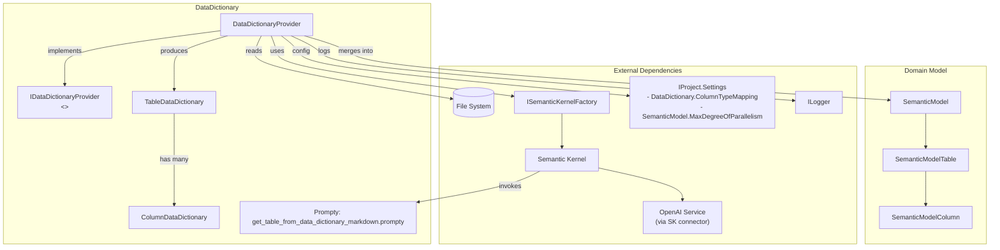
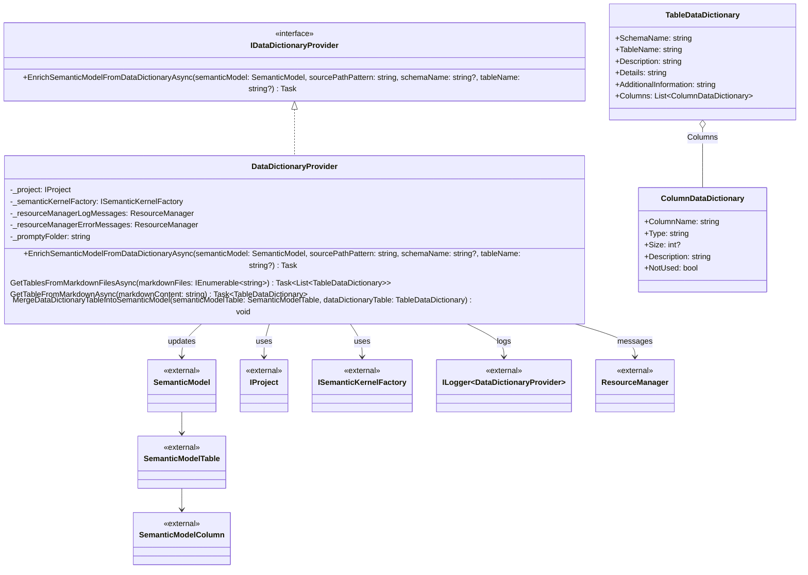

## Data Dictionary Component Documentation

The Data Dictionary component enriches the semantic model with human-authored metadata from data dictionary markdown files. It parses tables and columns, maps types, merges descriptions, and flags unused columns to improve natural language understanding and query generation.

## 1. Component Overview

### Purpose/Responsibility

- OVR-001: Enrich an existing semantic model using data dictionary files (markdown), aligning descriptions and usage flags.
- OVR-002: Scope includes parsing markdown into structured DTOs, applying column type mappings, merging descriptions/details, and logging mismatches; excludes schema extraction and AI-based description generation.
- OVR-003: Context: Operates within the model enrichment phase, using Semantic Kernel to parse markdown via a Prompty template, project settings for type mapping/parallelism, and writes updates into the in-memory `SemanticModel`.

## 2. Architecture

- ARC-001: Design patterns
  - Dependency Injection for `IProject`, `ISemanticKernelFactory`, `ILogger`.
  - Factory pattern via `ISemanticKernelFactory` to create a configured Semantic Kernel.
  - Provider pattern: `IDataDictionaryProvider` defines capabilities; `DataDictionaryProvider` implements them.
  - Parallel processing: `Parallel.ForEachAsync` for scalable file processing.
- ARC-002: Dependencies
  - Internal: `TableDataDictionary`, `ColumnDataDictionary`.
  - Domain: `SemanticModel`, `SemanticModelTable`, `SemanticModelColumn` (from Models/SemanticModel).
  - External: `Microsoft.SemanticKernel`, `Microsoft.SemanticKernel.Connectors.OpenAI`, `Microsoft.Extensions.Logging`, `System.Text.Json`, `System.Resources`, filesystem.
  - Configuration: `IProject.Settings.DataDictionary.ColumnTypeMapping`, `IProject.Settings.SemanticModel.MaxDegreeOfParallelism`.
  - Prompts: `Prompty/get_table_from_data_dictionary_markdown.prompty` (under application base directory at runtime).
- ARC-003: Interactions
  - Reads markdown files by glob/pattern; for each file, calls a Prompty-driven SK function to produce a `TableDataDictionary`; merges into `SemanticModel` with type mapping and warnings.
- ARC-004: Visual diagrams included below.
- ARC-005: Mermaid diagrams provided: one flowchart for structure/data flow; one class diagram for code structure.

### Component structure and dependencies (flowchart)



### Component structure (class diagram)



## 3. Interface Documentation

- INT-001: Public interfaces and API surface
  - `IDataDictionaryProvider`
    - Method: `Task EnrichSemanticModelFromDataDictionaryAsync(SemanticModel semanticModel, string sourcePathPattern, string? schemaName, string? tableName)`
      - Purpose: Load and parse markdown data dictionary files, filter by optional schema/table, merge into the provided semantic model.
      - Parameters: semanticModel (target to enrich), sourcePathPattern (directory + pattern, e.g., `d:/temp/dict/*.md`), schemaName (optional filter), tableName (optional filter).
      - Return: Task (async, no direct return value).
      - Usage: Resolve via DI and await the method; semantic model is modified in place.

| Method/Property | Purpose | Parameters | Return Type | Usage Notes |
|-----------------|---------|------------|-------------|-------------|
| IDataDictionaryProvider.EnrichSemanticModelFromDataDictionaryAsync | Enrich semantic model from markdown dictionaries | semanticModel, sourcePathPattern, schemaName?, tableName? | Task | Uses SK + Prompty; runs file parsing in parallel; logs warnings |
| TableDataDictionary.Columns | Parsed columns from markdown | — | `List<ColumnDataDictionary>` | Aggregation of column metadata |
| ColumnDataDictionary.NotUsed | Indicates column should not be used | — | bool | Sets `SemanticModelColumn.NotUsed` and reason |

- INT-003: Events/callbacks: None. Logging via `ILogger<DataDictionaryProvider>`.

## 4. Implementation Details

- IMP-001: Responsibilities
  - File discovery by pattern (directory from path, default `.`; pattern default `*.md`).
  - Parallel file processing: `Parallel.ForEachAsync` with max degree set from project settings.
  - Markdown parsing: Semantic Kernel function from Prompty file returns JSON that is deserialized to `TableDataDictionary`.
  - Merge behavior:
    - Table descriptions/details/additional info copied to `SemanticModelTable`.
    - Column mapping by name; descriptions concatenated/trimmed.
    - Type mapping: `DataDictionary.From` -> `To` if configured; note appended to description; mismatches logged.
    - Unused columns: `NotUsed` sets flags and reason on `SemanticModelColumn`.
    - Warnings logged for dictionary-only and model-only columns.
- IMP-002: Configuration and initialization
  - DI constructs `DataDictionaryProvider(IProject, ISemanticKernelFactory, ILogger<DataDictionaryProvider>)`.
  - Prompty path resolved relative to `AppDomain.CurrentDomain.BaseDirectory` + `Prompty` folder.
  - Settings used:
    - `Settings.SemanticModel.MaxDegreeOfParallelism`
    - `Settings.DataDictionary.ColumnTypeMapping[] { From, To }`
- IMP-003: Key algorithms
  - Deserialization via `System.Text.Json` into record types.
  - Case-insensitive column name matching and type mapping dictionary (`StringComparer.OrdinalIgnoreCase`).
- IMP-004: Performance
  - IO- and LLM-bound. Parallel file reads and SK invocations. Degree of parallelism configurable. Minimal locking only when appending results.

## 5. Usage Examples

### Basic Usage

```csharp
// Resolve from DI and enrich a semantic model
var provider = serviceProvider.GetRequiredService<IDataDictionaryProvider>();
await provider.EnrichSemanticModelFromDataDictionaryAsync(
    semanticModel,
    sourcePathPattern: "d:/temp/dict/*.md",
    schemaName: null,
    tableName: null);
```

### Advanced Usage

```csharp
// Configure column type mappings and parallelism via project settings (IProject.Settings)
// Example (settings.json fragment):
// {
//   "SemanticModel": { "MaxDegreeOfParallelism": 4 },
//   "DataDictionary": {
//     "ColumnTypeMapping": [ { "From": "varchar", "To": "string" }, { "From": "int", "To": "int" } ]
//   }
// }

// Filter to a specific table
await provider.EnrichSemanticModelFromDataDictionaryAsync(
    semanticModel,
    sourcePathPattern: "d:/temp/dict/*.md",
    schemaName: "dbo",
    tableName: "tblItemSellingLimit");
```

- USE-001: Keep markdown dictionaries consistent in format expected by the Prompty template.
- USE-002: Prefer explicit type mappings (e.g., vendor -> canonical) to reduce warnings.
- USE-003: Tune `MaxDegreeOfParallelism` to balance throughput and API limits for the LLM backend.

## 6. Quality Attributes

- QUA-001: Security: Reads local files; no direct DB access. AI calls use centralized `ISemanticKernelFactory` for configured credentials/endpoints.
- QUA-002: Performance: Parallel IO and LLM calls; complexity roughly O(n) over files; minimal synchronization.
- QUA-003: Reliability: Defensive checks for missing directories/files; warnings for mismatches; exceptions thrown on empty SK responses.
- QUA-004: Maintainability: Records and small, focused methods; DI + logging; follows repo patterns for AI execution; easily testable with mocks.
- QUA-005: Extensibility: New mappings or additional merge rules can be added; alternative parsers or prompt versions can be injected via factory.

## 7. Reference Information

- REF-001: Dependencies (key)
  - Microsoft.SemanticKernel, Microsoft.SemanticKernel.Connectors.OpenAI
  - Microsoft.Extensions.Logging
  - System.Text.Json, System.Resources
- REF-002: Configuration options
  - `SemanticModel.MaxDegreeOfParallelism: int`
  - `DataDictionary.ColumnTypeMapping: array of { From: string, To: string }`
- REF-003: Testing guidelines
  - Mock `ISemanticKernelFactory` and return a fake function result for `TableDataDictionary`.
  - Mock `IProject.Settings` for type mappings and parallelism.
  - Verify merge behavior on `SemanticModelTable` and `SemanticModelColumn` (descriptions, NotUsed flag, warnings).
- REF-004: Troubleshooting
  - "Source path does not exist": check `sourcePathPattern` directory.
  - "Files not found": verify glob/pattern; default is `*.md`.
  - Empty SK result or deserialization errors: ensure Prompty file path resolves under the application base directory and the markdown format matches expectations.
- REF-005: Related docs
  - See `docs/components/semantic-model-documentation.md` for the semantic model structures.
- REF-006: Change history
  - 2025-08-11: Initial version.

---

This document follows C4 context at the component/code boundary, Arc42, and IEEE 1016 guidance, keeping agile documentation principles in mind.
