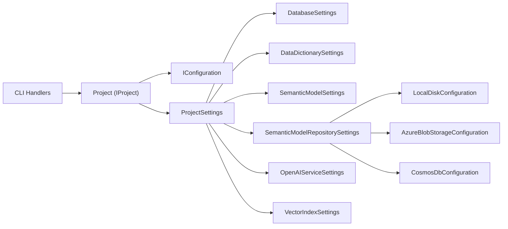
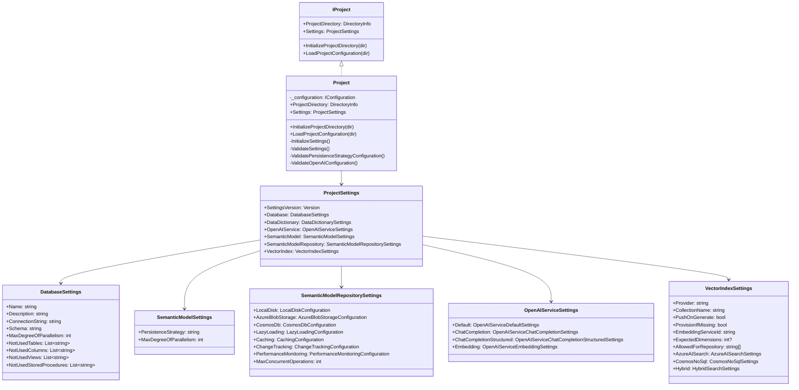

The Project Model encapsulates project-scoped configuration and utilities for GenAIDBExplorer. It loads, validates, and exposes the project's settings from settings.json and provides helpers for initializing a project directory.

## 1. Component Overview

### Purpose/Responsibility

- OVR-001: Centralize access to project configuration via strongly-typed settings.
- OVR-002: Initialize a new project folder structure from the built-in DefaultProject template.
- OVR-003: Provide validated configuration for downstream services (database, OpenAI, repositories, vector index).

Scope

- Included: Reading/binding settings.json, validation, DI-friendly access (IProject), directory initialization utilities.
- Excluded: Actual AI operations, repository implementations, database connectivity.

System context and relationships

- Used by CLI command handlers and providers to access configuration (e.g., SemanticKernelFactory, repositories).

## 2. Architecture

- ARC-001: Patterns
  - Interface + implementation (IProject + Project) using DI and SRP.
  - Validation attributes + ValidationContext for robust config validation.
  - Options-like binding pattern via Microsoft.Extensions.Configuration.
- ARC-002: Dependencies
  - Internal: ProjectSettings and nested settings types; ProjectUtils helpers; resource-based logging strings.
  - External: Microsoft.Extensions.Configuration, Microsoft.Extensions.Logging, System.ComponentModel.DataAnnotations.
- ARC-003: Interactions
  - LoadProjectConfiguration builds IConfiguration from project directory and binds sections to ProjectSettings.
  - ValidateSettings enforces constraints incl. strategy-specific checks for persistence and OpenAI.
  - InitializeProjectDirectory copies DefaultProject into an empty target folder.
- ARC-004/005: Diagrams below.

### Component Structure and Dependencies Diagram





## 3. Interface Documentation

- INT-001: Public interfaces
  - IProject
- INT-002: Members

| Method/Property | Purpose | Parameters | Return Type | Usage Notes |
|---|---|---|---|---|
| ProjectDirectory | Root folder of the project | — | DirectoryInfo | Set after initialize/load |
| Settings | Strongly-typed access to settings | — | ProjectSettings | Populated on load |
| InitializeProjectDirectory | Scaffold new project folder | dir: DirectoryInfo | void | Target must be empty |
| LoadProjectConfiguration | Bind settings.json into Settings | dir: DirectoryInfo | void | Validates on load |

- INT-003: Events/callbacks: None.

## 4. Implementation Details

- IMP-001: Main classes
  - Project: orchestration of load/init/validate.
  - ProjectSettings and nested settings types define config schema.
- IMP-002: Configuration
  - settings.json loaded from project root using ConfigurationBuilder.
  - Sections: Database, DataDictionary, SemanticModel, OpenAIService, SemanticModelRepository, VectorIndex.
- IMP-003: Key logic
  - ValidatePersistenceStrategyConfiguration enforces presence of specific sub-config based on SemanticModel.PersistenceStrategy (LocalDisk, AzureBlob, Cosmos).
  - ValidateOpenAIConfiguration checks endpoint URL, HTTPS, Azure domain, and required deployment/model IDs depending on ServiceType (AzureOpenAI vs OpenAI).
- IMP-004: Performance
  - Validation is lightweight; no I/O except initial file reads and optional directory copy during initialization.

## 5. Usage Examples

### Basic Usage

```csharp
var logger = loggerFactory.CreateLogger<Project>();
IProject project = new Project(logger);
project.LoadProjectConfiguration(new DirectoryInfo(@"d:/temp"));
var settings = project.Settings;
```

### Initialize New Project

```csharp
var logger = loggerFactory.CreateLogger<Project>();
IProject project = new Project(logger);
project.InitializeProjectDirectory(new DirectoryInfo(@"d:/temp"));
```

### Best Practices

- Keep settings.json checked in per sample but secure secrets externally.
- Prefer Managed Identity for Azure resources; avoid embedding keys.
- Validate early during app start; fail fast on invalid configuration.

## 6. Quality Attributes

- QUA-001 Security: Validates URLs and requires HTTPS for Azure OpenAI; encourages key-less auth patterns. Does not handle secrets directly.
- QUA-002 Performance: Minimal overhead; bind/validate only at startup or when loading.
- QUA-003 Reliability: Strong validation prevents misconfiguration; clear exceptions.
- QUA-004 Maintainability: Clear separation of settings types; uses data annotations and DI-friendly interfaces.
- QUA-005 Extensibility: New persistence strategies or vector providers can be added via new sub-settings and switch branches.

## 7. Reference Information

- REF-001 Dependencies
  - Microsoft.Extensions.Configuration: JSON binding
  - Microsoft.Extensions.Logging: structured logging
  - System.ComponentModel.DataAnnotations: validation
- REF-002 Configuration sections
  - Database, DataDictionary, SemanticModel, OpenAIService, SemanticModelRepository, VectorIndex
- REF-003 Testing
  - Unit tests under Tests/Unit/GenAIDBExplorer.Core.Test/Models/Project validate binding and constraints.
- REF-004 Troubleshooting
  - Invalid PersistenceStrategy -> ValidationException with allowed values
  - AzureOpenAIEndpoint invalid/HTTP -> ValidationException
  - Missing deployment/model IDs for chosen ServiceType -> ValidationException
- REF-005 Related Docs
  - docs/technical/SEMANTIC_MODEL_PROJECT_STRUCTURE.md
- REF-006 Change history
  - Introduced VectorIndex settings for embeddings and hybrid search.
