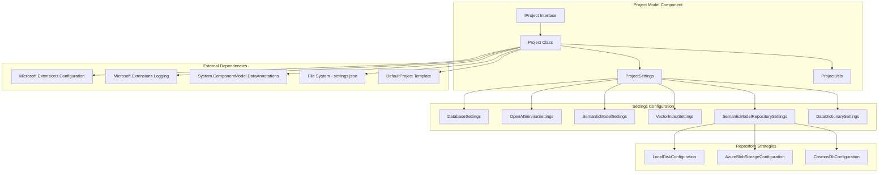
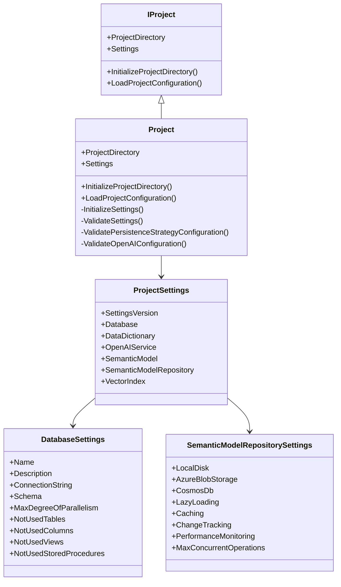

The Project Model encapsulates project-scoped configuration and utilities for GenAIDBExplorer. It loads, validates, and exposes the project's settings from settings.json and provides helpers for initializing a project directory.

## 1. Component Overview

### Purpose/Responsibility

- OVR-001: Centralize access to project configuration via strongly-typed settings
- OVR-002: Initialize a new project folder structure from the built-in DefaultProject template
- OVR-003: Provide validated configuration for downstream services (database, OpenAI, repositories, vector index)

### Scope

- **Included**: Reading/binding settings.json, validation, DI-friendly access (IProject), directory initialization utilities
- **Excluded**: Actual AI operations, repository implementations, database connectivity

### System Context and Relationships

- Used by CLI command handlers and providers to access configuration (e.g., SemanticKernelFactory, repositories)

## 2. Architecture

### Design Patterns

- **ARC-001**: Interface + implementation (IProject + Project) using Dependency Injection and Single Responsibility Principle
- **ARC-002**: Validation attributes + ValidationContext for robust config validation
- **ARC-003**: Options-like binding pattern via Microsoft.Extensions.Configuration
- **ARC-004**: Factory method pattern in ProjectUtils for directory operations

### Dependencies

- **Internal**: ProjectSettings and nested settings types; ProjectUtils helpers; resource-based logging strings
- **External**: Microsoft.Extensions.Configuration, Microsoft.Extensions.Logging, System.ComponentModel.DataAnnotations

### Component Interactions

- LoadProjectConfiguration builds IConfiguration from project directory and binds sections to ProjectSettings
- ValidateSettings enforces constraints including strategy-specific checks for persistence and OpenAI
- InitializeProjectDirectory copies DefaultProject into an empty target folder

### Component Structure and Dependencies Diagram





## 3. Interface Documentation

### Public Interfaces

- **INT-001**: IProject - Primary interface for project management and configuration access

### Interface Members

| Method/Property | Purpose | Parameters | Return Type | Usage Notes |
|---|---|---|---|---|
| ProjectDirectory | Root folder of the project | — | DirectoryInfo | Set after initialize/load |
| Settings | Strongly-typed access to settings | — | ProjectSettings | Populated on load |
| InitializeProjectDirectory | Scaffold new project folder | dir: DirectoryInfo | void | Target must be empty |
| LoadProjectConfiguration | Bind settings.json into Settings | dir: DirectoryInfo | void | Validates on load |

### Events/Callbacks

- **INT-003**: None - This component follows a synchronous, method-call-based interaction pattern

## 4. Implementation Details

### Main Classes

- **IMP-001**:
  - **Project**: Orchestration of load/init/validate operations
  - **ProjectSettings**: Root configuration object with nested settings types
  - **ProjectUtils**: Static utilities for directory operations

### Configuration Structure

- **IMP-002**: settings.json loaded from project root using ConfigurationBuilder
- **Sections**: Database, DataDictionary, SemanticModel, OpenAIService, SemanticModelRepository, VectorIndex

### Key Implementation Logic

- **IMP-003**:
  - **ValidatePersistenceStrategyConfiguration**: Enforces presence of specific sub-config based on SemanticModel.PersistenceStrategy (LocalDisk, AzureBlob, Cosmos)
  - **ValidateOpenAIConfiguration**: Checks endpoint URL, HTTPS, Azure domain, and required deployment/model IDs depending on ServiceType (AzureOpenAI vs OpenAI)
  - **Configuration Binding**: Uses Microsoft.Extensions.Configuration for strongly-typed binding

### Performance Characteristics

- **IMP-004**: Validation is lightweight; no I/O except initial file reads and optional directory copy during initialization

## 5. Usage Examples

### Basic Usage

```csharp
var logger = loggerFactory.CreateLogger<Project>();
IProject project = new Project(logger);
project.LoadProjectConfiguration(new DirectoryInfo(@"d:/temp"));
var settings = project.Settings;

// Access database configuration
var connectionString = settings.Database.ConnectionString;
var maxParallelism = settings.Database.MaxDegreeOfParallelism;
```

### Initialize New Project

```csharp
var logger = loggerFactory.CreateLogger<Project>();
IProject project = new Project(logger);
project.InitializeProjectDirectory(new DirectoryInfo(@"d:/temp"));
```

### Advanced Configuration Access

```csharp
// Access OpenAI service configuration
var openAIConfig = project.Settings.OpenAIService;
var chatCompletionSettings = openAIConfig.ChatCompletion;
var embeddingSettings = openAIConfig.Embedding;

// Access persistence strategy
var persistenceStrategy = project.Settings.SemanticModel.PersistenceStrategy;
switch (persistenceStrategy?.ToLowerInvariant())
{
    case "localdisk":
        var localConfig = project.Settings.SemanticModelRepository.LocalDisk;
        break;
    case "azureblob":
        var blobConfig = project.Settings.SemanticModelRepository.AzureBlobStorage;
        break;
    case "cosmosdb":
        var cosmosConfig = project.Settings.SemanticModelRepository.CosmosDb;
        break;
}
```

### Best Practices

- **USE-001**: Keep settings.json checked in per sample but secure secrets externally
- **USE-002**: Prefer Managed Identity for Azure resources; avoid embedding keys
- **USE-003**: Validate early during app start; fail fast on invalid configuration

## 6. Quality Attributes

### Security

- **QUA-001**: Validates URLs and requires HTTPS for Azure OpenAI; encourages key-less auth patterns. Does not handle secrets directly

### Performance

- **QUA-002**: Minimal overhead; bind/validate only at startup or when loading

### Reliability

- **QUA-003**: Strong validation prevents misconfiguration; clear exceptions with specific error messages

### Maintainability

- **QUA-004**: Clear separation of settings types; uses data annotations and DI-friendly interfaces

### Extensibility

- **QUA-005**: New persistence strategies or vector providers can be added via new sub-settings and switch branches

## 7. Reference Information

### Project Dependencies

- **REF-001**:
  - **Microsoft.Extensions.Configuration**: JSON binding and configuration management
  - **Microsoft.Extensions.Logging**: Structured logging with resource-based messages
  - **System.ComponentModel.DataAnnotations**: Validation attributes and ValidationContext

### Configuration Sections

- **REF-002**: Database, DataDictionary, SemanticModel, OpenAIService, SemanticModelRepository, VectorIndex

### Testing

- **REF-003**: Unit tests under Tests/Unit/GenAIDBExplorer.Core.Test/Models/Project validate binding and constraints

### Troubleshooting

- **REF-004**:
  - **Invalid PersistenceStrategy** → ValidationException with allowed values
  - **AzureOpenAIEndpoint invalid/HTTP** → ValidationException  
  - **Missing deployment/model IDs** for chosen ServiceType → ValidationException
  - **Empty/non-existent project directory** → DirectoryNotFoundException or InvalidOperationException

### Related Documentation

- **REF-005**: docs/technical/SEMANTIC_MODEL_PROJECT_STRUCTURE.md

### Change History

- **REF-006**:
  - Initial implementation with core settings structure
  - Added VectorIndex settings for embeddings and hybrid search
  - Enhanced validation for OpenAI service configurations
  - Added support for multiple persistence strategies (LocalDisk, AzureBlob, Cosmos)
