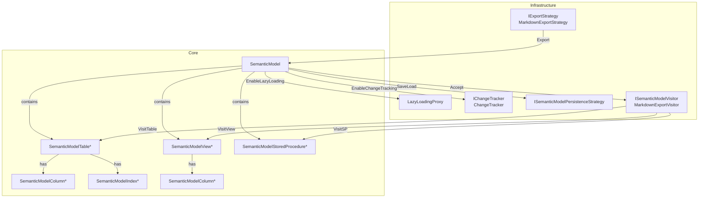
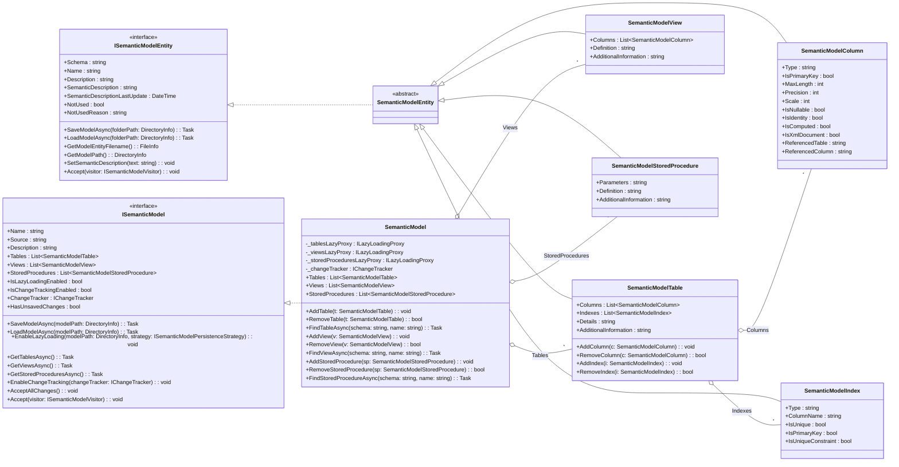

## Semantic Model Documentation

Represents the in-memory and persisted semantic representation of a relational database, including tables, views, stored procedures, columns, and indexes, with support for lazy loading, change tracking, visitor-based traversal, and export strategies.

## 1. Component Overview

### Purpose/Responsibility

- OVR-001: Provide a structured domain model for database metadata enriched with semantic descriptions.
- OVR-002: Scope includes persistence (save/load), lazy loading of entity collections, change tracking, and visitor traversal. SQL generation and enrichment are out of scope here.
- OVR-003: Sits at the Core domain layer. Interacts with repository strategies for persistence, visitors for export/processing, and higher layers (CLI/services) orchestrate operations.

## 2. Architecture Section

- ARC-001: Design patterns: Visitor (`ISemanticModelVisitor`), Strategy (`IExportStrategy`, `ISemanticModelPersistenceStrategy`, usage strategies), Lazy Loading Proxy (`ILazyLoadingProxy<T>`), Change Tracking (`ChangeTracker`), Composite/Aggregation (model contains entities), Template Method via abstract base `SemanticModelEntity`.
- ARC-002: Dependencies: System.Text.Json, Microsoft.Extensions.Logging, YamlDotNet; internal packages include ChangeTracking, LazyLoading, Export, UsageStrategy, Repository.
- ARC-003: Interactions: SemanticModel composes Tables/Views/SPs; can enable lazy proxies; uses change tracker; accepts visitors; delegates persistence to repository strategies.
- ARC-004: See diagrams below.
- ARC-005: Flowchart and class diagrams included and validated against Mermaid syntax reference.

### Component structure and dependencies (flowchart)



### Class model (UML)



## 3. Interface Documentation

- INT-001: Public interfaces define the component’s surface for persistence, traversal, usage filtering, lazy loading, and change tracking.
- INT-002: Key members reference:

| Method/Property | Purpose | Parameters | Return Type | Usage Notes |
|-----------------|---------|------------|-------------|-------------|
| ISemanticModel.SaveModelAsync | Persist model to disk layout | modelPath | Task | Writes semanticmodel.json and entity JSON files in tables/views/storedprocedures |
| ISemanticModel.LoadModelAsync | Load model from disk layout | modelPath | `Task<SemanticModel>` | Reads semanticmodel.json and entity files |
| ISemanticModel.EnableLazyLoading | Defer loading of collections | modelPath, persistenceStrategy | void | Creates LazyLoadingProxy for tables/views/SPs; clears eager lists |
| ISemanticModel.GetTablesAsync | Retrieve tables | — | `Task<IEnumerable<SemanticModelTable>>` | Returns lazy or eager collection |
| ISemanticModel.EnableChangeTracking | Turn on change tracking | changeTracker | void | Uses IChangeTracker; flips HasUnsavedChanges |
| ISemanticModel.Accept | Visitor traversal | visitor | void | Calls Visit on model and children |
| ISemanticModelEntity.SaveModelAsync | Persist entity | folderPath | Task | Serializes entity JSON |
| ISemanticModelEntity.LoadModelAsync | Load entity | folderPath | Task | Populates instance from JSON |
| IExportStrategy.ExportAsync | Export model | semanticModel, options | Task | MarkdownExportStrategy + MarkdownExportVisitor provided |
| ISemanticModelVisitor.Visit* | Visitor callbacks | entity | void | Extend for new behaviors |
| IChangeTracker.MarkAsDirty | Track dirty entity | entity | void | Thread-safe; raises event |
| ILazyLoadingProxy.GetEntitiesAsync | Access entities | — | `Task<IEnumerable<T>>` | Triggers load on first access |

- INT-003: Events: IChangeTracker.EntityStateChanged(object entity, bool isDirty).

## 4. Implementation Details

- IMP-001: Classes: SemanticModel (aggregate root), SemanticModelEntity (base), SemanticModelTable/View/StoredProcedure/Column/Index (leaves), ChangeTracker (default implementation), `LazyLoadingProxy<T>`, MarkdownExportStrategy + MarkdownExportVisitor, YAML extensions.
- IMP-002: Configuration: file layout uses subfolders tables/, views/, storedprocedures/; semanticmodel.json uses custom JsonConverters to store lightweight entity refs. Lazy loading enabled via EnableLazyLoading(modelPath, persistenceStrategy). Change tracking enabled via EnableChangeTracking(IChangeTracker).
- IMP-003: Algorithms: LazyLoadingProxy uses SemaphoreSlim + double-check to avoid races; ChangeTracker uses ConcurrentDictionary and event for state changes; Visitor pattern walks model depth-first.
- IMP-004: Performance: Lazy loading prevents large upfront loads; JSON serialization is indented for readability; thread safety considered in ChangeTracker and proxy. Potential bottlenecks: file I/O on large models; avoid unnecessary LoadModelAsync calls.

## 5. Usage Examples

### Basic Usage

```csharp
using GenAIDBExplorer.Core.Models.SemanticModel;

var model = new SemanticModel(name: "AdventureWorksLT", source: "sqlserver://localhost");

var table = new SemanticModelTable("dbo", "Customer")
{
    Columns =
    [
        new SemanticModelColumn("dbo", "CustomerID") { Type = "int", IsPrimaryKey = true },
        new SemanticModelColumn("dbo", "Name") { Type = "nvarchar", MaxLength = 100 }
    ]
};

model.AddTable(table);
await model.SaveModelAsync(new DirectoryInfo(@"d:/temp/SemanticModel"));
```

### Advanced Usage

```csharp
using GenAIDBExplorer.Core.Models.SemanticModel;
using GenAIDBExplorer.Core.Models.SemanticModel.Export;
using GenAIDBExplorer.Core.Models.SemanticModel.ChangeTracking;

var projectPath = new DirectoryInfo(@"d:/temp/SemanticModel");

// Load and enable lazy loading
var loaded = await new SemanticModel("AdventureWorksLT", "sqlserver").LoadModelAsync(projectPath);
loaded.EnableLazyLoading(projectPath, persistenceStrategy: /* your ISemanticModelPersistenceStrategy */ null!);

// Change tracking
loaded.EnableChangeTracking(new ChangeTracker());
loaded.AddView(new SemanticModelView("dbo", "ActiveCustomers"));
var hasChanges = loaded.HasUnsavedChanges; // true

// Export via Visitor
var exporter = new MarkdownExportStrategy();
await exporter.ExportAsync(loaded, new ExportOptions { ProjectPath = projectPath, OutputPath = @"d:/temp/export.md", SplitFiles = false });
```

- USE-001: Favor GetTablesAsync/GetViewsAsync/GetStoredProceduresAsync when lazy loading may be enabled.
- USE-002: Prefer visitor-based processing for exports and bulk traversals; keep export logic outside entities.
- USE-003: Mark entities dirty via Add*/Remove* to integrate with IChangeTracker; call AcceptAllChanges after persist.

## 6. Quality Attributes

- QUA-001 Security: File persistence only; ensure paths are validated by caller. No SQL execution here. Avoid loading untrusted JSON.
- QUA-002 Performance: Deferred loads; thread-safe change tracking. Consider batched I/O for very large models.
- QUA-003 Reliability: Exceptions: ObjectDisposedException if using disposed SemanticModel; FileNotFoundException on missing entity files; InvalidOperationException on deserialization failures; ArgumentNullException in trackers.
- QUA-004 Maintainability: Clear separation of concerns via patterns; extension methods for YAML; use of DI for repository strategies in higher layers.
- QUA-005 Extensibility: Add new entity types by extending SemanticModelEntity and ISemanticModelVisitor; new export strategies via IExportStrategy; custom usage strategies via IEntityUsageStrategy/IColumnUsageStrategy.

## 7. Reference Information

- REF-001 Dependencies:
  - System.Text.Json (serialization)
  - Microsoft.Extensions.Logging (logging in ChangeTracker/LazyLoadingProxy)
  - YamlDotNet (YAML extensions)
- REF-002 Configuration options: ExportOptions { ProjectPath, OutputPath, SplitFiles }. File layout: tables/, views/, storedprocedures/.
- REF-003 Testing guidelines: Mock ISemanticModelPersistenceStrategy and IExportStrategy; use in-memory directories; assert visitor outputs. For change tracking, assert DirtyEntityCount and events using FluentAssertions + Moq.
- REF-004 Troubleshooting:
  - Missing files: ensure semanticmodel.json and entity subfolders exist.
  - Diagram generation: use MarkdownExportStrategy and inspect output.
  - Lazy loading returns empty: verify folder structure and captured entities when enabling.
- REF-005 Related docs: docs/components/project-model.md, docs/components/semantic-model-repository.md.
- REF-006 Change history: Initial documentation version 1.0.
