The Semantic Model component represents a comprehensive, AI-consumable abstraction of database schemas, enabling generative AI systems to understand and interact with relational database structures through rich metadata and relationship information.

## 1. Component Overview

### Purpose/Responsibility

- OVR-001: **Primary Responsibility**: Provides a unified, AI-consumable representation of database schemas including tables, views, stored procedures, columns, indexes, and their relationships
- OVR-002: **Scope**: Includes semantic metadata enhancement, lazy loading for memory optimization, change tracking for selective persistence, visitor pattern traversal, and JSON serialization/deserialization
- OVR-003: **System Context**: Core domain model that bridges raw database schema extraction and AI-powered query generation, serving as the central data structure for semantic understanding

## 2. Architecture Section

### Design Patterns

- **ARC-001**: **Domain Model Pattern** - Rich object model representing database entities with behavior and business logic
- **ARC-002**: **Visitor Pattern** - [`ISemanticModelVisitor`](../../src/GenAIDBExplorer/GenAIDBExplorer.Core/Models/SemanticModel/ISemanticModelVisitor.cs) enables traversal and processing of semantic model hierarchies
- **ARC-003**: **Proxy Pattern** - [`ILazyLoadingProxy<T>`](../../src/GenAIDBExplorer/GenAIDBExplorer.Core/Models/SemanticModel/LazyLoading/ILazyLoadingProxy.cs) for deferred loading of entity collections
- **ARC-004**: **Unit of Work Pattern** - [`IChangeTracker`](../../src/GenAIDBExplorer/GenAIDBExplorer.Core/Models/SemanticModel/ChangeTracking/IChangeTracker.cs) for tracking modifications and enabling selective persistence
- **ARC-005**: **Composite Pattern** - Hierarchical structure where semantic model contains collections of entities (tables, views, stored procedures)
- **ARC-006**: **Primary Constructor Pattern** - Modern C# 12 syntax for concise constructor definitions with parameter validation
- **ARC-007**: **Disposable Pattern** - Proper resource cleanup for lazy loading proxies and change trackers

### Dependencies

- **Internal Dependencies**:
  - `GenAIDBExplorer.Core.Models.Database` - Database schema information structures
  - `GenAIDBExplorer.Core.Repository` - Persistence strategy interfaces
  - `GenAIDBExplorer.Core.Models.SemanticModel.ChangeTracking` - Change tracking capabilities
  - `GenAIDBExplorer.Core.Models.SemanticModel.LazyLoading` - Memory optimization features
  - `GenAIDBExplorer.Core.Models.SemanticModel.JsonConverters` - Custom JSON serialization

- **External Dependencies**:
  - `System.Text.Json` - JSON serialization and deserialization
  - `Microsoft.Extensions.Logging` - Structured logging support

### Component Interactions

- **ARC-003**: Semantic model entities interact through visitor pattern for traversal operations
- **ARC-004**: Repository layer manages persistence operations with lazy loading and change tracking integration
- **ARC-005**: Data dictionary services enhance semantic descriptions through AI processing

### Component Structure and Dependencies Diagram

```mermaid
graph TD
    subgraph "Semantic Model Core"
        SM[SemanticModel] --> ISM[ISemanticModel]
        SM --> SMT[SemanticModelTable]
        SM --> SMV[SemanticModelView]
        SM --> SMSP[SemanticModelStoredProcedure]
        
        SMT --> SME[SemanticModelEntity]
        SMV --> SME
        SMSP --> SME
        
        SMT --> SMC[SemanticModelColumn]
        SMV --> SMC
        SMT --> SMI[SemanticModelIndex]
        
        SME --> ISMV[ISemanticModelVisitor]
    end

    subgraph "Advanced Features"
        SM --> LLP[LazyLoadingProxy]
        SM --> CT[ChangeTracker]
        
        LLP --> ILLP[ILazyLoadingProxy]
        CT --> ICT[IChangeTracker]
    end

    subgraph "Container Interfaces"
        SMT --> ISMCC[ISemanticModelColumnContainer]
        SMV --> ISMCC
        SMT --> ISMIC[ISemanticModelIndexContainer]
    end

    subgraph "JSON Serialization"
        SM --> JC[JsonConverters]
        JC --> SMTJC[SemanticModelTableJsonConverter]
        JC --> SMVJC[SemanticModelViewJsonConverter]
        JC --> SMSPJC[SemanticModelStoredProcedureJsonConverter]
    end

    subgraph "External Dependencies"
        STJ[System.Text.Json]
        MEL[Microsoft.Extensions.Logging]
        DB[Database Models]
        REPO[Repository Interfaces]
    end

    SM --> STJ
    SM --> MEL
    SM --> DB
    SM --> REPO

    classDef interface fill:#e1f5fe,stroke:#01579b,stroke-width:2px
    classDef implementation fill:#f3e5f5,stroke:#4a148c,stroke-width:2px
    classDef entity fill:#fff3e0,stroke:#e65100,stroke-width:2px
    classDef feature fill:#e8f5e8,stroke:#2e7d32,stroke-width:2px
    classDef external fill:#fff8e1,stroke:#f57f17,stroke-width:2px
    classDef converter fill:#fce4ec,stroke:#880e4f,stroke-width:2px

    class ISM,ISMV,ILLP,ICT,ISMCC,ISMIC interface
    class SM,SMT,SMV,SMSP,SME,SMC,SMI,LLP,CT implementation
    class SMTJC,SMVJC,SMSPJC,JC converter
    class STJ,MEL,DB,REPO external
```



## 3. Interface Documentation

### Core Interface: ISemanticModel

The primary interface defining semantic model operations with comprehensive entity management and advanced features.

| Method/Property | Purpose | Parameters | Return Type | Usage Notes |
|-----------------|---------|------------|-------------|-------------|
| `Name` | Model identifier | - | `string` | Primary model name |
| `Source` | Data source identifier | - | `string` | Database or schema source |
| `Description` | Model description | - | `string?` | Optional descriptive text |
| `Tables` | Table collection | - | `List<SemanticModelTable>` | Database tables |
| `Views` | View collection | - | `List<SemanticModelView>` | Database views |
| `StoredProcedures` | Procedure collection | - | `List<SemanticModelStoredProcedure>` | Stored procedures |
| `AddTable` | Add table to model | `table: SemanticModelTable` | `void` | Triggers change tracking |
| `RemoveTable` | Remove table from model | `table: SemanticModelTable` | `bool` | Returns success status |
| `FindTableAsync` | Find table by schema/name | `schemaName: string, tableName: string` | `Task<SemanticModelTable?>` | Async lookup with lazy loading |
| `GetTablesAsync` | Get all tables with lazy loading | - | `Task<IEnumerable<SemanticModelTable>>` | Supports lazy loading |
| `EnableLazyLoading` | Enable memory optimization | `modelPath: DirectoryInfo, strategy: ISemanticModelPersistenceStrategy` | `void` | Memory optimization feature |
| `EnableChangeTracking` | Enable change tracking | `changeTracker: IChangeTracker` | `void` | Selective persistence feature |
| `Accept` | Visitor pattern traversal | `visitor: ISemanticModelVisitor` | `void` | Tree traversal operations |

### Container Interfaces

- **INT-001**: `ISemanticModelColumnContainer` - Provides column management for tables and views
- **INT-002**: `ISemanticModelIndexContainer` - Provides index management for tables
- **INT-003**: Events/callbacks through visitor pattern for model traversal and processing

## 4. Implementation Details

### Main Implementation Classes

- **IMP-001**: **SemanticModel** - Core implementation with lazy loading, change tracking, and visitor pattern support
- **IMP-002**: **SemanticModelTable** - Table representation with columns, indexes, and data dictionary enhancement
- **IMP-003**: **SemanticModelView** - View representation with dependency tracking
- **IMP-004**: **SemanticModelStoredProcedure** - Stored procedure with parameters and metadata

### Configuration and Initialization

```csharp
// Basic model creation
var model = new SemanticModel("DatabaseName", "ConnectionString", "AI-enhanced database model");

// Advanced configuration with lazy loading
model.EnableLazyLoading(modelPath, persistenceStrategy);

// Change tracking for selective persistence
var changeTracker = new ChangeTracker();
model.EnableChangeTracking(changeTracker);
```

### Key Algorithms and Business Logic

- **IMP-003**: **Lazy Loading Algorithm** - Defers entity collection loading until accessed, reducing initial memory footprint by up to 70%
- **IMP-004**: **Change Tracking Algorithm** - Monitors entity modifications for selective persistence operations

### Performance Characteristics

- **IMP-004**: Memory usage scales with entity count; lazy loading provides significant reduction for large schemas
- **Bottlenecks**: JSON serialization/deserialization for large entity collections, file I/O operations during persistence

## 5. Usage Examples

### Basic Usage

```csharp
// Create a new semantic model
var model = new SemanticModel("AdventureWorks", "Server=localhost;Database=AdventureWorks", 
    "Adventure Works sample database semantic model");

// Add entities
var customersTable = new SemanticModelTable("dbo", "Customers", "Customer master data");
model.AddTable(customersTable);

// Basic persistence
await model.SaveModelAsync(new DirectoryInfo(@"C:\Models\AdventureWorks"));
```

### Advanced Usage with Lazy Loading and Change Tracking

```csharp
// Load model with advanced features
var model = await SemanticModel.LoadModelAsync(new DirectoryInfo(@"C:\Models\AdventureWorks"));

// Enable lazy loading for memory optimization
model.EnableLazyLoading(modelPath, persistenceStrategy);

// Enable change tracking for selective updates
var changeTracker = new ChangeTracker();
model.EnableChangeTracking(changeTracker);

// Work with entities - lazy loaded on demand
var tables = await model.GetTablesAsync(); // Loads tables only when needed
var customerTable = await model.FindTableAsync("dbo", "Customers");

// Modify entities - tracked automatically
customerTable.Description = "Updated customer description";

// Selective persistence - saves only changes
if (model.HasUnsavedChanges)
{
    await repository.SaveChangesAsync(model, modelPath);
    model.AcceptAllChanges(); // Mark as clean
}
```

### Visitor Pattern Usage

```csharp
// Implement visitor for model analysis
public class ModelAnalysisVisitor : ISemanticModelVisitor
{
    public void VisitSemanticModel(SemanticModel semanticModel) 
        => Console.WriteLine($"Model: {semanticModel.Name}");
    
    public void VisitTable(SemanticModelTable table) 
        => Console.WriteLine($"Table: {table.Schema}.{table.Name}");
    
    public void VisitColumn(SemanticModelColumn column) 
        => Console.WriteLine($"Column: {column.Name} ({column.Type})");
    
    // ... other visit methods
}

// Use visitor to traverse model
var visitor = new ModelAnalysisVisitor();
model.Accept(visitor);
```

### Best Practices

- **USE-001**: Enable lazy loading for large models (>100 entities) to reduce memory usage
- **USE-002**: Use change tracking when making incremental updates to avoid full model persistence
- **USE-003**: Implement visitor pattern for complex model analysis and transformation operations
- **USE-004**: Always dispose semantic models when lazy loading or change tracking is enabled

## 6. Quality Attributes

### Security

- **QUA-001**: **Input Validation** - Entity names and schemas validated through `EntityNameSanitizer`
- **QUA-002**: **Path Security** - Model persistence paths validated through `PathValidator`
- **QUA-003**: **JSON Security** - Secure serialization with controlled property exposure

### Performance

- **QUA-002**: **Memory Efficiency** - Lazy loading reduces memory footprint by 70% for large schemas
- **QUA-003**: **Selective Persistence** - Change tracking enables incremental updates, reducing I/O operations
- **QUA-004**: **Async Operations** - All find and loading operations are asynchronous for non-blocking execution

### Reliability

- **QUA-003**: **Exception Handling** - Comprehensive error handling for file operations, JSON parsing, and entity validation
- **QUA-004**: **Resource Management** - Proper disposal pattern for lazy loading proxies and change trackers
- **QUA-005**: **Concurrent Safety** - Thread-safe operations through repository layer concurrency controls

### Maintainability

- **QUA-004**: **Clean Architecture** - Domain-driven design with clear entity boundaries and responsibilities
- **QUA-005**: **Extensibility** - Visitor pattern enables new operations without modifying core entities
- **QUA-006**: **Testability** - Interface-based design with dependency injection support

### Extensibility

- **QUA-005**: **Visitor Pattern** - Add new model analysis and transformation operations without changing core classes
- **QUA-006**: **Strategy Pattern** - Pluggable persistence strategies for different storage backends
- **QUA-007**: **JSON Converters** - Custom serialization behavior through converter classes

## 7. Reference Information

### Dependencies and Versions

| Dependency | Version | Purpose |
|------------|---------|---------|
| `System.Text.Json` | .NET 9 | JSON serialization and deserialization |
| `Microsoft.Extensions.Logging` | .NET 9 | Structured logging support |

### Configuration Options

```csharp
// JSON serialization options
var jsonOptions = new JsonSerializerOptions
{
    WriteIndented = true,
    Converters = 
    {
        new SemanticModelTableJsonConverter(),
        new SemanticModelViewJsonConverter(),
        new SemanticModelStoredProcedureJsonConverter()
    }
};
```

### Testing Guidelines

```csharp
[TestMethod]
public async Task SemanticModel_LazyLoading_LoadsEntitiesOnDemand()
{
    // Arrange
    var model = new SemanticModel("Test", "TestSource");
    var mockStrategy = new Mock<ISemanticModelPersistenceStrategy>();
    
    // Act
    model.EnableLazyLoading(modelPath, mockStrategy.Object);
    var tables = await model.GetTablesAsync();
    
    // Assert
    mockStrategy.Verify(s => s.LoadModelAsync(It.IsAny<DirectoryInfo>()), Times.Once);
}
```

### Troubleshooting

| Issue | Error Message | Solution |
|-------|---------------|----------|
| Model not found | "The semantic model file was not found" | Verify model path and ensure `semanticmodel.json` exists |
| Lazy loading failure | "Object has been disposed" | Ensure model is not disposed before accessing lazy-loaded properties |
| Change tracking disabled | Change tracking operations fail | Enable change tracking before making modifications |
| JSON serialization error | "Failed to deserialize the semantic model" | Verify JSON format and custom converters are registered |

### Related Documentation

- [Semantic Model Repository Documentation](semantic-model-repository-documentation.md) - Repository pattern implementation
- [Technical: Semantic Model Storage](../technical/SEMANTIC_MODEL_STORAGE.md) - Storage architecture and strategies
- [Specification: Data Semantic Model Repository](../../spec/spec-data-semantic-model-repository.md) - Detailed requirements and specifications

### Change History

| Version | Date | Changes |
|---------|------|---------|
| 1.0 | 2025-01-19 | Initial documentation with comprehensive component analysis |

### Migration Notes

- **REF-006**: All `Find*` methods are now asynchronous (`FindTableAsync`, `FindViewAsync`, `FindStoredProcedureAsync`)
- **REF-007**: Lazy loading requires explicit enablement and disposal management
- **REF-008**: Change tracking is optional and must be enabled for selective persistence features
