## Semantic Model Repository Documentation

The Semantic Model Repository provides a unified, secure, and performant persistence layer for the domain `SemanticModel`, supporting multiple backends (Local Disk, Azure Blob Storage, Azure Cosmos DB), with options for lazy loading, change tracking, caching, and performance monitoring.

Links: see `spec/spec-data-semantic-model-repository.md` and `.github/copilot-instructions.md` for related architecture and conventions.

## 1. Component Overview

### Purpose/Responsibility

- OVR-001: Persist and retrieve the `SemanticModel` and its entities (tables, views, stored procedures) across pluggable storage strategies.
- OVR-002: Scope includes I/O orchestration, caching integration, concurrency control, security validation, and performance monitoring. Excludes domain transformation logic and AI enrichment.
- OVR-003: Sits between domain objects and persistence strategies; used by CLI command handlers during Extract/Enrich/Query phases.

## 2. Architecture Section

- ARC-001: Patterns used
  - Repository (ISemanticModelRepository, SemanticModelRepository)
  - Strategy (ISemanticModelPersistenceStrategy + LocalDisk/AzureBlob/CosmosDb)
  - Factory (IPersistenceStrategyFactory, PersistenceStrategyFactory)
  - Builder (SemanticModelRepositoryOptionsBuilder → SemanticModelRepositoryOptions)
  - Composition for cross-cutting concerns (ISemanticModelCache, IPerformanceMonitor, ILogger)

- ARC-002: Key dependencies and purposes
  - Microsoft.Extensions.Logging: structured logging
  - Security: `PathValidator`, `EntityNameSanitizer`, `SecureJsonSerializer`, `KeyVaultConfigurationProvider`
  - Caching: `ISemanticModelCache` (e.g., Memory cache)
  - Performance: `IPerformanceMonitor`, `IPerformanceTrackingContext`
  - Azure: `Azure.Storage.Blobs` (AzureBlob), `Microsoft.Azure.Cosmos` (CosmosDb) and `Azure.Identity` (AzureIdentity)

- ARC-003: Interactions and relationships
  - Repository selects a strategy via factory, validates/sanitizes paths, applies concurrency protection, optionally loads/stores from cache, then enables lazy loading and change tracking on the loaded model.
  - SaveChanges uses change tracking if enabled; currently performs a full save when changes are present (granularity can evolve).

- ARC-004/ARC-005: Diagrams

### Component Structure and Dependencies Diagram

```mermaid
classDiagram
  class ISemanticModelRepository {
    +SaveModelAsync(model: SemanticModel, modelPath: DirectoryInfo, strategyName?: string) Task
    +SaveChangesAsync(model: SemanticModel, modelPath: DirectoryInfo, strategyName?: string) Task
    +LoadModelAsync(modelPath: DirectoryInfo, strategyName?: string) Task~SemanticModel~
    +LoadModelAsync(modelPath: DirectoryInfo, options: SemanticModelRepositoryOptions) Task~SemanticModel~
  }
  class SemanticModelRepository {
    -strategyFactory: IPersistenceStrategyFactory
    -cache: ISemanticModelCache
    -performance: IPerformanceMonitor
    -loggerFactory: ILoggerFactory
    -globalSemaphore: SemaphoreSlim
    -pathSemaphores: ConcurrentDictionary~string, SemaphoreSlim~
    +LoadModelAsync(...)
    +SaveModelAsync(...)
    +SaveChangesAsync(...)
  }
  class ISemanticModelPersistenceStrategy {
    +SaveModelAsync(model: SemanticModel, modelPath: DirectoryInfo) Task
    +LoadModelAsync(modelPath: DirectoryInfo) Task~SemanticModel~
    +ExistsAsync(modelPath: DirectoryInfo) Task~bool~
    +ListModelsAsync(rootPath: DirectoryInfo) Task~IEnumerable~
    +DeleteModelAsync(modelPath: DirectoryInfo) Task
  }
  class PersistenceStrategyFactory {
    +GetStrategy(strategyName?: string) ISemanticModelPersistenceStrategy
  }
  class AzureBlobPersistenceStrategy
  class LocalDiskPersistenceStrategy
  class CosmosDbPersistenceStrategy
  class ISemanticModelCache
  class IPerformanceMonitor
  class PathValidator
  class EntityNameSanitizer
  class SecureJsonSerializer

  SemanticModelRepository ..|> ISemanticModelRepository
  AzureBlobPersistenceStrategy ..|> ISemanticModelPersistenceStrategy
  LocalDiskPersistenceStrategy ..|> ISemanticModelPersistenceStrategy
  CosmosDbPersistenceStrategy ..|> ISemanticModelPersistenceStrategy
  SemanticModelRepository --> ISemanticModelCache
  SemanticModelRepository --> IPerformanceMonitor
  SemanticModelRepository --> PersistenceStrategyFactory
  SemanticModelRepository --> PathValidator
  SemanticModelRepository --> EntityNameSanitizer
  AzureBlobPersistenceStrategy --> SecureJsonSerializer
  CosmosDbPersistenceStrategy --> SecureJsonSerializer
  LocalDiskPersistenceStrategy --> SecureJsonSerializer
```




## 3. Interface Documentation

Public APIs (primary): `ISemanticModelRepository`

| Method/Property | Purpose | Parameters | Return Type | Usage Notes |
|-----------------|---------|------------|-------------|-------------|
| SaveModelAsync | Persist entire model to configured strategy | model: SemanticModel; modelPath: DirectoryInfo; strategyName?: string | Task | Full save; validates paths; secure serialization at strategy level |
| SaveChangesAsync | Persist only when change tracking detects modifications | model: SemanticModel; modelPath: DirectoryInfo; strategyName?: string | Task | Falls back to full save if tracking disabled or no changes |
| LoadModelAsync | Load with default options | modelPath: DirectoryInfo; strategyName?: string | Task&lt;SemanticModel&gt; | No lazy loading/caching/change tracking by default |
| LoadModelAsync | Load with immutable options | modelPath: DirectoryInfo; options: SemanticModelRepositoryOptions | Task&lt;SemanticModel&gt; | Enables lazy loading, change tracking, caching as requested |

Key secondary APIs: `ISemanticModelPersistenceStrategy`

| Method | Purpose | Parameters | Return Type | Notes |
|--------|---------|------------|-------------|-------|
| SaveModelAsync | Write model and entities | SemanticModel, DirectoryInfo | Task | LocalDisk writes JSON to folders; AzureBlob writes blobs; CosmosDb writes documents |
| LoadModelAsync | Read model and entities | DirectoryInfo | Task&lt;SemanticModel&gt; | Supports envelope `{ data, embedding }` for entities |
| ExistsAsync | Check for presence | DirectoryInfo | Task&lt;bool&gt; | Strategy-specific existence check |
| ListModelsAsync | Enumerate stored models | DirectoryInfo | Task&lt;IEnumerable&lt;string&gt;&gt; | Container/path scope |
| DeleteModelAsync | Remove stored model | DirectoryInfo | Task | Safe concurrent deletion |

Events/Callbacks: none. Observability via `IPerformanceMonitor` scopes and structured logging.

## 4. Implementation Details

- IMP-001: Main classes
  - `SemanticModelRepository`: orchestrates load/save, cache, concurrency, performance.
  - Strategies: `LocalDiskPersistenceStrategy`, `AzureBlobPersistenceStrategy`, `CosmosDbPersistenceStrategy` implementing `ISemanticModelPersistenceStrategy`.
  - `PersistenceStrategyFactory`: resolves strategy by name (default: LocalDisk) from DI.
  - Options: `SemanticModelRepositoryOptions` (immutable) built via `SemanticModelRepositoryOptionsBuilder`.

- IMP-002: Configuration/Initialization
  - Settings model: `Models/Project/SemanticModelRepositorySettings.cs` (LazyLoading, Caching, ChangeTracking, Performance, MaxConcurrentOperations; plus per-strategy configs).
  - DI: register strategies and factory; inject `ISemanticModelCache`, `IPerformanceMonitor`, `ILoggerFactory`.

- IMP-003: Key logic
  - Concurrency: global `SemaphoreSlim` limits concurrent ops; per-path semaphores prevent same-path conflicts.
  - Cache key: SHA-256 of `sanitizedPath|strategyName` prefixed with `semantic_model_{folder}_{hash16}`.
  - Security: inputs validated by `EntityNameSanitizer.ValidateInputSecurity`; paths by `PathValidator.ValidateAndSanitizePath` and `IsPathSafeForConcurrentOperations`.
  - Caching: optional `ISemanticModelCache.Get/Set`; on cache hit, late-enable lazy loading/change tracking.
  - SaveChanges: selective persistence placeholder; performs full save when changes exist, then `model.AcceptAllChanges()`.

- IMP-004: Performance
  - `IPerformanceMonitor.StartOperation("LoadModel"|"SaveModel")` with metadata; recommendations via metrics API.
  - Strategies implement parallelism (Azure Blob/Cosmos DB with semaphores and SDK retry policies).

## 5. Usage Examples

### Basic Usage

```csharp
// Resolve from DI
var repo = provider.GetRequiredService<ISemanticModelRepository>();

// Load with defaults (no lazy loading, no caching, no change tracking)
var model = await repo.LoadModelAsync(new DirectoryInfo(@"d:\\projects\\sample-model"));

// Save full model
await repo.SaveModelAsync(model, new DirectoryInfo(@"d:\\projects\\sample-model"));
```

### Advanced Options (builder)

```csharp
var options = SemanticModelRepositoryOptionsBuilder
    .Create()
    .WithStrategyName("AzureBlob")
    .WithLazyLoading(true)
    .WithChangeTracking(true)
    .WithCaching(true, TimeSpan.FromMinutes(30))
    .WithMaxConcurrentOperations(8)
    .Build();

var model = await repo.LoadModelAsync(new DirectoryInfo(@"d:\\projects\\sample-model"), options);

// Make edits to model... then persist only if changed
await repo.SaveChangesAsync(model, new DirectoryInfo(@"d:\\projects\\sample-model"), strategyName: "AzureBlob");
```

### Strategy Selection via Factory

```csharp
// Use settings or pass explicit name per call
await repo.SaveModelAsync(model, new DirectoryInfo(@"d:\\projects\\sample-model"), strategyName: "Cosmos");
```

- USE-001: Prefer immutable options builder over boolean overloads for clarity and thread safety.
- USE-002: Enable change tracking when using SaveChanges; otherwise, SaveModel.
- USE-003: For Azure backends, use managed identity via `DefaultAzureCredential` where possible.

## 6. Quality Attributes

- QUA-001: Security
  - Input and path sanitization; secure JSON serialization; Azure credentials via `DefaultAzureCredential`; optional Key Vault integration.
  - File name safety for entities via `EntityNameSanitizer.CreateSafeFileName`.

- QUA-002: Performance
  - Global and per-path semaphores; SDK retries; optional caching with configurable expiration; lazy loading.

- QUA-003: Reliability
  - Structured logging; performance scopes; defensive exception handling (wrapping I/O and SDK exceptions with actionable messages).

- QUA-004: Maintainability
  - Clear separation of concerns via Strategy/Factory; options builder; unit tests under `src/GenAIDBExplorer/Tests/Unit/...`.

- QUA-005: Extensibility
  - Add new strategies by implementing `ISemanticModelPersistenceStrategy` and wiring in the factory/DI.

## 7. Reference Information

- REF-001: Dependencies (purpose)
  - Azure.Storage.Blobs, Azure.Identity: Blob persistence with managed identity
  - Microsoft.Azure.Cosmos: Cosmos DB persistence
  - Microsoft.Extensions.Logging: logging
  - System.Text.Json: serialization

- REF-002: Configuration
  - `SemanticModelRepositorySettings` controls LazyLoading, Caching (ExpirationMinutes), ChangeTracking, PerformanceMonitoring, MaxConcurrentOperations, and per-strategy configs.

- REF-003: Testing
  - Unit tests in `src/GenAIDBExplorer/Tests/Unit/GenAIDBExplorer.Core.Test/Repository/*`. Use MSTest + FluentAssertions + Moq.

- REF-004: Troubleshooting
  - 403/404 from Azure: verify identity roles and container/database existence.
  - Path validation failures: ensure absolute, safe paths; avoid network drives for concurrent ops.
  - Cache misses or serialization issues: check `ISemanticModelCache` wiring and secure serializer options.

- REF-005: Related docs
  - `spec/spec-data-semantic-model-repository.md`
  - `.github/copilot-instructions.md` (patterns, DI, logging)

- REF-006: Change history
  - Initial documentation created on 2025-08-10.
