The Semantic Model Repository component provides a unified abstraction layer for persisting and retrieving semantic models across different storage backends. It implements the Repository Pattern with Strategy Pattern for multiple persistence backends, supporting advanced features like lazy loading, change tracking, caching, concurrent operation protection, and enterprise-grade security.

## 1. Component Overview

### Purpose/Responsibility

- **OVR-001**: **Primary Responsibility** - Provide unified persistence operations for semantic models across multiple storage backends (Local Disk, Azure Blob Storage, Azure Cosmos DB)
- **OVR-002**: **Scope** - Includes CRUD operations, caching, lazy loading, change tracking, concurrent operation protection, and advanced security validation. Excludes business logic for semantic model creation/transformation
- **OVR-003**: **System Context** - Acts as the persistence layer between the semantic model domain objects and various storage systems, integrating with the broader GenAI Database Explorer ecosystem

### Key Capabilities

✅ **Implemented Features**:

- Unified repository interface abstracting storage implementation details
- Multiple persistence strategies (Local Disk JSON, Azure Blob Storage, Azure Cosmos DB)
- Memory-based caching layer for performance optimization with statistics tracking
- Lazy loading support for memory efficiency (Tables, Views, StoredProcedures)
- Entity-level change tracking for selective persistence and audit capabilities
- Thread-safe concurrent operations with semaphore-based locking
- Comprehensive security validation, input sanitization, and secure JSON serialization
- Azure Key Vault integration for secure credential management
- Thread-safe performance monitoring with real-time metrics and recommendations
- Asynchronous operations throughout for I/O performance
- **Async Find methods for Table, View, and StoredProcedure replace synchronous versions for transparent lazy/eager loading**
- **all Find methods are now async for architectural consistency and lazy loading support**
- Complete backward compatibility with existing APIs (except for async Find migration)

## 2. Architecture Section

### Design Patterns

- **ARC-001**: **Repository Pattern** - Encapsulates data access logic and provides a uniform interface for semantic model persistence
- **ARC-002**: **Strategy Pattern** - Enables runtime selection of persistence strategies (Local Disk, Azure Blob, Cosmos DB)
- **ARC-003**: **Factory Pattern** - [`PersistenceStrategyFactory`](../../src/GenAIDBExplorer/GenAIDBExplorer.Core/Repository/PersistenceStrategyFactory.cs) manages strategy instantiation and selection
- **ARC-004**: **Lazy Loading Pattern** - [`ILazyLoadingProxy<T>`](../../src/GenAIDBExplorer/GenAIDBExplorer.Core/Models/SemanticModel/LazyLoading/ILazyLoadingProxy.cs) for deferred entity loading and memory optimization
- **ARC-005**: **Unit of Work Pattern** - [`IChangeTracker`](../../src/GenAIDBExplorer/GenAIDBExplorer.Core/Models/SemanticModel/ChangeTracking/IChangeTracker.cs) for change tracking and selective persistence
- **ARC-006**: **Dependency Injection Pattern** - All dependencies injected via constructor for testability and flexibility
- **ARC-007**: **Options Pattern** - Configuration provided via `IOptions<T>` for various components (`CacheOptions`, `SecureJsonSerializerOptions`, `KeyVaultOptions`)
- **ARC-008**: **Adapter Pattern** - Wraps existing functionality for migration support
- **ARC-009**: **Facade Pattern** - Provides unified interface
- **ARC-010**: **Disposable Pattern** - Proper resource cleanup for semaphores, caches, and strategy-specific resources
- **ARC-011**: **Async Find Methods** - All Find methods in ISemanticModel and SemanticModel are now async; all consumers updated to use async/await. Synchronous Find methods removed in favor of async versions.

### Dependencies

- **Internal Dependencies**:
  - `GenAIDBExplorer.Core.Models.SemanticModel` - Core semantic model domain objects with lazy loading and change tracking support
  - `GenAIDBExplorer.Core.Security` - Security validation and serialization utilities ([PathValidator](../../src/GenAIDBExplorer/GenAIDBExplorer.Core/Security/PathValidator.cs), [EntityNameSanitizer](../../src/GenAIDBExplorer/GenAIDBExplorer.Core/Security/EntityNameSanitizer.cs))
  - `GenAIDBExplorer.Core.Repository.Security` - Secure JSON serialization and Azure Key Vault configuration ([SecureJsonSerializer](../../src/GenAIDBExplorer/GenAIDBExplorer.Core/Repository/Security/SecureJsonSerializer.cs), [KeyVaultConfigurationProvider](../../src/GenAIDBExplorer/GenAIDBExplorer.Core/Repository/Security/KeyVaultConfigurationProvider.cs))
  - `GenAIDBExplorer.Core.Repository.Caching` - Caching infrastructure ([ISemanticModelCache](../../src/GenAIDBExplorer/GenAIDBExplorer.Core/Repository/Caching/ISemanticModelCache.cs), [MemorySemanticModelCache](../../src/GenAIDBExplorer/GenAIDBExplorer.Core/Repository/Caching/MemorySemanticModelCache.cs))
  - `GenAIDBExplorer.Core.Repository.Performance` - Performance monitoring ([IPerformanceMonitor](../../src/GenAIDBExplorer/GenAIDBExplorer.Core/Repository/Performance/IPerformanceMonitor.cs), [PerformanceMonitor](../../src/GenAIDBExplorer/GenAIDBExplorer.Core/Repository/Performance/PerformanceMonitor.cs))
  - `GenAIDBExplorer.Core.Models.SemanticModel.ChangeTracking` - Change tracking infrastructure ([IChangeTracker](../../src/GenAIDBExplorer/GenAIDBExplorer.Core/Models/SemanticModel/ChangeTracking/IChangeTracker.cs), [ChangeTracker](../../src/GenAIDBExplorer/GenAIDBExplorer.Core/Models/SemanticModel/ChangeTracking/ChangeTracker.cs))
  - `GenAIDBExplorer.Core.Models.SemanticModel.LazyLoading` - Lazy loading infrastructure ([ILazyLoadingProxy](../../src/GenAIDBExplorer/GenAIDBExplorer.Core/Models/SemanticModel/LazyLoading/ILazyLoadingProxy.cs), [LazyLoadingProxy](../../src/GenAIDBExplorer/GenAIDBExplorer.Core/Models/SemanticModel/LazyLoading/LazyLoadingProxy.cs))
- **External Dependencies**:
  - `Microsoft.Extensions.Logging` (9.0.0) - Structured logging framework
  - `Microsoft.Extensions.Caching.Memory` (9.0.6) - In-memory caching implementation
  - `Azure.Storage.Blobs` (12.23.1) - Azure Blob Storage client SDK
  - `Microsoft.Azure.Cosmos` (3.47.0) - Azure Cosmos DB client SDK
  - `Azure.Identity` (1.13.2) - Azure authentication and credential management
  - `Azure.Security.KeyVault.Secrets` (4.7.0) - Azure Key Vault client SDK
  - `System.Text.Json` (9.0.0) - JSON serialization for local disk persistence

### Component Interactions

The repository acts as a facade coordinating between multiple subsystems: strategy factory for backend selection, cache for performance, security validators for input validation, secure JSON serializer for data protection, and logging for observability.

### Component Structure and Dependencies Diagram

```mermaid
graph TD
    subgraph "Semantic Model Repository System"
        SMR[SemanticModelRepository] --> PSF[PersistenceStrategyFactory]
        SMR --> MSMC[MemorySemanticModelCache]
        SMR --> PM[PerformanceMonitor]
        
        PSF --> LDPS[LocalDiskPersistenceStrategy]
        PSF --> ABPS[AzureBlobPersistenceStrategy]
        PSF --> CPS[CosmosPersistenceStrategy]
        
        LDPS --> SJS[SecureJsonSerializer]
        ABPS --> SJS
        CPS --> SJS
        
        SJS --> PV[PathValidator]
        SJS --> ENS[EntityNameSanitizer]
    end

    subgraph "Semantic Model Domain"
        SM[SemanticModel]
        SM --> SMT[SemanticModelTable]
        SM --> SMV[SemanticModelView]
        SM --> SMSP[SemanticModelStoredProcedure]
        SM --> LLP[LazyLoadingProxy]
        SM --> CT[ChangeTracker]
    end

    subgraph "External Dependencies"
        SJS --> STJ["System.Text.Json"]
        ABPS --> ABS["Azure.Storage.Blobs"]
        CPS --> CDB["Microsoft.Azure.Cosmos"]
        MSMC --> MEC["Microsoft.Extensions.Caching"]
        SMR --> MEL["Microsoft.Extensions.Logging"]
        KVC[KeyVaultConfigurationProvider] --> AKV["Azure.Security.KeyVault"]
    end

    SMR --> SM
    LDPS --> SM
    ABPS --> SM
    CPS --> SM
    SMR --> KVC

    classDef interface fill:#f9f,stroke:#333,stroke-dasharray: 5 5
    classDef implementation fill:#bbf,stroke:#333
    classDef external fill:#dfd,stroke:#333

    class ISemanticModelRepository,IPersistenceStrategyFactory,ISemanticModelPersistenceStrategy,ISemanticModelCache,IPerformanceMonitor,ISecureJsonSerializer,ISemanticModel interface
    class SemanticModelRepository,PersistenceStrategyFactory,LocalDiskPersistenceStrategy,AzureBlobPersistenceStrategy,CosmosPersistenceStrategy,MemorySemanticModelCache,PerformanceMonitor,SecureJsonSerializer,SemanticModel implementation
    class STJ,ABS,CDB,MEC,MEL,AKV external
    
    subgraph "Strategy Layer"
        IFactory[IPersistenceStrategyFactory]
        Factory[PersistenceStrategyFactory]
        
        IStrategy[ISemanticModelPersistenceStrategy]
        ILocal[ILocalDiskPersistenceStrategy]
        IAzure[IAzureBlobPersistenceStrategy]
        ICosmos[ICosmosPersistenceStrategy]
        
        IFactory --> Factory
        IStrategy --> ILocal
        IStrategy --> IAzure
        IStrategy --> ICosmos
        
        Local[LocalDiskPersistenceStrategy]
        Azure[AzureBlobPersistenceStrategy]
        Cosmos[CosmosPersistenceStrategy]
        
        ILocal --> Local
        IAzure --> Azure
        ICosmos --> Cosmos
    end
    
    subgraph "Caching Layer"
        ICache[ISemanticModelCache]
        Cache[MemorySemanticModelCache]
        CacheOpts[CacheOptions]
        
        ICache --> Cache
        Cache --> CacheOpts
    end
    
    subgraph "Configuration"
        AzureConfig[AzureBlobStorageConfiguration]
        CosmosConfig[CosmosDbConfiguration]
        KeyVaultOpts[KeyVaultOptions]
        SecureJsonOpts[SecureJsonSerializerOptions]
    end
    
    subgraph "Security"
        PathVal[PathValidator]
        EntitySan[EntityNameSanitizer]
        ISecureJson[ISecureJsonSerializer]
        SecureJson[SecureJsonSerializer]
        
        ISecureJson --> SecureJson
    end
    
    subgraph "Configuration Providers"
        KeyVaultProvider[KeyVaultConfigurationProvider]
    end
    
    subgraph "Storage Backends"
        LocalFS[Local File System]
        AzureBlob[Azure Blob Storage]
        CosmosDB[Azure Cosmos DB]
    end
    
    subgraph "Domain Models"
        SemanticModel[SemanticModel]
        ChangeTracker[ChangeTracker]
        LazyProxy[LazyLoadingProxy]
    end
    
    %% Client connections
    Client --> IRepo
    Console --> IRepo
    API --> IRepo
    
    %% Repository connections
    Repo --> IFactory
    Repo --> ICache
    Repo --> PathVal
    Repo --> EntitySan
    Repo --> ISecureJson
    
    %% Factory connections
    Factory --> ILocal
    Factory --> IAzure
    Factory --> ICosmos
    
    %% Strategy connections
    Azure --> AzureConfig
    Cosmos --> CosmosConfig
    
    %% Security connections
    SecureJson --> SecureJsonOpts
    KeyVaultProvider --> KeyVaultOpts
    
    %% Storage connections
    Local --> LocalFS
    Azure --> AzureBlob
    Cosmos --> CosmosDB
    
    %% Domain connections
    Repo --> SemanticModel
    SemanticModel --> ChangeTracker
    SemanticModel --> LazyProxy
    
    %% Styling
    classDef interface fill:#e1f5fe,stroke:#01579b,stroke-width:2px
    classDef implementation fill:#f3e5f5,stroke:#4a148c,stroke-width:2px
    classDef config fill:#fff3e0,stroke:#e65100,stroke-width:2px
    classDef storage fill:#e8f5e8,stroke:#2e7d32,stroke-width:2px
    classDef domain fill:#fce4ec,stroke:#880e4f,stroke-width:2px
    classDef security fill:#fff8e1,stroke:#f57f17,stroke-width:2px
    
    class IRepo,IFactory,IStrategy,ILocal,IAzure,ICosmos,ICache,ISecureJson interface
    class Repo,Factory,Local,Azure,Cosmos,Cache,SecureJson,KeyVaultProvider implementation
    class AzureConfig,CosmosConfig,CacheOpts,KeyVaultOpts,SecureJsonOpts config
    class LocalFS,AzureBlob,CosmosDB storage
    class SemanticModel,ChangeTracker,LazyProxy domain
    class PathVal,EntitySan security
```



## 3. Interface Documentation

### [ISemanticModelRepository](../../src/GenAIDBExplorer/GenAIDBExplorer.Core/Repository/ISemanticModelRepository.cs)

**Purpose**: Main repository interface providing unified access to semantic model persistence operations across different storage backends.

**Key Features**:

- Asynchronous CRUD operations with configurable strategies
- Support for lazy loading, change tracking, and caching options
- Concurrent operation safety with built-in locking mechanisms

| Method | Purpose | Parameters | Return Type | Usage Notes |
|--------|---------|------------|-------------|-------------|
| `SaveModelAsync` | Saves complete semantic model | `model`, `modelPath`, `strategyName?` | `Task` | Full model persistence |
| `SaveChangesAsync` | Saves only changed entities | `model`, `modelPath`, `strategyName?` | `Task` | Optimized for change tracking |
| `LoadModelAsync` | Loads semantic model (basic) | `modelPath`, `strategyName?` | `Task<SemanticModel>` | Basic loading without features |
| `LoadModelAsync` | Loads with lazy loading | `modelPath`, `enableLazyLoading`, `strategyName?` | `Task<SemanticModel>` | Memory-optimized loading |
| `LoadModelAsync` | Loads with lazy loading + change tracking | `modelPath`, `enableLazyLoading`, `enableChangeTracking`, `strategyName?` | `Task<SemanticModel>` | Feature combination |
| `LoadModelAsync` | Loads with all features | `modelPath`, `enableLazyLoading`, `enableChangeTracking`, `enableCaching`, `strategyName?` | `Task<SemanticModel>` | Full feature set |

### [ISemanticModel](../../src/GenAIDBExplorer/GenAIDBExplorer.Core/Models/SemanticModel/ISemanticModel.cs)

**Purpose**: Defines the semantic model domain interface, including entity access and advanced features.

**Key Features**:

- Asynchronous Find methods for Table, View, and StoredProcedure
- Transparent support for lazy and eager loading
- Change tracking, caching, and performance monitoring

| Method | Purpose | Parameters | Return Type | Usage Notes |
|--------|---------|------------|-------------|-------------|
| `Task<SemanticModelTable?> FindTableAsync(string schema, string name)` | Finds a table by schema/name | `schema`, `name` | `Task<SemanticModelTable?>` | Async, supports lazy/eager loading |
| `Task<SemanticModelView?> FindViewAsync(string schema, string name)` | Finds a view by schema/name | `schema`, `name` | `Task<SemanticModelView?>` | Async, supports lazy/eager loading |
| `Task<SemanticModelStoredProcedure?> FindStoredProcedureAsync(string schema, string name)` | Finds a stored procedure by schema/name | `schema`, `name` | `Task<SemanticModelStoredProcedure?>` | Async, supports lazy/eager loading |

**Note:** All Find methods are now async and transparently support lazy/eager loading. Synchronous Find methods have been removed as of Phase 6.

### [ISecureJsonSerializer](../../src/GenAIDBExplorer/GenAIDBExplorer.Core/Security/ISecureJsonSerializer.cs)

**Purpose**: Provides a secure JSON serialization layer to protect against common JSON-based vulnerabilities.

| Method | Purpose | Parameters | Return Type | Usage Notes |
|--------|---------|------------|-------------|-------------|
| `SerializeAsync` | Serializes an object to a secure JSON string | `value`, `cancellationToken?` | `Task<string>` | Applies security validation during serialization |
| `DeserializeAsync` | Deserializes a secure JSON string to an object | `json`, `cancellationToken?` | `Task<T?>` | Applies security validation during deserialization |
| `ValidateJsonSecurityAsync` | Validates a JSON string against security rules | `json`, `cancellationToken?` | `Task<bool>` | Checks for malicious content without full deserialization |

### [ISemanticModelPersistenceStrategy](../../src/GenAIDBExplorer/GenAIDBExplorer.Core/Repository/ISemanticModelPersistenceStrategy.cs)

**Purpose**: Base interface defining standard persistence operations that all storage backend strategies must implement.

| Method | Purpose | Parameters | Return Type | Usage Notes |
|--------|---------|------------|-------------|-------------|
| `SaveModelAsync` | Saves model to storage | `semanticModel`, `modelPath` | `Task` | Strategy-specific implementation |
| `LoadModelAsync` | Loads model from storage | `modelPath` | `Task<SemanticModel>` | Strategy-specific loading |
| `ExistsAsync` | Checks model existence | `modelPath` | `Task<bool>` | Non-destructive existence check |
| `ListModelsAsync` | Lists available models | `rootPath` | `Task<IEnumerable<string>>` | Discovery operation |
| `DeleteModelAsync` | Removes model | `modelPath` | `Task` | Destructive operation |

### [ISemanticModelCache](../../src/GenAIDBExplorer/GenAIDBExplorer.Core/Repository/Caching/ISemanticModelCache.cs)

**Purpose**: Caching interface for performance optimization of frequently accessed semantic models.

| Method | Purpose | Parameters | Return Type | Usage Notes |
|--------|---------|------------|-------------|-------------|
| `GetAsync` | Retrieves cached model | `cacheKey` | `Task<SemanticModel?>` | Returns null if not found |
| `SetAsync` | Caches model | `cacheKey`, `model`, `expiration?` | `Task` | Optional expiration time |
| `RemoveAsync` | Removes cached item | `cacheKey` | `Task<bool>` | Returns success status |
| `ClearAsync` | Clears entire cache | none | `Task` | Administrative operation |
| `GetStatisticsAsync` | Returns cache metrics | none | `Task<CacheStatistics>` | Performance monitoring |
| `ExistsAsync` | Checks cache key | `cacheKey` | `Task<bool>` | Non-destructive check |

### [IPerformanceMonitor](../../src/GenAIDBExplorer/GenAIDBExplorer.Core/Repository/Performance/IPerformanceMonitor.cs)

**Purpose**: Performance monitoring interface for tracking semantic model operations and providing real-time metrics.

| Method | Purpose | Parameters | Return Type | Usage Notes |
|--------|---------|------------|-------------|-------------|
| `StartOperation` | Starts tracking an operation | `operationName`, `context?` | `IPerformanceTrackingContext` | Returns tracking context for disposal |
| `RecordMetric` | Records a custom metric | `metricName`, `value`, `context?` | `void` | For custom performance data |
| `GetMetrics` | Gets current metrics | `operationName?` | `PerformanceMetrics` | Synchronous access to metrics |
| `GetRecommendations` | Gets performance recommendations | none | `IEnumerable<string>` | AI-driven performance insights |
| `Reset` | Resets all metrics | none | `void` | Administrative operation |

## 4. Implementation Details

### [SemanticModelRepository](../../src/GenAIDBExplorer/GenAIDBExplorer.Core/Repository/SemanticModelRepository.cs) (Main Implementation)

**Responsibilities**:

- **IMP-001**: Orchestrates persistence operations across different strategies
- **IMP-002**: Provides concurrent operation protection using semaphores
- **IMP-003**: Integrates caching, security validation, performance monitoring, and logging concerns
- **IMP-004**: Manages strategy selection through factory pattern
- **IMP-005**: Uses `ISecureJsonSerializer` for all JSON operations in cloud strategies
- **IMP-006**: Tracks operation performance through `IPerformanceMonitor` integration

**Key Components**:

- [`IPersistenceStrategyFactory`](../../src/GenAIDBExplorer/GenAIDBExplorer.Core/Repository/IPersistenceStrategyFactory.cs) - Strategy selection and instantiation
- [`ISemanticModelCache`](../../src/GenAIDBExplorer/GenAIDBExplorer.Core/Repository/Caching/ISemanticModelCache.cs) - Optional caching layer for performance
- [`ISecureJsonSerializer`](../../src/GenAIDBExplorer/GenAIDBExplorer.Core/Repository/Security/ISecureJsonSerializer.cs) - Secure JSON serialization for cloud strategies
- [`IPerformanceMonitor`](../../src/GenAIDBExplorer/GenAIDBExplorer.Core/Repository/Performance/IPerformanceMonitor.cs) - Thread-safe performance monitoring and metrics collection
- `ConcurrentDictionary<string, SemaphoreSlim>` - Path-specific concurrency control
- `SemaphoreSlim` - Global concurrency limiting

### Configuration Requirements

**Local Disk Strategy**:

- No specific configuration required (uses default local file system)
- Automatic directory creation and path validation
- JSON serialization with UTF-8 encoding (uses standard `System.Text.Json`)

**Azure Blob Storage Strategy**:

```json
{
  "SemanticModelRepository": {
    "AzureBlobStorage": {
      "AccountEndpoint": "https://mystorageaccount.blob.core.windows.net",
      "ContainerName": "semantic-models",
      "BlobPrefix": "models/",
      "OperationTimeoutSeconds": 300,
      "MaxConcurrentOperations": 4
    }
  }
}
```

**Azure Cosmos DB Strategy**:

```json
{
  "SemanticModelRepository": {
    "CosmosDb": {
      "AccountEndpoint": "https://mycosmosaccount.documents.azure.com:443/",
      "DatabaseName": "SemanticModels",
      "ModelsContainerName": "Models",
      "EntitiesContainerName": "ModelEntities",
      "DatabaseThroughput": 400,
      "ConsistencyLevel": "Session"
    }
  }
}
```

**Secure JSON Serializer Configuration**:

```json
{
  "SecureJsonSerializer": {
    "MaxJsonSizeBytes": 52428800, // 50 MB
    "MaxStringLength": 1048576,   // 1 MB
    "MaxDepth": 64,
    "AllowUnicode": true
  }
}
```

**Azure Key Vault Configuration**:

```json
{
  "KeyVault": {
    "VaultUri": "https://mykeyvault.vault.azure.net/",
    "CacheTTLMinutes": 30,
    "RetryPolicy": {
      "MaxRetries": 3,
      "DelaySeconds": 2,
      "MaxDelaySeconds": 10
    }
  }
}
```

**Performance Monitoring Configuration**:

```json
{
  "PerformanceMonitoring": {
    "Enabled": true,
    "MaxConcurrentOperations": 10,
    "OperationTimeoutSeconds": 300,
    "MetricsRetentionMinutes": 60
  }
}
```

### Key Algorithms

**Concurrent Operation Protection**:

1. Generate sanitized path key using `PathValidator`
2. Acquire path-specific semaphore from `ConcurrentDictionary`
3. Acquire global semaphore to limit total concurrent operations
4. Execute operation with timeout and error handling
5. Release semaphores in reverse order

**Cache Key Generation**:

- Uses SHA256 hash of normalized model path for consistent cache keys
- Includes strategy name in cache key to prevent cross-strategy conflicts

**Performance Characteristics**:

- **Memory**: Lazy loading can reduce memory usage by 70%+ for large models
- **I/O**: Asynchronous operations prevent thread blocking
- **Concurrency**: Semaphore-based limiting prevents resource exhaustion
- **Caching**: Can improve frequently accessed model load times by 80%+

## 5. Usage Examples

### Basic Usage

```csharp
// Dependency injection setup
services.AddScoped<ISemanticModelRepository, SemanticModelRepository>();
services.AddScoped<IPersistenceStrategyFactory, PersistenceStrategyFactory>();

// Basic repository operations
var repository = serviceProvider.GetRequiredService<ISemanticModelRepository>();

// Save a model (uses default strategy)
await repository.SaveModelAsync(model, new DirectoryInfo("/path/to/model"));

// Load a model
var loadedModel = await repository.LoadModelAsync(new DirectoryInfo("/path/to/model"));
```

### Async Find Method Usage

```csharp
// Find entities using async methods (Phase 6 - Breaking Change)
var table = await model.FindTableAsync("dbo", "Users");
var view = await model.FindViewAsync("dbo", "UserSummary");
var procedure = await model.FindStoredProcedureAsync("dbo", "GetUserById");

// Works transparently with both lazy and eager loading
if (table != null)
{
    logger.LogInformation("Found table: {TableName}", table.Name);
}
```

### Advanced Usage with Features

```csharp
// Load with all advanced features enabled
var model = await repository.LoadModelAsync(
    new DirectoryInfo("/path/to/model"),
    enableLazyLoading: true,        // Memory optimization
    enableChangeTracking: true,     // Selective persistence
    enableCaching: true,            // Performance optimization
    strategyName: "azureblob"       // Specific storage backend
);

// Make changes to the model
model.AddTable(newTable);
model.UpdateView(existingView);

// Save only the changes (if change tracking is enabled)
await repository.SaveChangesAsync(model, new DirectoryInfo("/path/to/model"));
```

### Strategy-Specific Usage

```csharp
// Use specific persistence strategies
await repository.SaveModelAsync(model, modelPath, strategyName: "localdisk");
await repository.SaveModelAsync(model, modelPath, strategyName: "azureblob");
await repository.SaveModelAsync(model, modelPath, strategyName: "cosmos");

// List available models with specific strategy
var strategy = strategyFactory.GetStrategy("azureblob");
var availableModels = await strategy.ListModelsAsync(rootPath);

// Check if model exists before loading
if (await strategy.ExistsAsync(modelPath))
{
    var model = await repository.LoadModelAsync(modelPath, strategyName: "azureblob");
}
```

### Performance Monitoring Usage

```csharp
// Performance monitoring setup
var performanceMonitor = serviceProvider.GetRequiredService<IPerformanceMonitor>();

// Track operation performance
using var trackingContext = performanceMonitor.StartOperation("LoadModel", new { ModelPath = "/path/to/model" });

var model = await repository.LoadModelAsync(modelPath);

// Get performance metrics
var metrics = performanceMonitor.GetMetrics("LoadModel");
var recommendations = performanceMonitor.GetRecommendations();

// Log performance insights
logger.LogInformation("Load operation took {Duration}ms. Recommendations: {Recommendations}", 
    metrics.AverageDuration, string.Join(", ", recommendations));
```

**Best Practices**:

- **USE-001**: Always use dependency injection for repository and factory instances
- **USE-002**: Enable caching for frequently accessed models in production
- **USE-003**: Use `SaveChangesAsync()` with change tracking for large models to improve performance
- **USE-004**: Enable performance monitoring to track operation metrics and get optimization recommendations
- **USE-005**: Use lazy loading for large models to reduce memory footprint by up to 70%

## 6. Quality Attributes

### Security (QUA-001)

**Input Validation**:

- Path validation prevents directory traversal attacks using [`PathValidator`](../../src/GenAIDBExplorer/GenAIDBExplorer.Core/Security/PathValidator.cs)
- Entity name sanitization prevents file system injection via [`EntityNameSanitizer`](../../src/GenAIDBExplorer/GenAIDBExplorer.Core/Security/EntityNameSanitizer.cs)
- All public methods validate input parameters for null/empty values
- Cloud persistence strategies use `ISecureJsonSerializer` to prevent XSS, injection, and other JSON-based attacks

**Authentication & Authorization**:

- Azure strategies use `DefaultAzureCredential` supporting managed identities
- `KeyVaultConfigurationProvider` securely retrieves secrets from Azure Key Vault
- Customer-managed encryption keys supported for Azure Blob Storage
- Secure credential handling without exposing connection strings in logs

**Data Protection**:

- Atomic file operations prevent data corruption during concurrent access
- Temporary file strategy ensures clean rollback on operation failures
- `SecureJsonSerializer` validates JSON for dangerous content, excessive size/depth, and other security risks

### Performance (QUA-002)

**Scalability**:

- Concurrent operation limiting prevents resource exhaustion
- Lazy loading reduces memory footprint by 70%+ for large models
- Caching layer can improve load times by 80%+ for frequently accessed models

**Resource Usage**:

- Configurable semaphore limits for concurrent operations (default: 10)
- Memory cache with size limits and automatic expiration
- Asynchronous operations throughout prevent thread blocking

### Reliability (QUA-003)

**Error Handling**:

- Comprehensive exception handling with structured logging context
- Retry policies for transient cloud service failures
- Graceful degradation when optional features (caching) fail

**Fault Tolerance**:

- Path-specific locking prevents concurrent operation conflicts
- Atomic operations ensure data consistency during failures
- Resource cleanup via `IDisposable` pattern

### Maintainability (QUA-004)

**Code Standards**:

- Follows SOLID principles with clear separation of concerns
- Comprehensive XML documentation on all public APIs
- Consistent async/await patterns throughout

**Testing**:

- Unit tests with AAA pattern using MSTest, FluentAssertions, and Moq
- Mock-based testing for all persistence strategies
- Comprehensive test coverage including concurrent operations and security scenarios

### Extensibility (QUA-005)

**Extension Points**:

- New persistence strategies can be added by implementing [`ISemanticModelPersistenceStrategy`](../../src/GenAIDBExplorer/GenAIDBExplorer.Core/Repository/ISemanticModelPersistenceStrategy.cs)
- Custom caching implementations via [`ISemanticModelCache`](../../src/GenAIDBExplorer/GenAIDBExplorer.Core/Repository/Caching/ISemanticModelCache.cs) interface
- Strategy factory supports runtime registration of new strategies
- Configuration-driven strategy selection

## 7. Reference Information

### Dependencies (REF-001)

**Core Dependencies**:

```xml
<PackageReference Include="Microsoft.Extensions.DependencyInjection" Version="9.0.0" />
<PackageReference Include="Microsoft.Extensions.Logging" Version="9.0.0" />
<PackageReference Include="Microsoft.Extensions.Caching.Memory" Version="9.0.6" />
<PackageReference Include="System.Text.Json" Version="9.0.0" />
```

**Cloud & Security Dependencies**:

```xml
<PackageReference Include="Azure.Storage.Blobs" Version="12.23.1" />
<PackageReference Include="Microsoft.Azure.Cosmos" Version="3.47.0" />
<PackageReference Include="Azure.Identity" Version="1.13.2" />
<PackageReference Include="Azure.Security.KeyVault.Secrets" Version="4.7.0" />
```

### Configuration Options (REF-002)

**Repository Configuration**:

```json
{
  "PersistenceStrategy": "LocalDisk",  // Default strategy
  "SemanticModelCache": {
    "Enabled": true,
    "MaxCacheSize": 100,
    "DefaultExpiration": "00:30:00",
    "MemoryLimitMB": 512
  },
  "SecureJsonSerializer": {
    "MaxJsonSizeBytes": 52428800,
    "MaxStringLength": 1048576,
    "MaxDepth": 64
  },
  "KeyVault": {
    "VaultUri": "https://mykeyvault.vault.azure.net/"
  }
}
```

### Testing Guidelines (REF-003)

**Current Test Status**: ✅ **374 tests passing** with 100% success rate across all components

**Unit Test Setup**:

```csharp
// Mock setup for repository testing
var mockFactory = new Mock<IPersistenceStrategyFactory>();
var mockStrategy = new Mock<ISemanticModelPersistenceStrategy>();
var mockCache = new Mock<ISemanticModelCache>();
var mockLogger = new Mock<ILogger<SemanticModelRepository>>();
var mockSecureJson = new Mock<ISecureJsonSerializer>();
var mockPerformanceMonitor = new Mock<IPerformanceMonitor>();

mockFactory.Setup(f => f.GetStrategy(It.IsAny<string>())).Returns(mockStrategy.Object);

var repository = new SemanticModelRepository(
    mockFactory.Object, 
    mockLogger.Object, 
    cache: mockCache.Object,
    secureJsonSerializer: mockSecureJson.Object,
    performanceMonitor: mockPerformanceMonitor.Object
);
```

**Test Coverage Areas**:

- Repository pattern operations (CRUD, strategy selection)
- Lazy loading functionality (Tables, Views, StoredProcedures)
- Change tracking and selective persistence
- Caching with hit/miss scenarios and statistics
- Security validation (path traversal, entity sanitization, secure JSON)
- Performance monitoring (metrics collection, recommendations)
- Concurrent operations and thread safety
- Error handling and resource disposal
- **Async Find methods migration and transparent lazy/eager loading**

### Troubleshooting (REF-004)

**Common Issues**:

| Error | Cause | Solution |
|-------|-------|----------|
| `ArgumentException: Persistence strategy 'X' is not registered` | Strategy not registered in DI | Verify strategy registration in [`HostBuilderExtensions`](../../src/GenAIDBExplorer/GenAIDBExplorer.Console/Extensions/HostBuilderExtensions.cs) |
| `Azure.RequestFailedException: Secret not found` | Secret missing in Key Vault or permissions issue | Verify secret exists in Key Vault and the application's managed identity has `Get` permissions |
| `UnauthorizedAccessException` | Insufficient file system permissions | Check directory permissions for local disk strategy |
| `Azure.RequestFailedException` | Azure authentication failure | Verify Azure credentials and service permissions |
| `ObjectDisposedException` | Repository used after disposal | Ensure repository lifetime matches usage scope |
| `JsonException: The input does not contain any JSON tokens` | Malformed or dangerous JSON blocked by `SecureJsonSerializer` | Check logs for specific security validation failure and inspect the source JSON content |

### Related Documentation (REF-005)

- [Implementation Plan](../../plan/plan-data-semantic-model-repository-updates.md) - Detailed implementation roadmap
- [Repository Pattern Specification](../../spec/spec-data-semantic-model-repository.md) - Architecture specification
- [Security Guidelines](../security/README.md) - Security best practices
- [Performance Optimization Guide](../performance/README.md) - Performance tuning recommendations

### Change History (REF-006)

**Version 1.3 (2025-07-14)**:

- **Phase 6 Breaking Changes - Async Find Methods**
  - **BREAKING CHANGE**: All Find methods in ISemanticModel and SemanticModel are now async
  - Replaced `FindTable(string, string)` with `Task<SemanticModelTable?> FindTableAsync(string, string)`
  - Replaced `FindView(string, string)` with `Task<SemanticModelView?> FindViewAsync(string, string)`
  - Replaced `FindStoredProcedure(string, string)` with `Task<SemanticModelStoredProcedure?> FindStoredProcedureAsync(string, string)`
  - All consumers updated to use async/await pattern (CommandHandler.cs, EnrichModelCommandHandler.cs, DataDictionaryProvider.cs)
  - Transparent support for both lazy and eager loading scenarios
  - 374 tests passing with full validation of async Find migration
  - Clear migration path with helpful error messages for consumers

**Version 1.2 (2025-07-12)**:

- **Complete Implementation Status Update**
  - All core phases (1-5c) now fully implemented and production-ready
  - 349 tests passing with 100% success rate
  - Added comprehensive performance monitoring with thread-safe operations
  - Complete feature set available: repository pattern, multiple strategies, lazy loading, change tracking, caching, security, and performance monitoring
  - Only Phase 5d (advanced property-level change tracking) remains as optional future enhancement

**Version 1.1 (2025-07-08)**:

- **Enhanced Security Features (Phase 5b)**
  - Added `ISecureJsonSerializer` to protect against JSON-based vulnerabilities (XSS, injection)
  - Integrated `KeyVaultConfigurationProvider` for secure credential management from Azure Key Vault
  - Updated cloud strategies to use secure serialization
  - Added comprehensive security-related configuration options
- **Basic Caching Foundation (Phase 5a)**
  - Implemented `ISemanticModelCache` with `MemorySemanticModelCache`
  - Cache statistics tracking and performance optimization
  - Repository integration with cache-first loading strategy
- **Performance Monitoring System (Phase 5c)**
  - Thread-safe `PerformanceMonitor` implementation with concurrent collections
  - Real-time metrics collection and recommendation engine
  - Production-ready monitoring for web API scenarios

**Version 1.0 (2025-07-05)**:

- **Core Repository Pattern Implementation (Phases 1-4d)**
  - Repository pattern with strategy selection (Local Disk, Azure Blob, Cosmos DB)
  - Lazy loading for memory optimization (Tables, Views, StoredProcedures)
  - Entity-level change tracking for selective persistence
  - Security hardening with path validation and entity sanitization
  - Concurrent operation protection with semaphore-based locking
  - Complete backward compatibility with existing APIs
- **Comprehensive test coverage and documentation**

**Migration Notes**:

- **BREAKING CHANGE (Phase 6)**: Synchronous Find methods have been removed and replaced with async versions
- **Migration Required**: Update all calls from `FindTable()`, `FindView()`, `FindStoredProcedure()` to their async equivalents with await
- **Migration Example**: `var table = model.FindTable("dbo", "Users");` becomes `var table = await model.FindTableAsync("dbo", "Users");`
- Backward compatible with existing [`SemanticModel.SaveModelAsync()` and `LoadModelAsync()`](../../src/GenAIDBExplorer/GenAIDBExplorer.Core/Models/SemanticModel/SemanticModel.cs) methods
- All new features (except async Find migration) are opt-in and don't affect existing functionality
- Configuration-driven strategy selection allows gradual migration to cloud storage
- Zero breaking changes across phases 1-5 implementation phases
