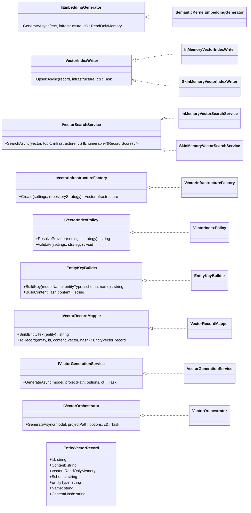
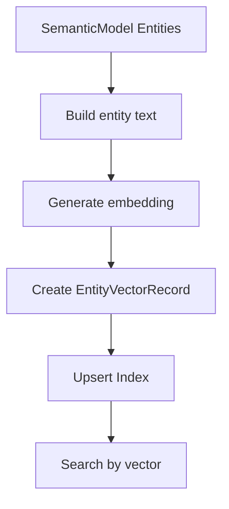

# Semantic Vectors Documentation

This document was created by GPT-5 in developer-flow-gpt-5 chat mode. It describes the SemanticVectors component that generates embeddings for semantic model entities, maps them to vector records, and indexes/searches them using pluggable providers.

## 1. Component Overview

### Purpose/Responsibility
- OVR-001: Provide an end-to-end pipeline to generate, persist, index, and search vector embeddings for semantic model entities (tables, views, stored procedures).
- OVR-002: Scope includes embedding generation, record mapping, index writing, in-memory search, provider policy, and orchestration. It excludes long-term storage engines, distributed indexing infrastructure, and UI/CLI concerns beyond service APIs.
- OVR-003: Context: integrates with Semantic Model and Project Settings, uses Semantic Kernel for embeddings, and writes to provider-specific vector indexes (in-memory now; Azure/Cosmos planned by policy/options).

## 2. Architecture

- ARC-001: Patterns used
  - Strategy: interchangeable implementations for embedding generation, index writing, and search services (interfaces + multiple concrete classes).
  - Factory: `IVectorInfrastructureFactory` creates provider-specific infrastructure metadata.
  - Policy: `IVectorIndexPolicy` encapsulates provider selection/validation rules.
  - Facade/Orchestrator: `VectorOrchestrator` fronts `VectorGenerationService` for a simple orchestration entry point.
  - Mapper: `IVectorRecordMapper` converts domain entities to vector records.
  - Builder: `IEntityKeyBuilder` constructs stable IDs and content hashes.
- ARC-002: Dependencies
  - Internal: Semantic Model (`GenAIDBExplorer.Core.Models.SemanticModel.*`), Project Settings (`GenAIDBExplorer.Core.Models.Project`), Repository DTO/Mappers/Security, Logging.
  - External: Microsoft.SemanticKernel, Microsoft.Extensions.AI, Microsoft.Extensions.VectorData, System.Numerics.Tensors.
- ARC-003: Interactions
  - Orchestrator selects entities from the Semantic Model, builds content, generates embeddings, writes envelopes (when applicable), and upserts index records; search services compute similarity from query vectors.
- ARC-004/005: Diagrams below show structure and flow.

### Component structure and dependencies diagram

```mermaid
flowchart LR
  subgraph App[GenAIDBExplorer.Core]
    O[VectorOrchestrator] --> GS[VectorGenerationService]
    GS --> IF[IVectorInfrastructureFactory]
    GS --> RM[IVectorRecordMapper]
    GS --> EG[IEmbeddingGenerator]
    GS --> KB[IEntityKeyBuilder]
    GS --> IW[IVectorIndexWriter]
    QS[IVectorSearchService]
  end

  subgraph External[External Dependencies]
    SK[Semantic Kernel\n(ISemanticKernelFactory, Embeddings)]
    VD[Microsoft.Extensions.VectorData]
    Tensors[System.Numerics.Tensors]
    Repo[SemanticModel Repository\n(LocalDisk/AzureBlob/Cosmos)]
  end

  EG --> SK
  IW --> VD
  QS --> VD
  QS --> Tensors
  GS --> Repo
```



## 3. Interface documentation

| Method/Property | Purpose | Parameters | Return Type | Usage Notes |
|---|---|---|---|---|
| IEmbeddingGenerator.GenerateAsync | Create embedding vector from text via configured SK embedding service | text:string, infrastructure:VectorInfrastructure, ct | ReadOnlyMemory<float> | Returns empty when no service registered or generation failed; logs scope includes ServiceId |
| IVectorIndexWriter.UpsertAsync | Upsert a vector record into provider-specific index | record:EntityVectorRecord, infrastructure, ct | Task | In-memory writers create collections if required (SK variant reflects methods) |
| IVectorSearchService.SearchAsync | Find nearest records by vector similarity | vector:ReadOnlyMemory<float>, topK:int, infrastructure, ct | IEnumerable<(EntityVectorRecord,double)> | In-memory: cosine similarity (Tensors); SK: provider search via VectorData |
| IVectorInfrastructureFactory.Create | Build infrastructure descriptor for provider/collection/service | settings:VectorIndexSettings, repositoryStrategy:string | VectorInfrastructure | Uses policy to resolve/validate provider |
| IVectorIndexPolicy.ResolveProvider | Decide provider for given settings/strategy | settings, repositoryStrategy | string | Auto maps Cosmos→CosmosNoSql, else InMemory by default |
| IVectorIndexPolicy.Validate | Validate provider/strategy compatibility | settings, repositoryStrategy | void | Throws InvalidOperationException if incompatible |
| IEntityKeyBuilder.BuildKey | Construct stable ID for entity | modelName, entityType, schema, name | string | Normalizes to lowercase, strips invalid chars, joined by ':' |
| IEntityKeyBuilder.BuildContentHash | Compute content hash | content | string | SHA-256 hex lowercase for change detection |
| IVectorRecordMapper.BuildEntityText | Build human-readable text content to embed | entity:SemanticModelEntity | string | Includes schema, name, description, and table columns if available |
| IVectorRecordMapper.ToRecord | Map entity and embedding to record | entity, id, content, vector, contentHash | EntityVectorRecord | Copies metadata into `VectorStoreData` fields |
| IVectorGenerationService.GenerateAsync | Generate embeddings for selected entities and write index | model, projectPath, options, ct | Task<int> | Returns number processed; supports DryRun and Overwrite |
| IVectorOrchestrator.GenerateAsync | Orchestrate generation via service | model, projectPath, options, ct | Task<int> | Thin logging facade |

## 4. Implementation details

- IMP-001: Main classes
  - SemanticKernelEmbeddingGenerator: resolves `IEmbeddingGenerator<string, Embedding<float>>` from the Semantic Kernel (optionally by ServiceId) and generates vectors for text.
  - InMemoryVectorIndexWriter / SkInMemoryVectorIndexWriter: upsert records into either a static `ConcurrentDictionary` store or SK `InMemoryVectorStore` collections.
  - InMemoryVectorSearchService / SkInMemoryVectorSearchService: similarity search using cosine similarity (Tensors) or SK VectorData search.
  - VectorInfrastructureFactory + VectorIndexPolicy: choose and validate provider given `VectorIndexSettings` and repository strategy.
  - EntityKeyBuilder: creates stable IDs and SHA-256 content hashes.
  - VectorRecordMapper: builds content text and materializes `EntityVectorRecord` with metadata.
  - VectorGenerationService: end-to-end generation, envelope persistence (LocalDisk/AzureBlob), and index upsert; returns processed count.
  - VectorOrchestrator: logs and delegates to generation service.
- IMP-002: Configuration and initialization
  - Options: `VectorIndexOptions` (Provider, CollectionName, PushOnGenerate, ProvisionIfMissing, AllowedForRepository, AzureAISearch, CosmosNoSql, EmbeddingServiceId, ExpectedDimensions, Hybrid).
  - Validation: `VectorOptionsValidator` enforces allowed providers and provider-specific required fields; positive ExpectedDimensions; hybrid sanity checks.
  - DI: services take dependencies via constructor injection; embedding uses `ISemanticKernelFactory.CreateSemanticKernel()`.
- IMP-003: Key algorithms and logic
  - Change detection: compute `contentHash` from built entity text; skip unchanged unless `Overwrite`.
  - Vector similarity: cosine similarity via `TensorPrimitives.CosineSimilarity` for in-memory search.
  - Envelope persistence: for LocalDisk/AzureBlob, writes embedding payload with metadata (model id, dimension, hash, timestamp, service id, version) via `ISecureJsonSerializer`.
  - Provider selection: Auto policy prefers CosmosNoSql when repository strategy is Cosmos, otherwise defaults to InMemory; compatibility checks throw early.
- IMP-004: Performance characteristics
  - In-memory index/search are O(n) scans; suitable for dev/test, not large-scale.
  - Embedding generation is the dominant cost; uses the configured embedding deployment via Semantic Kernel.
  - Vector dimensionality defaults to 3072 attribute on `EntityVectorRecord`; ensure runtime model matches to avoid provider schema mismatch.

## 5. Usage examples

### Basic: generate vectors for a project

```csharp
// Assuming DI container already configured with concrete implementations
// and ISemanticKernelFactory wired up.

IVectorOrchestrator orchestrator = host.Services.GetRequiredService<IVectorOrchestrator>();
var processed = await orchestrator.GenerateAsync(
    model: semanticModel,                 // GenAIDBExplorer.Core.Models.SemanticModel.SemanticModel
    projectPath: new DirectoryInfo(projectFolderPath),
    options: new VectorGenerationOptions {
        Overwrite = false,
        DryRun = false,
        SkipTables = false,
        SkipViews = true,
        SkipStoredProcedures = true
    },
    cancellationToken: CancellationToken.None);

Console.WriteLine($"Processed {processed} entities");
```

### Advanced: search by a query vector

```csharp
// 1) Generate a vector for your query text
var infra = infrastructureFactory.Create(projectSettings.VectorIndex, projectSettings.SemanticModel.PersistenceStrategy);
var queryVector = await embeddingGenerator.GenerateAsync("find product table", infra);

// 2) Execute vector search
var results = await vectorSearchService.SearchAsync(queryVector, topK: 5, infrastructure: infra);
foreach (var (record, score) in results)
{
    Console.WriteLine($"{score:F3} -> {record.Schema}.{record.Name} ({record.EntityType})");
}
```

### Configuration snippet (appsettings.json excerpt)

```json
{
  "VectorIndex": {
    "Provider": "Auto",
    "CollectionName": "genaide-entities",
    "EmbeddingServiceId": "Embeddings",
    "ExpectedDimensions": 3072,
    "Hybrid": { "Enabled": false }
  }
}
```

- USE-001: Prefer `VectorOrchestrator` from application code for simplicity.
- USE-002: Set `EmbeddingServiceId` to the registered SK embedding generator service ID.
- USE-003: For dev/test, use in-memory provider; for Cosmos or Azure Search, ensure provider-specific options are populated and validated.

## 6. Quality attributes

- QUA-001 Security
  - Input validation via argument guards; avoids null/empty inputs.
  - `ISecureJsonSerializer` used for envelope serialization; ensure secrets are not written to disk; logs avoid embedding content.
  - Content hashes avoid storing duplicate vectors; no keys are derived from sensitive data.
- QUA-002 Performance
  - In-memory search is linear; acceptable for small datasets; plan provider backends for scale.
  - Embedding generation is async and cancellable; consider batching for throughput when provider supports it.
- QUA-003 Reliability
  - Policy validation fails fast on incompatible configurations; generator logs and returns empty vectors if missing services.
  - Orchestrator tallies processed items; dry-run mode for safe previews.
- QUA-004 Maintainability
  - Clear interfaces, SRP-aligned classes, DI-friendly; provider-specific code isolated behind interfaces.
  - Options validated with `IValidateOptions<T>`; consistent logging scopes.
- QUA-005 Extensibility
  - Add new providers by implementing `IVectorIndexWriter`/`IVectorSearchService` and extending policy/factory.
  - Swap embedding implementations via `IEmbeddingGenerator` without touching orchestration.

## 7. Reference information

### Dependencies

| Package/Namespace | Purpose |
|---|---|
| Microsoft.SemanticKernel | Kernel, in-memory vector store, embeddings integration |
| Microsoft.Extensions.AI | Embedding generator abstractions and types |
| Microsoft.Extensions.VectorData | Vector store attributes and search abstractions |
| System.Numerics.Tensors | High-performance SIMD tensor ops (cosine similarity) |
| Microsoft.Extensions.Logging | Structured logging |

### VectorIndexOptions reference

| Option | Type | Default | Notes |
|---|---|---|---|
| Provider | string | Auto | Auto, InMemory, AzureAISearch, CosmosNoSql |
| CollectionName | string | genaide-entities | Index/collection name |
| PushOnGenerate | bool | true | Push to index during generation |
| ProvisionIfMissing | bool | false | Attempt index provisioning if supported |
| AllowedForRepository | string[] | [] | Restrict providers by repo strategy |
| AzureAISearch.Endpoint | string? | null | Required when Provider=AzureAISearch |
| AzureAISearch.IndexName | string? | null | Required when Provider=AzureAISearch |
| AzureAISearch.ApiKey | string? | null | Optional credential (prefer MI) |
| CosmosNoSql.AccountEndpoint | string? | null | Required when Provider=CosmosNoSql |
| CosmosNoSql.Database | string? | null | Required when Provider=CosmosNoSql |
| CosmosNoSql.Container | string? | null | Required when Provider=CosmosNoSql |
| EmbeddingServiceId | string | Embeddings | SK service ID to resolve embeddings |
| ExpectedDimensions | int? | null | Validate against model vector size |
| Hybrid.Enabled | bool | false | Hybrid search switch |
| Hybrid.TextWeight | double? | null | Weight if supported |
| Hybrid.VectorWeight | double? | null | Weight if supported |

### Testing guidelines and mocks

- Mock `IEmbeddingGenerator` to return fixed vectors for deterministic tests.
- Use `InMemoryVectorIndexWriter` and `InMemoryVectorSearchService` for unit tests; no external dependencies.
- Verify skip-on-unchanged via content hash by pre-writing an envelope and running with `Overwrite=false`.
- Validate options with `VectorOptionsValidator` unit tests for positive/negative cases.

### Troubleshooting

- "Provider must be one of ...": invalid `VectorIndexOptions.Provider` value; fix configuration.
- "Cosmos persistence requires CosmosNoSql vector provider": repository strategy is Cosmos but provider not CosmosNoSql.
- Embedding generation returned no result: SK embedding service not registered or misconfigured `EmbeddingServiceId`.
- Mismatched vector dimensions: ensure `ExpectedDimensions` and model output align with `EntityVectorRecord` vector attribute.

### Related links

- Semantic Kernel docs (embeddings, vector store)
- Microsoft.Extensions.AI and VectorData docs

## Visual



## Notes

- This document focuses on the SemanticVectors code under `GenAIDBExplorer.Core`. It intentionally does not duplicate other component docs.
