# Semantic Vectors Documentation

This document describes the SemanticVectors component set: a cohesive group of services that generate embeddings for semantic model entities, persist envelopes, and index/search vectors. Created by GPT-5 in developer-flow-gpt-5 chat mode. ✅

## 1. Component Overview

### Purpose/Responsibility

- OVR-001: Generate vector embeddings for semantic model entities (tables, views, stored procedures) and upsert them into a vector index.
- OVR-002: Provide in-memory and Semantic Kernel-backed indexing/search for development and tests; future providers selected by policy.
- OVR-003: Orchestrate generation with options (overwrite, dry-run, filters) and persist envelopes to disk/blob when applicable.

### Scope

- Included: embedding generation, key building, content mapping, vector indexing/search (in-memory/SK in-memory), provider policy, options validation, orchestration.
- Excluded: external managed vector stores (Azure AI Search, Cosmos NoSQL) beyond interfaces/policy scaffolding; database schema extraction; CLI wiring.

### System Context

- Inputs: SemanticModel (domain), ProjectSettings (configuration), projectPath (workspace), VectorGenerationOptions.
- Outputs: JSON envelopes persisted for LocalDisk/AzureBlob strategies; vector index upserts for search; logs for observability.

## 2. Architecture

### Patterns Used

- Factory: VectorInfrastructureFactory creates minimal provider-specific infrastructure.
- Policy: VectorIndexPolicy resolves provider and validates compatibility.
- Strategy/Adapter: IVectorIndexWriter and IVectorSearchService with InMemory/SK implementations. Embedding generation via IEmbeddingGenerator with SemanticKernelEmbeddingGenerator.
- Orchestrator: VectorOrchestrator delegates to VectorGenerationService.
- Mapper: VectorRecordMapper turns domain entities into vector records/content strings.
- Builder: EntityKeyBuilder for stable IDs and content hashes.

### Dependencies

- Microsoft.SemanticKernel and Microsoft.Extensions.AI (embeddings, InMemoryVectorStore).
- Microsoft.Extensions.VectorData (vector store attributes and APIs).
- System.Numerics.Tensors (cosine similarity).
- Microsoft.Extensions.Logging (structured logging).
- Core domain: SemanticModel, ProjectSettings, repository mappers/serialization.

### Interactions and Flow

- Orchestrator → GenerationService.
- GenerationService → InfrastructureFactory, RecordMapper, EmbeddingGenerator, KeyBuilder, IndexWriter, SecureJsonSerializer.
- Index/Search implementations depend on provider (InMemory or SK InMemory) resolved via policy/infrastructure.

### Component Structure and Dependencies Diagram

```mermaid
classDiagram
  class IVectorOrchestrator{+GenerateAsync(model, path, options, ct): Task<int>}
  class IVectorGenerationService{+GenerateAsync(model, path, options, ct): Task<int>}
  class IVectorInfrastructureFactory{+Create(settings, repositoryStrategy): VectorInfrastructure}
  class IEmbeddingGenerator{+GenerateAsync(text, infra, ct): Task~ReadOnlyMemory<float>~}
  class IVectorIndexWriter{+UpsertAsync(record, infra, ct): Task}
  class IVectorSearchService{+SearchAsync(vector, topK, infra, ct): Task~IEnumerable<(Record,Score)>~}
  class IVectorRecordMapper{+BuildEntityText(entity): string +ToRecord(...): EntityVectorRecord}
  class IEntityKeyBuilder{+BuildKey(model, type, schema, name): string +BuildContentHash(content): string}
  class EntityVectorRecord

  IVectorOrchestrator <|.. VectorOrchestrator
  IVectorGenerationService <|.. VectorGenerationService
  IVectorInfrastructureFactory <|.. VectorInfrastructureFactory
  IEmbeddingGenerator <|.. SemanticKernelEmbeddingGenerator
  IVectorIndexWriter <|.. InMemoryVectorIndexWriter
  IVectorIndexWriter <|.. SkInMemoryVectorIndexWriter
  IVectorSearchService <|.. InMemoryVectorSearchService
  IVectorSearchService <|.. SkInMemoryVectorSearchService
  IVectorRecordMapper <|.. VectorRecordMapper
  IEntityKeyBuilder <|.. EntityKeyBuilder
```




## 3. Interface Documentation

| Interface | Method/Property | Purpose | Parameters | Return Type | Usage Notes |
|---|---|---|---|---|---|
| IVectorOrchestrator | GenerateAsync | Entry point for vector generation orchestration | SemanticModel model, DirectoryInfo projectPath, VectorGenerationOptions options, CancellationToken ct | `Task<int>` | Logs and delegates to GenerationService |
| IVectorGenerationService | GenerateAsync | Core generation loop over entities | Same as above | `Task<int>` | Applies filters, dry-run/overwrite, persistence, indexing |
| IVectorInfrastructureFactory | Create | Build minimal infrastructure descriptor | VectorIndexSettings settings, string repositoryStrategy | VectorInfrastructure | Uses VectorIndexPolicy to resolve/validate |
| IEmbeddingGenerator | GenerateAsync | Produce embedding for text | string text, VectorInfrastructure infra, CancellationToken ct | `Task<ReadOnlyMemory<float>>` | Uses Semantic Kernel service id from infra |
| IVectorIndexWriter | UpsertAsync | Insert or update vector record | EntityVectorRecord record, VectorInfrastructure infra, CancellationToken ct | Task | InMemory or SK InMemory writers |
| IVectorSearchService | SearchAsync | Vector similarity search | `ReadOnlyMemory<float>` vector, int topK, VectorInfrastructure infra, CancellationToken ct | `Task<IEnumerable<(EntityVectorRecord,double)>>` | Cosine similarity (in-memory) or SK search |
| IVectorRecordMapper | BuildEntityText | Build content string from entity | SemanticModelEntity entity | string | Includes schema, name, description, columns |
| IVectorRecordMapper | ToRecord | Map entity and vector to record | entity, id, content, vector, contentHash | EntityVectorRecord | Populates metadata fields |
| IEntityKeyBuilder | BuildKey | Stable ID for entity record | modelName, entityType, schema, name | string | Normalized parts joined with ':' |
| IEntityKeyBuilder | BuildContentHash | SHA-256 content hash | content | string | Lowercase hex SHA-256 |

## 4. Implementation Details

### Key Classes and Responsibilities

- VectorOrchestrator: thin facade over GenerationService with logging.
- VectorGenerationService: end-to-end pipeline:
  - Select and filter entities from SemanticModel.
  - Build content (VectorRecordMapper) and content hash (EntityKeyBuilder).
  - Skip unchanged when Overwrite=false and content hash matches envelope.
  - Generate embeddings (IEmbeddingGenerator) using infra.EmbeddingServiceId.
  - Persist JSON envelope (LocalDisk/AzureBlob strategies) via ISecureJsonSerializer and LocalBlobEntityMapper.
  - Upsert vector record (IVectorIndexWriter) into provider-specific index.
- SemanticKernelEmbeddingGenerator: resolves `IEmbeddingGenerator<string, Embedding<float>>` from Kernel by service id; returns first result vector; warns when missing.
- InMemoryVectorIndexWriter: process-wide static `ConcurrentDictionary<string, ConcurrentDictionary<string, EntityVectorRecord>>` by collection; simple upsert.
- SkInMemoryVectorIndexWriter: uses SK InMemoryVectorStore; ensures collection exists via reflection across potential method shapes; uses UpsertAsync.
- InMemoryVectorSearchService: cosine similarity via `TensorPrimitives.CosineSimilarity` and top-K ordering.
- SkInMemoryVectorSearchService: uses `IVectorSearchable.SearchAsync` on SK collection; ensures collection exists.
- VectorIndexPolicy: resolves provider (Auto→CosmosNoSql when repo=Cosmos, else InMemory); validates constraints and AllowedForRepository.
- VectorOptionsValidator: startup validation for VectorIndexOptions.

### Configuration & Initialization

- VectorIndexOptions (ProjectSettings.VectorIndex):
  - Provider: Auto | InMemory | AzureAISearch | CosmosNoSql (Auto by default).
  - CollectionName: default "genaide-entities".
  - EmbeddingServiceId: Semantic Kernel service id (default "Embeddings").
  - PushOnGenerate, ProvisionIfMissing, AllowedForRepository, Hybrid (weights), and provider-specific blocks.
- InfrastructureFactory uses VectorIndexPolicy + VectorIndexSettings to produce VectorInfrastructure { Provider, CollectionName, EmbeddingServiceId, Settings }.

### Algorithms & Notes

- Similarity: cosine similarity for in-memory search; deterministic ordering by score.
- Content hashing: SHA-256 over mapped content string; used to skip unchanged envelopes.
- Dimension: EntityVectorRecord is annotated with [VectorStoreVector(3072)] to match SK InMemory expectations; ensure embedding model dimension compatibility.
- Collection creation: SK-based writer/searcher attempt multiple CreateCollection* shapes via reflection to support version variance.

### Performance Characteristics

- In-memory indexing/search is O(N) for scan with cosine similarity; adequate for local dev/test data sizes.
- Embedding generation latency dominated by model call; use async and cancellation tokens.
- JSON persistence uses indented serializer; disk I/O proportional to number of entities.

## 5. Usage Examples

### Basic Generation via Orchestrator

```csharp
// Resolve from DI
var orchestrator = serviceProvider.GetRequiredService<GenAIDBExplorer.Core.SemanticVectors.Orchestration.IVectorOrchestrator>();

// Given: model (SemanticModel), projectPath, and options
var options = new GenAIDBExplorer.Core.SemanticVectors.Orchestration.VectorGenerationOptions
{
    Overwrite = false,
    DryRun = false,
    SkipTables = false,
    SkipViews = true,
    SkipStoredProcedures = true
};

var processed = await orchestrator.GenerateAsync(model, new DirectoryInfo(projectPath), options, cancellationToken);
```

### Direct Embedding + Index/Search (In-Memory)

```csharp
var infraFactory = serviceProvider.GetRequiredService<GenAIDBExplorer.Core.SemanticVectors.Infrastructure.IVectorInfrastructureFactory>();
var keyBuilder = serviceProvider.GetRequiredService<GenAIDBExplorer.Core.SemanticVectors.Keys.IEntityKeyBuilder>();
var mapper = serviceProvider.GetRequiredService<GenAIDBExplorer.Core.SemanticVectors.Mapping.IVectorRecordMapper>();
var embedder = serviceProvider.GetRequiredService<GenAIDBExplorer.Core.SemanticVectors.Embeddings.IEmbeddingGenerator>();
var writer = serviceProvider.GetRequiredService<GenAIDBExplorer.Core.SemanticVectors.Indexing.IVectorIndexWriter>();
var search = serviceProvider.GetRequiredService<GenAIDBExplorer.Core.SemanticVectors.Search.IVectorSearchService>();

var settings = projectSettings.VectorIndex; // VectorIndexSettings
var infra = infraFactory.Create(settings, projectSettings.SemanticModel.PersistenceStrategy);

var content = mapper.BuildEntityText(entity);
var vector = await embedder.GenerateAsync(content, infra, cancellationToken);
var id = keyBuilder.BuildKey(model.Name, entity.GetType().Name, entity.Schema, entity.Name);
var hash = keyBuilder.BuildContentHash(content);

var record = mapper.ToRecord(entity, id, content, vector, hash);
await writer.UpsertAsync(record, infra, cancellationToken);

var results = await search.SearchAsync(vector, topK: 5, infra, cancellationToken);
```

### Best Practices

- Register Semantic Kernel embedding services with the expected service id (EmbeddingServiceId) and ensure model dimension matches the vector attribute.
- Use Overwrite=false to skip unchanged entities via content hash.
- Prefer orchestrator for end-to-end generation; use DI and logging scopes for observability.

## 6. Quality Attributes

- Security: no secrets logged; serialization is via ISecureJsonSerializer; inputs validated; repository strategy considered for compatibility.
- Performance: async I/O, in-memory store for dev speed; cosine similarity scan is linear.
- Reliability: skip unchanged logic reduces unnecessary work; graceful handling when embedding service missing (warning + empty vector).
- Maintainability: SOLID interfaces, clear responsibilities, small focused classes; provider-specific code isolated.
- Extensibility: add new writers/searchers/providers by implementing interfaces and updating policy/factory.

## 7. Reference Information

### Dependencies Used

- Microsoft.SemanticKernel (Kernel, InMemoryVectorStore, embeddings API)
- Microsoft.Extensions.AI (embedding generator abstractions)
- Microsoft.Extensions.VectorData (vector store attributes/APIs)
- System.Numerics.Tensors (similarity)
- Microsoft.Extensions.Logging

### Configuration Options (VectorIndexOptions)

| Option | Type | Default | Purpose |
|---|---|---|---|
| Provider | string | Auto | Vector provider: Auto, InMemory, AzureAISearch, CosmosNoSql |
| CollectionName | string | genaide-entities | Collection/index name |
| PushOnGenerate | bool | true | Push to external index during generation (if supported) |
| ProvisionIfMissing | bool | false | Provision index if missing (provider-dependent) |
| AllowedForRepository | string[] | [] | Restrict providers per repository strategy |
| EmbeddingServiceId | string | Embeddings | Semantic Kernel embedding service id |
| ExpectedDimensions | int? | null | Validate embedding dimensionality |
| AzureAISearch.Endpoint | string? | null | AI Search endpoint |
| AzureAISearch.IndexName | string? | null | AI Search index name |
| AzureAISearch.ApiKey | string? | null | API key if not MSI |
| CosmosNoSql.AccountEndpoint | string? | null | Cosmos endpoint |
| CosmosNoSql.Database | string? | null | Cosmos database |
| CosmosNoSql.Container | string? | null | Cosmos container |
| Hybrid.Enabled | bool | false | Enable hybrid search |
| Hybrid.TextWeight | double? | null | Hybrid text weight |
| Hybrid.VectorWeight | double? | null | Hybrid vector weight |

### Testing Guidelines

- Use InMemoryVectorIndexWriter and InMemoryVectorSearchService for deterministic unit tests.
- Mock IEmbeddingGenerator to return fixed vectors; verify UpsertAsync and SearchAsync interactions.
- Validate VectorOptions via VectorOptionsValidator; assert failures for invalid providers or missing fields.

### Troubleshooting

- Empty embeddings: ensure Semantic Kernel embedding service is registered under EmbeddingServiceId; check logs for warnings.
- Dimension mismatch: [VectorStoreVector(3072)] suggests using a 3072-d model; align model choice or attribute.
- Provider selection: Auto with repositoryStrategy=Cosmos forces CosmosNoSql; adjust settings or strategy.
- Collection creation (SK): reflection attempts multiple CreateCollection* signatures to handle version differences; ensure SK version compatibility.

### Related Links

- Project settings and repository strategies: see overall project docs and configuration guidance in this repo.

### Change History

- 2025-08-10: Initial version authored by GPT-5 (developer-flow-gpt-5).
