The SemanticVectors component provides a comprehensive vector embedding and indexing system for semantic database exploration. It generates, stores, and searches vector embeddings of database schema entities (tables, views, stored procedures) to enable natural language querying capabilities.

## 1. Component Overview

### Purpose/Responsibility

- **OVR-001**: Generate vector embeddings for database schema entities using AI embedding models
- **OVR-002**: Provide unified vector indexing abstraction supporting multiple providers (InMemory, Azure AI Search, Cosmos NoSQL)
- **OVR-003**: Enable semantic search capabilities across database schema metadata through vector similarity matching

### Scope

- **Included**: Vector generation, embedding creation, multi-provider indexing, semantic search, content hashing, record mapping
- **Excluded**: Database schema extraction, AI model training, semantic model management, natural language query parsing

### System Context

The SemanticVectors component operates within the GenAI Database Explorer ecosystem, integrating with:

- **Semantic Model Providers**: Consumes enriched database schema entities
- **Semantic Kernel Factory**: Leverages AI embedding services for vector generation
- **Repository Layer**: Persists vector data and metadata across multiple storage strategies
- **Query Processing**: Provides semantic search capabilities for natural language queries

## 2. Architecture Section

### Design Patterns

- **ARC-001**: **Factory Pattern** - `VectorInfrastructureFactory` creates provider-specific infrastructure configurations
- **ARC-002**: **Strategy Pattern** - Multiple vector index writers and search services for different providers
- **ARC-003**: **Repository Pattern** - Abstracted persistence layer with multiple storage backends
- **ARC-004**: **Orchestrator Pattern** - `VectorOrchestrator` coordinates complex multi-step vector generation workflows
- **ARC-005**: **Builder Pattern** - `EntityKeyBuilder` constructs standardized entity identifiers and content hashes

### Component Dependencies

- **Internal**: SemanticKernel Factory, Repository Performance Monitoring, Project Settings, Secure JSON Serialization
- **External**: Microsoft.SemanticKernel, Microsoft.Extensions.VectorData, Microsoft.Extensions.AI, System.Text.Json
- **Azure**: Azure AI Search SDK, Azure Cosmos DB SDK (optional providers)

### Component Interactions

- **Inbound**: Receives semantic model entities from enrichment pipeline
- **Outbound**: Generates embeddings via Semantic Kernel, persists vectors to configured indices
- **Orchestration**: Coordinates batch processing with configurable filtering and update strategies

### Component Structure and Dependencies Diagram

```mermaid
graph TB
    subgraph "SemanticVectors Component"
        subgraph "Orchestration Layer"
            VO[VectorOrchestrator]
            VGS[VectorGenerationService]
            VGO[VectorGenerationOptions]
        end
        
        subgraph "Infrastructure Layer" 
            VIF[VectorInfrastructureFactory]
            VI[VectorInfrastructure]
            VIP[VectorIndexPolicy]
        end
        
        subgraph "Embedding Layer"
            EG[IEmbeddingGenerator]
            SKEG[SemanticKernelEmbeddingGenerator]
        end
        
        subgraph "Indexing Layer"
            IVW[IVectorIndexWriter]
            IMVIW[InMemoryVectorIndexWriter]
            SKVIW[SkInMemoryVectorIndexWriter]
        end
        
        subgraph "Search Layer"
            IVSS[IVectorSearchService]
            IMVSS[InMemoryVectorSearchService]
            SKVSS[SkInMemoryVectorSearchService]
        end
        
        subgraph "Data Layer"
            EVR[EntityVectorRecord]
            VRM[VectorRecordMapper]
            EKB[EntityKeyBuilder]
        end
        
        subgraph "Configuration"
            VIO[VectorIndexOptions]
            VOV[VectorOptionsValidator]
        end
    end
    
    subgraph "External Dependencies"
        SKF[SemanticKernelFactory]
        PS[ProjectSettings]
        SM[SemanticModel]
        REPO[ISemanticModelRepository]
        PM[PerformanceMonitor]
        LOGGER[ILogger]
    end
    
    subgraph "Vector Providers"
        MEMORY[In-Memory Store]
        AISEARCH[Azure AI Search]
        COSMOS[Cosmos NoSQL]
    end
    
    %% Orchestration flows
    VO --> VGS
    VGS --> VIF
    VGS --> VRM
    VGS --> EG
    VGS --> EKB
    VGS --> IVW
    
    %% Infrastructure flows
    VIF --> VI
    VIF --> VIP
    VI --> VIO
    
    %% Embedding flows
    EG --> SKEG
    SKEG --> SKF
    
    %% Indexing flows
    IVW --> IMVIW
    IVW --> SKVIW
    
    %% Search flows
    IVSS --> IMVSS
    IVSS --> SKVSS
    
    %% Data mapping flows
    VRM --> EVR
    EKB --> EVR
    
    %% External integrations
    VGS --> SM
    VGS --> PS
    VGS --> PM
    VGS --> LOGGER
    SKEG --> SKF
    
    %% Provider connections
    IMVIW --> MEMORY
    SKVIW --> MEMORY
    IMVSS --> MEMORY
    SKVSS --> MEMORY
    
    %% Configuration validation
    VOV --> VIO
    
    classDef orchestration fill:#e1f5fe
    classDef infrastructure fill:#f3e5f5
    classDef embedding fill:#e8f5e8
    classDef indexing fill:#fff3e0
    classDef search fill:#fce4ec
    classDef data fill:#f1f8e9
    classDef config fill:#fff8e1
    classDef external fill:#f5f5f5
    classDef provider fill:#e3f2fd
    
    class VO,VGS,VGO orchestration
    class VIF,VI,VIP infrastructure
    class EG,SKEG embedding
    class IVW,IMVIW,SKVIW indexing
    class IVSS,IMVSS,SKVSS search
    class EVR,VRM,EKB data
    class VIO,VOV config
    class SKF,PS,SM,REPO,PM,LOGGER external
    class MEMORY,AISEARCH,COSMOS provider
```



## 3. Interface Documentation

### Core Interfaces

| Interface | Purpose | Key Methods | Usage Pattern |
|-----------|---------|-------------|---------------|
| `IEmbeddingGenerator` | Generate vector embeddings from text | `GenerateAsync(text, infrastructure)` | Inject via DI, call with entity content |
| `IVectorIndexWriter` | Write vectors to provider-specific indices | `UpsertAsync(record, infrastructure)` | Provider-agnostic vector persistence |
| `IVectorSearchService` | Search vectors by similarity | `SearchAsync(vector, topK, infrastructure)` | Semantic search implementation |
| `IVectorOrchestrator` | Coordinate vector generation workflows | `GenerateAsync(model, projectPath, options)` | High-level batch processing |
| `IVectorInfrastructureFactory` | Create provider configurations | `Create(settings, repositoryStrategy)` | Abstract provider selection |
| `IVectorRecordMapper` | Map entities to vector records | `BuildEntityText(entity)`, `ToRecord(...)` | Entity serialization for embeddings |
| `IEntityKeyBuilder` | Generate entity identifiers and hashes | `BuildKey(...)`, `BuildContentHash(content)` | Consistent entity identification |

### Method Reference

| Method/Property | Purpose | Parameters | Return Type | Usage Notes |
|-----------------|---------|------------|-------------|-------------|
| `IEmbeddingGenerator.GenerateAsync` | Generate vector embedding | `text: string`, `infrastructure: VectorInfrastructure`, `cancellationToken` | `Task<ReadOnlyMemory<float>>` | Returns empty memory on failure |
| `IVectorIndexWriter.UpsertAsync` | Insert or update vector record | `record: EntityVectorRecord`, `infrastructure: VectorInfrastructure`, `cancellationToken` | `Task` | Idempotent operation |
| `IVectorSearchService.SearchAsync` | Find similar vectors | `vector: ReadOnlyMemory<float>`, `topK: int`, `infrastructure: VectorInfrastructure`, `cancellationToken` | `Task<IEnumerable<(EntityVectorRecord, double)>>` | Returns scored results |
| `VectorOrchestrator.GenerateAsync` | Process semantic model | `model: SemanticModel`, `projectPath: DirectoryInfo`, `options: VectorGenerationOptions`, `cancellationToken` | `Task<int>` | Returns count of processed entities |
| `EntityKeyBuilder.BuildKey` | Create entity identifier | `modelName: string`, `entityType: string`, `schema: string`, `name: string` | `string` | Format: "model:type:schema:name" (normalized) |
| `EntityKeyBuilder.BuildContentHash` | Generate content hash | `content: string` | `string` | SHA-256 hash in lowercase hex |

## 4. Implementation Details

### Core Implementation Classes

- **IMP-001**: **SemanticKernelEmbeddingGenerator** - Integrates with Semantic Kernel for AI-powered embedding generation using Microsoft.Extensions.AI patterns
- **IMP-002**: **VectorGenerationService** - Orchestrates end-to-end vector processing with content change detection, parallel processing, and robust error handling
- **IMP-003**: **InMemoryVectorIndexWriter** - Provides fast, concurrent in-memory vector storage using `ConcurrentDictionary` for development and testing
- **IMP-004**: **VectorInfrastructureFactory** - Resolves provider configurations based on repository strategy and project settings

### Configuration Requirements

The component requires configuration in `ProjectSettings.VectorIndex`:

```json
{
  "VectorIndex": {
    "Provider": "Auto|InMemory|AzureAISearch|CosmosNoSql",
    "CollectionName": "genaide-entities",
    "EmbeddingServiceId": "Embeddings",
    "PushOnGenerate": true,
    "ProvisionIfMissing": false,
    "ExpectedDimensions": 3072,
    "AllowedForRepository": ["LocalDisk", "AzureBlob", "Cosmos"]
  }
}
```

### Key Algorithms

- **Content Change Detection**: Uses SHA-256 content hashing with multi-level JSON parsing fallbacks to detect entity changes and avoid unnecessary reprocessing
- **Batch Processing**: Processes entities in parallel with configurable filtering (tables, views, stored procedures) and selective object targeting
- **Provider Selection**: Implements "Auto" provider resolution based on repository strategy with policy-based validation

### Performance Characteristics

- **IMP-004**: Embedding generation is I/O bound on AI service calls; supports batching for efficiency
- **Bottlenecks**: Network latency to embedding services, JSON serialization/deserialization for large entities
- **Scalability**: Horizontal scaling limited by AI service rate limits; vertical scaling benefits from increased memory for large semantic models

## 5. Usage Examples

### Basic Usage

```csharp
// Configure services in DI container
services.AddScoped<IVectorOrchestrator, VectorOrchestrator>();
services.AddScoped<IEmbeddingGenerator, SemanticKernelEmbeddingGenerator>();

// Generate vectors for semantic model
var orchestrator = serviceProvider.GetRequiredService<IVectorOrchestrator>();
var options = new VectorGenerationOptions
{
    SkipTables = false,
    SkipViews = true,
    SkipStoredProcedures = true,
    Overwrite = false
};

var processedCount = await orchestrator.GenerateAsync(semanticModel, projectPath, options);
```

### Advanced Configuration

```csharp
// Provider-specific configuration
var vectorOptions = new VectorIndexOptions
{
    Provider = "AzureAISearch",
    CollectionName = "custom-entities",
    EmbeddingServiceId = "text-embedding-3-large",
    ExpectedDimensions = 3072,
    AzureAISearch = new()
    {
        Endpoint = "https://mysearch.search.windows.net",
        IndexName = "semantic-entities"
    }
};

// Selective processing
var targetOptions = new VectorGenerationOptions
{
    ObjectType = "table",
    SchemaName = "dbo", 
    ObjectName = "Users",
    Overwrite = true,
    DryRun = false
};
```

### Search Implementation

```csharp
// Search for similar entities
var searchService = serviceProvider.GetRequiredService<IVectorSearchService>();
var embeddingGenerator = serviceProvider.GetRequiredService<IEmbeddingGenerator>();

var queryText = "user authentication table";
var queryVector = await embeddingGenerator.GenerateAsync(queryText, infrastructure);
var results = await searchService.SearchAsync(queryVector, topK: 5, infrastructure);

foreach (var (record, score) in results)
{
    Console.WriteLine($"Found: {record.Schema}.{record.Name} (Score: {score:F3})");
}
```

## 6. Quality Attributes

### Security (QUA-001)

- **Input Validation**: All user inputs validated with `ArgumentNullException` and `ArgumentException` checks
- **Content Sanitization**: Entity content sanitized before embedding generation to prevent injection attacks
- **Secure Serialization**: Uses `ISecureJsonSerializer` for all JSON operations with controlled deserialization
- **Access Control**: Provider configurations support Azure Managed Identity and secure connection strings

### Performance (QUA-002)

- **Characteristics**: Embedding generation typically 100-500ms per entity; indexing operations sub-millisecond for in-memory
- **Scalability**: Supports parallel processing of entities; limited by AI service rate limits (typically 1000-10000 requests/minute)
- **Resource Usage**: Memory usage scales with vector dimensions (3072 floats = ~12KB per vector) and entity count
- **Optimization**: Content change detection prevents unnecessary reprocessing; configurable batch sizes

### Reliability (QUA-003)

- **Error Handling**: Graceful degradation on embedding failures; comprehensive logging with structured data
- **Fault Tolerance**: Retry logic for transient failures; robust file I/O with sharing violation handling
- **Recovery**: Supports incremental processing and resume capabilities through content hash tracking
- **Monitoring**: Integrated performance monitoring with success/failure metrics and timing data

### Maintainability (QUA-004)

- **Standards**: Follows .NET 9 conventions, SOLID principles, and dependency injection patterns
- **Testing**: Comprehensive unit test coverage with MSTest, FluentAssertions, and Moq
- **Documentation**: Extensive XML documentation, architectural decision records, and usage examples
- **Extensibility**: Plugin architecture for new vector providers; interface-based design for testability

### Extensibility (QUA-005)

- **Extension Points**: New vector providers via `IVectorIndexWriter` and `IVectorSearchService` implementations
- **Customization**: Configurable embedding models, vector dimensions, and provider-specific options
- **Integration**: Seamless integration with additional AI embedding services through Semantic Kernel
- **Evolution**: Version-aware persistence format supports schema migration and backward compatibility

## 7. Reference Information

### Dependencies

| Dependency | Version | Purpose |
|------------|---------|---------|
| Microsoft.SemanticKernel | Latest | AI orchestration and embedding generation |
| Microsoft.Extensions.VectorData | Latest | Vector storage abstractions and data models |
| Microsoft.Extensions.AI | Latest | Standardized AI service interfaces |
| System.Text.Json | .NET 9 | High-performance JSON serialization |
| Microsoft.Extensions.Logging | .NET 9 | Structured logging and diagnostics |
| Microsoft.Extensions.DependencyInjection | .NET 9 | Service registration and resolution |

### Configuration Reference

```csharp
public sealed class VectorIndexOptions
{
    public string Provider { get; init; } = "Auto"; // Auto|InMemory|AzureAISearch|CosmosNoSql
    public string CollectionName { get; init; } = "genaide-entities";
    public string EmbeddingServiceId { get; init; } = "Embeddings";
    public bool PushOnGenerate { get; init; } = true;
    public bool ProvisionIfMissing { get; init; } = false;
    public int? ExpectedDimensions { get; init; } = 3072;
    public string[] AllowedForRepository { get; init; } = [];
    public AzureAISearchOptions AzureAISearch { get; init; } = new();
    public CosmosNoSqlOptions CosmosNoSql { get; init; } = new();
    public HybridSearchOptions Hybrid { get; init; } = new();
}
```

### Testing Guidelines

```csharp
[TestMethod]
public async Task EmbeddingGenerator_Should_ReturnValidVector_When_ProvidedValidText()
{
    // Arrange
    var mockFactory = new Mock<ISemanticKernelFactory>();
    var mockKernel = new Mock<Kernel>();
    var mockEmbeddingService = new Mock<IEmbeddingGenerator<string, Embedding<float>>>();
    
    mockFactory.Setup(f => f.CreateSemanticKernel()).Returns(mockKernel.Object);
    mockKernel.Setup(k => k.GetRequiredService<IEmbeddingGenerator<string, Embedding<float>>>())
              .Returns(mockEmbeddingService.Object);
    
    var expectedVector = new ReadOnlyMemory<float>(new float[] { 0.1f, 0.2f, 0.3f });
    mockEmbeddingService.Setup(s => s.GenerateAsync(It.IsAny<string[]>(), null, default))
                       .ReturnsAsync([new Embedding<float>(expectedVector)]);
    
    var generator = new SemanticKernelEmbeddingGenerator(mockFactory.Object, Mock.Of<ILogger<SemanticKernelEmbeddingGenerator>>(), Mock.Of<IPerformanceMonitor>());
    var infrastructure = new VectorInfrastructure("InMemory", "test", "embeddings", new VectorIndexSettings());
    
    // Act
    var result = await generator.GenerateAsync("test content", infrastructure);
    
    // Assert
    result.Should().NotBeEmpty();
    result.Length.Should().Be(3);
}
```

### Troubleshooting

**Common Issues:**

- **Empty Vector Results**: Check embedding service configuration and API key validity
- **Provider Resolution Errors**: Validate VectorIndexOptions.Provider and AllowedForRepository settings
- **Performance Issues**: Monitor AI service rate limits and consider batch size optimization
- **Content Hash Mismatches**: Verify JSON serialization consistency across different environments

**Error Messages:**

- `"No embedding generator service was found in the kernel"` - Missing Semantic Kernel service registration
- `"Text must be provided"` - Null or empty input to embedding generation
- `"Embedding generation returned empty vector"` - AI service failure or rate limiting

### Related Documentation

- **REF-005**: [Semantic Model Project Structure](../technical/SEMANTIC_MODEL_PROJECT_STRUCTURE.md)
- [Vector Embeddings and Indexing Specification](../../spec/spec-data-vector-embeddings-and-indexing.md)
- [Semantic Model Repository Documentation](semantic-model-repository.md)
- [Installation Guide](../../docs/INSTALLATION.md)
- [CLI Reference](../../docs/cli/README.md)

### Change History

#### Version 1.0 (2025-08-11)

- **REF-006**: Initial implementation with InMemory provider support
- Multi-provider architecture with Azure AI Search and Cosmos NoSQL foundation
- Semantic Kernel integration with Microsoft.Extensions.AI patterns
- Content change detection and incremental processing capabilities
- Comprehensive configuration and validation framework
