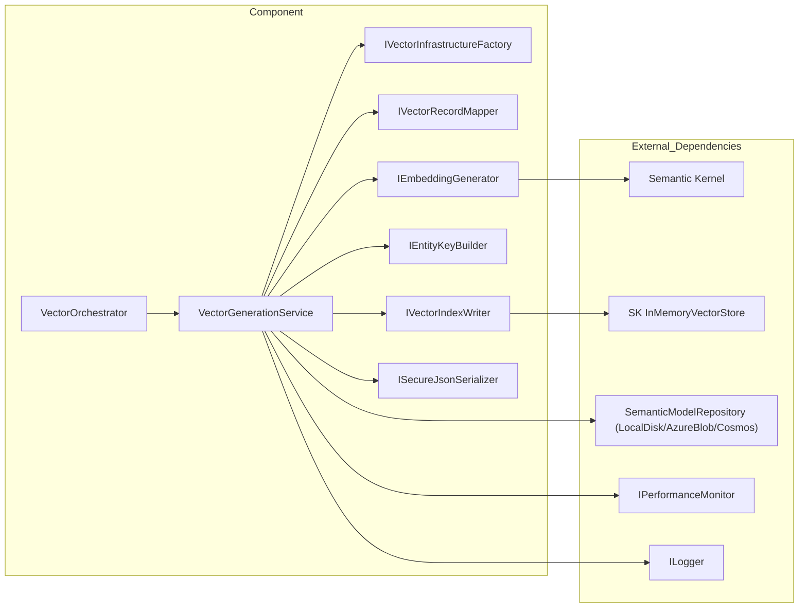
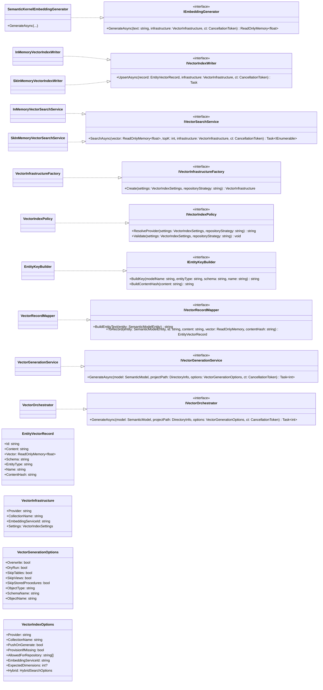

## Semantic Vectors Documentation

Vector Embeddings, Indexing, and Search support for semantic model entities. Provides generation, persistence, and querying of vector representations using provider-agnostic interfaces and pluggable infrastructure.

## 1. Component Overview

### Purpose/Responsibility

- OVR-001: Generate embeddings for semantic model entities and upsert them into a vector index.
- OVR-002: Provide unified APIs to map entities to vector records and to search vectors by similarity.
- OVR-003: Select and configure vector infrastructure based on project settings and repository strategy.

Scope

- Included: Embedding generation (via Semantic Kernel), in-memory index writers/search, infrastructure factory, key building, mapping, orchestration service, options/validation, policy for provider selection.
- Excluded: External managed vector stores beyond SK InMemory (future: Azure AI Search, Cosmos DB), end-user CLI wiring, UI concerns.

System context

- Consumes SemanticModel (tables, views, stored procedures) and ProjectSettings.
- Produces persisted envelopes for local/blob repositories and upserts vector records into the configured index provider.

## 2. Architecture

- ARC-001 Patterns: Strategy (embedding/index/search implementations), Factory (VectorInfrastructureFactory), Policy (VectorIndexPolicy), Orchestrator (VectorOrchestrator), Mapper, Key Builder, Options + Validation, Repository-like writer abstraction.
- ARC-002 Dependencies: Microsoft.SemanticKernel, Microsoft.Extensions.AI, Microsoft.SemanticKernel.Connectors.InMemory, Microsoft.Extensions.VectorData, logging (ILogger), performance monitor (IPerformanceMonitor), secure JSON serialization.
- ARC-003 Interactions: Orchestrator -> GenerationService -> Infrastructure/Mapper/Embedding/KeyBuilder/IndexWriter (+ optional persistence).
- ARC-004 Diagrams: Flow of responsibilities and type relationships below.
- ARC-005 Mermaid diagrams (flowchart and class diagram) provided separately for correctness.

### Component structure and dependencies (flow)



### Type relationships (class diagram)



## 3. Interface Documentation

Key public interfaces and methods.

| Method/Property | Purpose | Parameters | Return Type | Usage Notes |
|---|---|---|---|---|
| IEmbeddingGenerator.GenerateAsync | Create embedding vector for text | `text: string`; `infrastructure: VectorInfrastructure`; `ct` | `ReadOnlyMemory<float>` | Uses Semantic Kernel registered IEmbeddingGenerator; returns empty when service missing |
| IVectorIndexWriter.UpsertAsync | Insert or update vector record in index | record: EntityVectorRecord; infrastructure; ct | Task | In-memory implementations use SK InMemory or process-static store |
| IVectorSearchService.SearchAsync | KNN similarity search | `vector: ReadOnlyMemory<float>`; `topK: int`; `infrastructure`; `ct` | `Task<IEnumerable<(EntityVectorRecord,double)>>` | Cosine similarity (in-memory) or provider-native search (SK) |
| IVectorInfrastructureFactory.Create | Build provider-specific infra description | `settings: VectorIndexSettings`; `repositoryStrategy` | `VectorInfrastructure` | Uses VectorIndexPolicy to resolve provider and validate |
| IVectorIndexPolicy.ResolveProvider | Decide effective provider | `settings`; `repositoryStrategy` | `string` | Auto policy maps Cosmos repo -> CosmosNoSql; otherwise InMemory |
| IVectorIndexPolicy.Validate | Validate compatibility | `settings`; `repositoryStrategy` | `void` | Throws on invalid combos (e.g., Cosmos requires CosmosNoSql) |
| IEntityKeyBuilder.BuildKey | Build deterministic entity key | `modelName, entityType, schema, name` | `string` | Normalizes parts to lowercase, restricted chars, colon-delimited |
| IEntityKeyBuilder.BuildContentHash | Content SHA-256 | `content` | `string` | Hex lower-case |
| IVectorRecordMapper.BuildEntityText | Create textual content for embedding | `entity` | `string` | Includes schema/name/description/columns |
| IVectorRecordMapper.ToRecord | Map entity to vector record | `entity, id, content, vector, contentHash` | `EntityVectorRecord` | Adds metadata for search |
| IVectorGenerationService.GenerateAsync | Generate vectors for selected entities | `model, projectPath, options, ct` | `Task<int>` | Writes envelopes (LocalDisk/AzureBlob), upserts into index |
| IVectorOrchestrator.GenerateAsync | Orchestrate generation | `model, projectPath, options, ct` | `Task<int>` | Thin logger wrapper over service |

## 4. Implementation Details

- Embeddings: SemanticKernelEmbeddingGenerator resolves Microsoft.Extensions.AI IEmbeddingGenerator from the SK kernel using optional serviceId, tracks performance, handles missing registrations gracefully.
- Indexing: InMemoryVectorIndexWriter uses process-static dictionary; SkInMemoryVectorIndexWriter uses SK InMemoryVectorStore and ensures collection exists via reflective helper to support multiple SK versions.
- Search: InMemoryVectorSearchService computes cosine similarity using TensorPrimitives; SkInMemoryVectorSearchService delegates to SK collection SearchAsync.
- Infrastructure: VectorInfrastructureFactory applies VectorIndexPolicy to resolve provider and returns minimal VectorInfrastructure (provider, collection, embedding service id, settings).
- Policy: VectorIndexPolicy enforces Cosmos repository -> CosmosNoSql vector provider; validates dimensions and AllowedForRepository.
- Orchestration: VectorGenerationService selects entities from SemanticModel, builds content + hash + id, optional dry-run/overwrite checks, persists envelopes for LocalDisk/AzureBlob, upserts records, with robust file read and JSON parsing.
- Options/Validation: VectorIndexOptions and VectorOptionsValidator provide DI-bound configuration and startup validation.

Performance and bottlenecks

- Embedding generation is remote-model bound; batch where possible (generator supports lists, current implementation uses single-item list).
- In-memory stores are single-process only; for large models, memory usage scales with entity count and vector dimension.
- File IO has robust retries to reduce transient sharing violations on Windows.

Security

- Secure serializer used for envelopes; avoid leaking secrets in logs; use DI configuration and managed identity for cloud providers in future implementations.

## 5. Usage Examples

### Basic generation via orchestrator

```csharp
// Resolve from DI
var orchestrator = host.Services.GetRequiredService<IVectorOrchestrator>();
var model = await project.GetSemanticModelAsync();
var projectPath = new DirectoryInfo(project.ProjectRoot);

var options = new VectorGenerationOptions
{
    Overwrite = false,
    DryRun = false,
    SkipTables = false,
    SkipViews = true,
    SkipStoredProcedures = true
};

var count = await orchestrator.GenerateAsync(model, projectPath, options, CancellationToken.None);
logger.LogInformation("Generated {Count} vectors", count);
```

### Advanced: custom search

```csharp
// Build embedding for ad-hoc query text and search top 5 similar entities
var infraFactory = host.Services.GetRequiredService<IVectorInfrastructureFactory>();
var search = host.Services.GetRequiredService<IVectorSearchService>();
var embed = host.Services.GetRequiredService<IEmbeddingGenerator>();

var infra = infraFactory.Create(project.Settings.VectorIndex, project.Settings.SemanticModel.PersistenceStrategy);
var queryVector = await embed.GenerateAsync("items with selling limits", infra);
var results = await search.SearchAsync(queryVector, 5, infra);

foreach (var (record, score) in results)
{
    Console.WriteLine($"{score:F3}: {record.Schema}.{record.Name} [{record.EntityType}]");
}
```

Best practices

- Register Semantic Kernel embedding generator with a named serviceId matching VectorIndexOptions.EmbeddingServiceId.
- Prefer provider-agnostic abstractions in app code; select provider through settings + policy.
- Use DryRun to assess impact; use Overwrite=false to skip unchanged content via contentHash.

## 6. Quality Attributes

- Security: No direct credentials in component; uses DI-provided settings. Future cloud providers should prefer managed identity.
- Performance: Tracks operations via IPerformanceMonitor; avoids unnecessary JSON parsing when hashes match.
- Reliability: Robust file-read with retries; graceful fallback when embedding generator missing.
- Maintainability: Clear abstractions/interfaces; provider-specific code isolated; options validated at startup.
- Extensibility: Add new IVectorIndexWriter/IVectorSearchService implementations for Azure AI Search or Cosmos; extend policy/factory accordingly.

## 7. Reference Information

- Dependencies
  - Microsoft.SemanticKernel, Microsoft.Extensions.AI, Microsoft.Extensions.VectorData
  - Microsoft.SemanticKernel.Connectors.InMemory
  - Microsoft.Extensions.Logging, GenAIDBExplorer.Core.Repository.Performance

- Configuration (excerpt)
  - VectorIndexOptions: Provider (Auto|InMemory|AzureAISearch|CosmosNoSql), CollectionName, EmbeddingServiceId, ExpectedDimensions, Hybrid, provider-specific options.

- Testing and mocks
  - Use InMemory writers/search for unit tests; mock interfaces with Moq; assert with FluentAssertions.

- Troubleshooting
  - Empty embedding: Ensure embedding service registered in SK with correct serviceId.
  - Dimension mismatch: Adjust ExpectedDimensions or model deployment.
  - Missing collection: InMemory writers create on demand; external providers may require ProvisionIfMissing.

- Related docs
  - See docs/components/semantic-model-documentation.md for entity model, and semantic-model-repository-documentation.md for persistence strategies.

---
This document aligns with C4/Arc42/IEEE 1016 principles: provides context, containers/components, interfaces, and code-level details sufficient for developers and maintainers.
