# SemanticVectors Documentation

The SemanticVectors component provides a comprehensive vector embedding and search infrastructure for the GenAI Database Explorer. It transforms semantic model entities into vector embeddings using AI models and enables similarity-based search across database schemas through multiple storage providers.

## 1. Component Overview

### Purpose/Responsibility

- **OVR-001**: Generate vector embeddings from semantic model entities (tables, views, stored procedures) using AI embedding models
- **OVR-002**: Index and store vector embeddings across multiple providers (InMemory, Azure AI Search, Cosmos NoSQL)
- **OVR-003**: Provide vector-based similarity search capabilities for natural language querying

### Scope (included/excluded functionality)

- **Included**: Embedding generation, vector indexing, similarity search, provider abstraction, content hashing, key generation
- **Excluded**: Natural language query interpretation, SQL generation, embedding model training, provider-specific infrastructure provisioning

### System Context and Relationships

- **Integrates with**: SemanticKernel for AI embeddings, project settings for configuration, semantic model for entity data
- **Depends on**: Microsoft.Extensions.AI, Microsoft.SemanticKernel, Microsoft.Extensions.VectorData
- **Used by**: Query processing components, semantic model enrichment workflows, natural language interfaces

## 2. Architecture Section

### Design Patterns Used

- **ARC-001**: **Abstract Factory Pattern** - `IVectorInfrastructureFactory` creates provider-specific infrastructure objects
- **ARC-002**: **Strategy Pattern** - Multiple implementations for vector storage (`InMemoryVectorIndexWriter`, Azure AI Search, Cosmos) and search providers
- **ARC-003**: **Orchestrator Pattern** - `VectorOrchestrator` coordinates the complete vector generation workflow
- **ARC-004**: **Repository Pattern** - Abstract vector storage through `IVectorIndexWriter` and `IVectorSearchService` interfaces
- **ARC-005**: **Builder Pattern** - `EntityKeyBuilder` constructs normalized, collision-resistant entity keys
- **ARC-006**: **Mapper Pattern** - `VectorRecordMapper` transforms semantic entities into vector records
- **ARC-007**: **Options Pattern** - `VectorIndexOptions` provides type-safe configuration with validation
- **ARC-008**: **Policy Pattern** - `IVectorIndexPolicy` determines appropriate providers based on repository strategy

### Dependencies and Relationships

- **Internal Dependencies**: Project settings, semantic model entities, secure JSON serialization, logging infrastructure
- **External Dependencies**: Microsoft Semantic Kernel, Microsoft Extensions AI, Vector Data extensions, .NET logging
- **Component Interactions**: Receives semantic model entities, generates embeddings via AI services, persists to configurable storage

### Component Structure and Dependencies Diagram

```mermaid
graph TD
    subgraph "SemanticVectors Component"
        VO[VectorOrchestrator] --> VGS[VectorGenerationService]
        VGS --> EG[IEmbeddingGenerator]
        VGS --> VIW[IVectorIndexWriter]
        VGS --> VRM[IVectorRecordMapper]
        VGS --> EKB[IEntityKeyBuilder]
        VGS --> VIF[IVectorInfrastructureFactory]
        
        VIF --> VIP[IVectorIndexPolicy]
        VIF --> VI[VectorInfrastructure]
        
        EG --> SKEG[SemanticKernelEmbeddingGenerator]
        VIW --> IMVIW[InMemoryVectorIndexWriter]
        VIW --> AIVIW[AzureAISearchIndexWriter]
        VIW --> CVIW[CosmosVectorIndexWriter]
        
        VSS[IVectorSearchService] --> IMVSS[InMemoryVectorSearchService]
        VSS --> AIVSS[AzureAISearchService]
        VSS --> CVSS[CosmosVectorSearchService]
        
        EVR[EntityVectorRecord] --> VIW
        EVR --> VSS
        
        VIO[VectorIndexOptions] --> VIF
        VGO[VectorGenerationOptions] --> VGS
    end

    subgraph "External Dependencies"
        SK[Semantic Kernel]
        AI[Microsoft.Extensions.AI]
        VD[Microsoft.Extensions.VectorData]
        LOG[Microsoft.Extensions.Logging]
        PS[ProjectSettings]
        SM[SemanticModel]
        SJS[SecureJsonSerializer]
    end

    subgraph "Storage Providers"
        MEM[In-Memory Store]
        AIS[Azure AI Search]
        CDB[Cosmos DB]
        BLOB[Azure Blob Storage]
        DISK[Local File System]
    end

    SKEG --> SK
    SKEG --> AI
    EVR --> VD
    VGS --> LOG
    VGS --> PS
    VGS --> SM
    VGS --> SJS

    IMVIW --> MEM
    AIVIW --> AIS
    CVIW --> CDB
    VGS --> BLOB
    VGS --> DISK

    classDef component fill:#e1f5fe
    classDef external fill:#fff3e0
    classDef storage fill:#f3e5f5
    
    class VO,VGS,EG,VIW,VRM,EKB,VIF,VIP,VSS,EVR component
    class SK,AI,VD,LOG,PS,SM,SJS external
    class MEM,AIS,CDB,BLOB,DISK storage
```



## 3. Interface Documentation

| Method/Property | Purpose | Parameters | Return Type | Usage Notes |
|-----------------|---------|------------|-------------|-------------|
| **IEmbeddingGenerator.GenerateAsync** | Generate vector embedding from text | `text: string`, `infrastructure: VectorInfrastructure`, `cancellationToken: CancellationToken` | `Task<ReadOnlyMemory<float>>` | Uses Semantic Kernel AI services; returns empty if generation fails |
| **IVectorIndexWriter.UpsertAsync** | Insert or update vector record | `record: EntityVectorRecord`, `infrastructure: VectorInfrastructure`, `cancellationToken: CancellationToken` | `Task` | Provider-specific implementation; InMemory uses concurrent dictionary |
| **IVectorSearchService.SearchAsync** | Search for similar vectors | `vector: ReadOnlyMemory<float>`, `topK: int`, `infrastructure: VectorInfrastructure`, `cancellationToken: CancellationToken` | `Task<IEnumerable<(EntityVectorRecord, double)>>` | Returns records with cosine similarity scores; sorted by relevance |
| **IVectorOrchestrator.GenerateAsync** | Orchestrate complete vector generation | `model: SemanticModel`, `projectPath: DirectoryInfo`, `options: VectorGenerationOptions`, `cancellationToken: CancellationToken` | `Task<int>` | Returns count of processed entities; supports filtering and dry-run mode |
| **IVectorInfrastructureFactory.Create** | Create provider infrastructure | `settings: VectorIndexSettings`, `repositoryStrategy: string` | `VectorInfrastructure` | Resolves provider based on auto-selection rules and validates compatibility |
| **IEntityKeyBuilder.BuildKey** | Generate normalized entity key | `modelName: string`, `entityType: string`, `schema: string`, `name: string` | `string` | Creates collision-resistant keys; normalizes whitespace and special characters |
| **IEntityKeyBuilder.BuildContentHash** | Generate content hash | `content: string` | `string` | SHA256 hash for change detection; lowercase hex format |
| **IVectorRecordMapper.BuildEntityText** | Transform entity to searchable text | `entity: SemanticModelEntity` | `string` | Includes schema, name, description, and column details for tables |
| **IVectorRecordMapper.ToRecord** | Convert to vector record | `entity: SemanticModelEntity`, `id: string`, `content: string`, `vector: ReadOnlyMemory<float>`, `contentHash: string` | `EntityVectorRecord` | Creates structured record with metadata for vector storage |

## 4. Implementation Details

### Main Implementation Classes and Responsibilities
- **IMP-001**: `VectorOrchestrator` - Entry point for vector generation workflows; delegates to `VectorGenerationService`
- **IMP-002**: `VectorGenerationService` - Core orchestration logic; handles entity filtering, content generation, embedding creation, and persistence
- **IMP-003**: `SemanticKernelEmbeddingGenerator` - Integrates with Semantic Kernel AI services; gracefully handles service resolution failures
- **IMP-004**: `InMemoryVectorIndexWriter/SearchService` - Default implementations using concurrent collections and tensor operations

### Configuration Requirements and Initialization
- **IMP-005**: `VectorIndexOptions` configuration section with provider selection, collection naming, and provider-specific settings
- **IMP-006**: Dependency injection setup requires `ISemanticKernelFactory`, project settings, and provider-specific services
- **IMP-007**: Validation through `VectorOptionsValidator` ensures configuration correctness at startup

### Key Algorithms and Business Logic
- **IMP-008**: **Auto Provider Selection**: Cosmos repository strategy automatically selects CosmosNoSql provider; others default to InMemory
- **IMP-009**: **Content Change Detection**: SHA256 hashing prevents unnecessary re-embedding of unchanged entities
- **IMP-010**: **Entity Text Generation**: Combines schema, name, description, and column information into searchable text representation
- **IMP-011**: **Similarity Search**: Uses cosine similarity with TensorPrimitives for efficient vector comparison

### Performance Characteristics and Bottlenecks
- **IMP-012**: **Embedding Generation**: Primary bottleneck due to AI service round-trips; supports cancellation and error handling
- **IMP-013**: **In-Memory Storage**: Fast for development but limited by available RAM; uses concurrent collections for thread safety
- **IMP-014**: **Content Hashing**: Optimizes performance by skipping unchanged entities during incremental updates

## 5. Usage Examples

### Basic Usage

```csharp
// Configure vector services in DI
services.Configure<VectorIndexOptions>(options =>
{
    options.Provider = "InMemory";
    options.CollectionName = "semantic-entities";
    options.EmbeddingServiceId = "Embeddings";
});

// Generate vectors for entire semantic model
var orchestrator = serviceProvider.GetRequiredService<IVectorOrchestrator>();
var options = new VectorGenerationOptions { DryRun = false };
var processedCount = await orchestrator.GenerateAsync(semanticModel, projectPath, options);
```

### Advanced Usage

```csharp
// Advanced configuration with Azure AI Search
services.Configure<VectorIndexOptions>(options =>
{
    options.Provider = "AzureAISearch";
    options.CollectionName = "genaide-production";
    options.EmbeddingServiceId = "AzureOpenAI-Embeddings";
    options.PushOnGenerate = true;
    options.ProvisionIfMissing = true;
    options.ExpectedDimensions = 1536;
    options.AzureAISearch.Endpoint = "https://search.azure.com";
    options.AzureAISearch.IndexName = "semantic-vectors";
    options.Hybrid.Enabled = true;
    options.Hybrid.TextWeight = 0.7;
    options.Hybrid.VectorWeight = 0.3;
});

// Selective generation with filtering
var selectiveOptions = new VectorGenerationOptions
{
    ObjectType = "table",
    SchemaName = "dbo",
    ObjectName = "Users",
    Overwrite = true,
    SkipViews = true,
    SkipStoredProcedures = true
};

// Perform vector search
var searchService = serviceProvider.GetRequiredService<IVectorSearchService>();
var embeddingGenerator = serviceProvider.GetRequiredService<IEmbeddingGenerator>();
var infrastructure = infrastructureFactory.Create(vectorSettings, "AzureBlob");

var queryVector = await embeddingGenerator.GenerateAsync("user management table", infrastructure);
var results = await searchService.SearchAsync(queryVector, topK: 10, infrastructure);

foreach (var (record, score) in results)
{
    Console.WriteLine($"Entity: {record.Schema}.{record.Name} (Score: {score:F3})");
}
```

### USE-001: Provider-agnostic vector operations with automatic fallback strategies
### USE-002: Incremental updates using content hashing for change detection
### USE-003: Multi-provider support allows seamless migration between storage backends

## 6. Quality Attributes

### Security
- **QUA-001**: **Input Validation** - All public methods validate arguments with `ArgumentNullException` and `ArgumentException`
- **QUA-002**: **Content Hashing** - SHA256 provides cryptographically secure content fingerprinting
- **QUA-003**: **Secure Serialization** - Uses `ISecureJsonSerializer` for safe persistence of sensitive vector data

### Performance
- **QUA-004**: **Concurrent Operations** - In-memory implementations use `ConcurrentDictionary` for thread-safe access
- **QUA-005**: **Change Detection** - Content hashing prevents redundant embedding generation and storage operations
- **QUA-006**: **Vector Similarity** - Leverages `TensorPrimitives.CosineSimilarity` for optimized mathematical operations
- **QUA-007**: **Batch Processing** - Supports selective entity processing to minimize resource usage

### Reliability
- **QUA-008**: **Graceful Degradation** - Embedding failures return empty vectors rather than throwing exceptions
- **QUA-009**: **Cancellation Support** - All async operations respect `CancellationToken` for clean shutdown
- **QUA-010**: **Provider Validation** - Configuration validation prevents runtime failures due to misconfiguration
- **QUA-011**: **Error Isolation** - Per-entity processing prevents single failures from affecting entire batch

### Maintainability
- **QUA-012**: **Interface Segregation** - Clear separation of concerns through focused interfaces
- **QUA-013**: **Configuration-Driven** - Provider selection and behavior controlled through strongly-typed options
- **QUA-014**: **Comprehensive Logging** - Structured logging with scopes for debugging and monitoring
- **QUA-015**: **Consistent Patterns** - Factory, strategy, and repository patterns provide familiar abstractions

### Extensibility
- **QUA-016**: **Provider Pluggability** - New vector storage providers can be added through interface implementation
- **QUA-017**: **Policy Customization** - `IVectorIndexPolicy` allows custom provider selection logic
- **QUA-018**: **Content Transformation** - `IVectorRecordMapper` enables customization of entity-to-text conversion
- **QUA-019**: **Validation Hooks** - `IValidateOptions<VectorIndexOptions>` supports custom validation rules

## 7. Reference Information

### Dependencies
- **REF-001**: `Microsoft.SemanticKernel` (^1.0.0) - AI embedding generation and orchestration
- **REF-002**: `Microsoft.Extensions.AI` (^9.0.0) - Modern AI service abstractions and embeddings
- **REF-003**: `Microsoft.Extensions.VectorData` (^9.0.0) - Vector storage attributes and operations
- **REF-004**: `Microsoft.Extensions.Logging` (^9.0.0) - Structured logging and diagnostics
- **REF-005**: `Microsoft.Extensions.Options` (^9.0.0) - Configuration binding and validation
- **REF-006**: `System.Numerics.Tensors` (^9.0.0) - High-performance tensor operations

### Configuration Options Reference

```json
{
  "VectorIndex": {
    "Provider": "Auto|InMemory|AzureAISearch|CosmosNoSql",
    "CollectionName": "genaide-entities",
    "EmbeddingServiceId": "Embeddings",
    "PushOnGenerate": true,
    "ProvisionIfMissing": false,
    "ExpectedDimensions": 3072,
    "AllowedForRepository": ["LocalDisk", "AzureBlob", "Cosmos"],
    "AzureAISearch": {
      "Endpoint": "https://search.azure.com",
      "IndexName": "semantic-vectors",
      "ApiKey": "optional-if-managed-identity"
    },
    "CosmosNoSql": {
      "AccountEndpoint": "https://cosmos.azure.com",
      "Database": "genaide",
      "Container": "vectors"
    },
    "Hybrid": {
      "Enabled": true,
      "TextWeight": 0.7,
      "VectorWeight": 0.3
    }
  }
}
```

### Testing Guidelines and Mock Setup
- **REF-007**: Mock `IEmbeddingGenerator` to return consistent test vectors for predictable unit tests
- **REF-008**: Use `InMemoryVectorIndexWriter` for integration tests to avoid external dependencies
- **REF-009**: Test provider selection logic through `IVectorIndexPolicy` with various repository strategies
- **REF-010**: Validate configuration scenarios using `VectorOptionsValidator` in isolation

### Troubleshooting

| Issue | Error Message | Solution |
|-------|---------------|----------|
| **Missing Embedding Service** | "No embedding generator service was found" | Verify Semantic Kernel configuration includes embedding service registration |
| **Provider Validation** | "Cosmos persistence requires CosmosNoSql vector provider" | Use compatible provider combinations per policy constraints |
| **Configuration Error** | "VectorIndex options are required" | Ensure `VectorIndexOptions` section exists in application configuration |
| **Empty Vectors** | "Embedding generation returned empty vector" | Check AI service connectivity and API key configuration |
| **Dimension Mismatch** | Vector dimension validation failures | Verify `ExpectedDimensions` matches actual embedding model output |

### Related Documentation Links
- **REF-011**: [Semantic Model Documentation](semantic-model-documentation.md) - Entity structure and relationships
- **REF-012**: [Project Model Documentation](project-model-documentation.md) - Configuration and settings management
- **REF-013**: Microsoft Semantic Kernel Documentation - AI service integration patterns
- **REF-014**: Microsoft Extensions VectorData Documentation - Vector storage abstractions

### Change History and Migration Notes
- **REF-015**: **Version 1.0** (2025-08-10) - Initial implementation with multi-provider support
- **REF-016**: **Migration Path** - Future versions will support additional providers (Pinecone, Weaviate) through interface extensions
- **REF-017**: **Breaking Changes** - Provider interface changes will require dependency injection reconfiguration
