The SemanticVectors component is a sophisticated vector processing system that enables semantic search capabilities over database schema elements (tables, views, stored procedures). It transforms semantic model entities into high-dimensional vectors using AI embedding models and provides fast similarity search capabilities through various vector storage providers.

## 1. Component Overview

### Purpose/Responsibility

- OVR-001: **Primary Responsibility**: Generate, store, and search vector embeddings for semantic model entities to enable natural language queries over database schemas
- OVR-002: **Scope**: Includes vector generation orchestration, embedding generation, indexing strategies, search capabilities, and policy-driven provider selection. Excludes semantic model extraction and natural language query processing
- OVR-003: **System Context**: Operates as a bridge between the semantic model repository and natural language processing capabilities, integrating with Semantic Kernel for AI operations and supporting multiple vector storage backends

## 2. Architecture Section

- ARC-001: **Design Patterns**: Strategy (multiple vector providers), Factory (infrastructure creation), Repository (vector storage abstraction), Builder (key generation), Policy (provider selection), Orchestrator (workflow coordination)
- ARC-002: **Dependencies**: Internal dependencies on SemanticModel entities, ProjectSettings, and SemanticKernel infrastructure. External dependencies on Microsoft.Extensions.AI, Microsoft.SemanticKernel, Microsoft.Extensions.VectorData, and System.Numerics.Tensors
- ARC-003: **Component Interactions**: Receives semantic models from repository layer, generates embeddings through Semantic Kernel, persists vectors via storage providers, and serves search requests to query processing components
- ARC-004: **Visual Architecture**: Multi-layered architecture with clear separation between orchestration, infrastructure, services, policy, and data layers
- ARC-005: **Mermaid Diagram**: Comprehensive component structure showing relationships, dependencies, and data flow

### Component Structure and Dependencies Diagram

```mermaid
graph TB
    subgraph "Orchestration Layer"
        VO[VectorOrchestrator] --> VGS[VectorGenerationService]
        VO -.-> IVO[IVectorOrchestrator]
        VGS -.-> IVGS[IVectorGenerationService]
    end

    subgraph "Infrastructure Layer"
        VIF[VectorInfrastructureFactory] -.-> IVIF[IVectorInfrastructureFactory]
        VIF --> VIP[VectorIndexPolicy]
        VIP -.-> IVIP[IVectorIndexPolicy]
        VIF --> VI[VectorInfrastructure]
    end

    subgraph "Service Layer - Embeddings"
        SKEG[SemanticKernelEmbeddingGenerator] -.-> IEG[IEmbeddingGenerator]
    end

    subgraph "Service Layer - Indexing"
        IMVIW[InMemoryVectorIndexWriter] -.-> IVIW[IVectorIndexWriter]
        SKIMVIW[SkInMemoryVectorIndexWriter] -.-> IVIW
    end

    subgraph "Service Layer - Search"
        IMVSS[InMemoryVectorSearchService] -.-> IVSS[IVectorSearchService]
        SKIMVSS[SkInMemoryVectorSearchService] -.-> IVSS
    end

    subgraph "Service Layer - Mapping & Keys"
        VRM[VectorRecordMapper] -.-> IVRM[IVectorRecordMapper]
        EKB[EntityKeyBuilder] -.-> IEKB[IEntityKeyBuilder]
    end

    subgraph "Policy Layer"
        VIP -.-> IVIP
    end

    subgraph "Data Layer"
        EVR[EntityVectorRecord]
        VGO[VectorGenerationOptions]
        VIO[VectorIndexOptions]
    end

    subgraph "External Dependencies"
        SK[Semantic Kernel]
        MEAI[Microsoft.Extensions.AI]
        MEVD[Microsoft.Extensions.VectorData]
        SNT[System.Numerics.Tensors]
        SM[SemanticModel Entities]
        PS[ProjectSettings]
    end

    %% Main Dependencies
    VGS --> VIF
    VGS --> VRM
    VGS --> SKEG
    VGS --> EKB
    VGS --> IVIW
    VGS --> PS

    %% External Dependencies
    SKEG --> SK
    SKEG --> MEAI
    SKIMVIW --> MEVD
    SKIMVSS --> MEVD
    IMVSS --> SNT
    VGS --> SM

    %% Data Flow
    VRM --> EVR
    VGS --> VGO
    VIF --> VIO

    classDef interface fill:#e1f5fe
    classDef implementation fill:#f3e5f5
    classDef external fill:#fff3e0
    classDef data fill:#e8f5e8

    class IVO,IVGS,IVIF,IEG,IVIW,IVSS,IVRM,IEKB,IVIP interface
    class VO,VGS,VIF,SKEG,IMVIW,SKIMVIW,IMVSS,SKIMVSS,VRM,EKB,VIP implementation
    class SK,MEAI,MEVD,SNT,SM,PS external
    class EVR,VGO,VIO data
```



## 3. Interface Documentation

- INT-001: **Public Interfaces**: Comprehensive interface-based design enabling dependency injection and testability
- INT-002: **Method/Property Reference**: All public interfaces with detailed method signatures and purposes
- INT-003: **Events/Callbacks**: Async operation patterns with CancellationToken support for long-running operations

| Interface/Method | Purpose | Parameters | Return Type | Usage Notes |
|------------------|---------|------------|-------------|-------------|
| `IVectorOrchestrator.GenerateAsync` | Orchestrate vector generation for semantic model | `SemanticModel model`, `DirectoryInfo projectPath`, `VectorGenerationOptions options`, `CancellationToken cancellationToken` | `Task<int>` | Returns count of processed entities |
| `IVectorGenerationService.GenerateAsync` | Execute detailed vector generation workflow | `SemanticModel model`, `DirectoryInfo projectPath`, `VectorGenerationOptions options`, `CancellationToken cancellationToken` | `Task<int>` | Core processing logic with entity filtering |
| `IEmbeddingGenerator.GenerateAsync` | Generate vector embeddings for text content | `string text`, `VectorInfrastructure infrastructure`, `CancellationToken cancellationToken` | `Task<ReadOnlyMemory<float>>` | Uses configured AI embedding model |
| `IVectorIndexWriter.UpsertAsync` | Store/update vector records in index | `EntityVectorRecord record`, `VectorInfrastructure infrastructure`, `CancellationToken cancellationToken` | `Task` | Provider-specific implementation |
| `IVectorSearchService.SearchAsync` | Perform similarity search over vectors | `ReadOnlyMemory<float> vector`, `int topK`, `VectorInfrastructure infrastructure`, `CancellationToken cancellationToken` | `Task<IEnumerable<(EntityVectorRecord Record, double Score)>>` | Returns ranked results by similarity |
| `IVectorRecordMapper.BuildEntityText` | Convert semantic model entity to searchable text | `SemanticModelEntity entity` | `string` | Includes schema, name, description, columns |
| `IVectorRecordMapper.ToRecord` | Create vector record from entity and embedding | `SemanticModelEntity entity`, `string id`, `string content`, `ReadOnlyMemory<float> vector`, `string contentHash` | `EntityVectorRecord` | Maps to storage format |
| `IEntityKeyBuilder.BuildKey` | Generate unique identifier for entity | `string modelName`, `string entityType`, `string schema`, `string name` | `string` | Normalized composite key |
| `IEntityKeyBuilder.BuildContentHash` | Generate content hash for change detection | `string content` | `string` | SHA256 lowercase hex |
| `IVectorInfrastructureFactory.Create` | Create provider-specific infrastructure config | `VectorIndexSettings settings`, `string repositoryStrategy` | `VectorInfrastructure` | Applies policy-driven selection |
| `IVectorIndexPolicy.ResolveProvider` | Determine effective vector provider | `VectorIndexSettings settings`, `string repositoryStrategy` | `string` | Auto-selection logic |
| `IVectorIndexPolicy.Validate` | Validate provider/strategy compatibility | `VectorIndexSettings settings`, `string repositoryStrategy` | `void` | Throws on incompatibility |

## 4. Implementation Details

- IMP-001: **Main Implementation Classes**:
  - `VectorOrchestrator` - Entry point for vector operations with logging
  - `VectorGenerationService` - Core business logic handling entity processing, embedding generation, persistence, and indexing
  - `SemanticKernelEmbeddingGenerator` - AI embedding generation using Microsoft.Extensions.AI
  - Multiple storage providers: `InMemoryVectorIndexWriter`, `SkInMemoryVectorIndexWriter`
  - Multiple search implementations: `InMemoryVectorSearchService`, `SkInMemoryVectorSearchService`

- IMP-002: **Configuration Requirements**:
  - `VectorIndexOptions` with provider selection, collection naming, embedding service configuration
  - `ProjectSettings` integration for repository strategy determination
  - Semantic Kernel factory for AI service access
  - JSON serialization for local/blob persistence

- IMP-003: **Key Algorithms**:
  - Content hash-based change detection to avoid unnecessary reprocessing
  - Cosine similarity search using `System.Numerics.Tensors`
  - Entity filtering by type (tables, views, stored procedures) and specific object selection
  - Batch processing with async/await patterns

- IMP-004: **Performance Characteristics**:
  - Memory-efficient using `ReadOnlyMemory<float>` for vectors
  - Supports dry-run mode for planning
  - Skip unchanged entities via content hash comparison
  - Configurable vector dimensions with validation
  - Concurrent processing potential through async patterns

## 5. Usage Examples

### Basic Usage

```csharp
// Basic vector generation
var options = new VectorGenerationOptions
{
    Overwrite = false,
    DryRun = false,
    SkipTables = false,
    SkipViews = true,
    SkipStoredProcedures = true
};

var orchestrator = serviceProvider.GetRequiredService<IVectorOrchestrator>();
var processedCount = await orchestrator.GenerateAsync(semanticModel, projectPath, options);
Console.WriteLine($"Processed {processedCount} entities");
```

### Advanced Usage

```csharp
// Advanced configuration with specific entity targeting
var options = new VectorGenerationOptions
{
    Overwrite = true,
    DryRun = false,
    ObjectType = "table",
    SchemaName = "dbo",
    ObjectName = "Customers",
    SkipTables = false,
    SkipViews = true,
    SkipStoredProcedures = true
};

// Configure vector index options
var vectorOptions = new VectorIndexOptions
{
    Provider = "Auto", // Will auto-select based on repository strategy
    CollectionName = "custom-entities",
    EmbeddingServiceId = "AzureOpenAI-Embeddings",
    ExpectedDimensions = 1536,
    PushOnGenerate = true,
    ProvisionIfMissing = true
};

// Dependency injection setup
services.Configure<VectorIndexOptions>(vectorOptions);
services.AddSingleton<IVectorOrchestrator, VectorOrchestrator>();
services.AddSingleton<IVectorGenerationService, VectorGenerationService>();
services.AddSingleton<IEmbeddingGenerator, SemanticKernelEmbeddingGenerator>();
services.AddSingleton<IVectorIndexWriter, SkInMemoryVectorIndexWriter>();
services.AddSingleton<IVectorSearchService, SkInMemoryVectorSearchService>();

var orchestrator = serviceProvider.GetRequiredService<IVectorOrchestrator>();
await orchestrator.GenerateAsync(semanticModel, projectPath, options);
```

- USE-001: **Basic Usage**: Simple vector generation with minimal configuration
- USE-002: **Advanced Configuration**: Provider selection, specific entity targeting, custom collection names
- USE-003: **Best Practices**: Use dependency injection, configure options through IOptions pattern, leverage async/await with CancellationToken

## 6. Quality Attributes

- QUA-001: **Security**: Content hash validation prevents tampering, secure JSON serialization for sensitive data, input validation on all public methods, no direct file system access outside configured paths
- QUA-002: **Performance**: Memory-efficient vector handling with `ReadOnlyMemory<float>`, cosine similarity using optimized tensor operations, change detection avoids unnecessary reprocessing, concurrent processing support through async patterns
- QUA-003: **Reliability**: Comprehensive error handling with specific exceptions, graceful degradation when embedding services unavailable, atomic operations for vector storage, retry patterns through Semantic Kernel
- QUA-004: **Maintainability**: Interface-based design enables easy testing and mocking, SOLID principles applied throughout, clear separation of concerns, comprehensive logging with structured scopes
- QUA-005: **Extensibility**: Strategy pattern allows new vector providers without code changes, policy-driven provider selection, pluggable embedding generators, configurable dimensions and collection names

## 7. Reference Information

- REF-001: **Dependencies with Versions and Purposes**:
  - `Microsoft.Extensions.AI` - Modern AI abstractions for embedding generation
  - `Microsoft.SemanticKernel` - AI orchestration and service management
  - `Microsoft.Extensions.VectorData` - Vector storage abstractions and implementations
  - `System.Numerics.Tensors` - High-performance tensor operations for similarity calculations
  - `Microsoft.Extensions.Logging` - Structured logging throughout component
  - `System.Text.Json` - JSON serialization for persistence
  - `System.ComponentModel.DataAnnotations` - Configuration validation

- REF-002: **Complete Configuration Options Reference**:

```csharp
public sealed class VectorIndexOptions
{
    public string Provider { get; init; } = "Auto"; // Auto, InMemory, AzureAISearch, CosmosNoSql
    public string CollectionName { get; init; } = "genaide-entities";
    public bool PushOnGenerate { get; init; } = true;
    public bool ProvisionIfMissing { get; init; } = false;
    public string[] AllowedForRepository { get; init; } = [];
    public string EmbeddingServiceId { get; init; } = "Embeddings";
    public int? ExpectedDimensions { get; init; }
    public AzureAISearchOptions AzureAISearch { get; init; } = new();
    public CosmosNoSqlOptions CosmosNoSql { get; init; } = new();
    public HybridSearchOptions Hybrid { get; init; } = new();
}
```

- REF-003: **Testing Guidelines and Mock Setup**:

```csharp
// Mock setup for unit testing
var mockEmbeddingGenerator = new Mock<IEmbeddingGenerator>();
mockEmbeddingGenerator.Setup(x => x.GenerateAsync(It.IsAny<string>(), It.IsAny<VectorInfrastructure>(), It.IsAny<CancellationToken>()))
    .ReturnsAsync(new ReadOnlyMemory<float>(new float[1536]));

var mockIndexWriter = new Mock<IVectorIndexWriter>();
mockIndexWriter.Setup(x => x.UpsertAsync(It.IsAny<EntityVectorRecord>(), It.IsAny<VectorInfrastructure>(), It.IsAny<CancellationToken>()))
    .Returns(Task.CompletedTask);
```

- REF-004: **Troubleshooting Common Issues**:
  - **Empty vectors returned**: Check embedding service configuration and API connectivity
  - **Provider selection errors**: Verify repository strategy compatibility with vector provider
  - **Dimension mismatch**: Ensure `ExpectedDimensions` matches actual embedding model output
  - **Permission errors**: Verify write access to project directory for local persistence
  - **Memory usage**: Monitor vector storage size, consider external providers for large datasets

- REF-005: **Related Documentation Links**:
  - [Semantic Model Documentation](semantic-model-documentation.md)
  - [Project Model Documentation](project-model-documentation.md)
  - [Microsoft.Extensions.AI Documentation](https://docs.microsoft.com/en-us/dotnet/api/microsoft.extensions.ai)
  - [Semantic Kernel Documentation](https://docs.microsoft.com/en-us/semantic-kernel/)

- REF-006: **Change History and Migration Notes**:
  - **Version 1.0**: Initial implementation with InMemory and Semantic Kernel providers
  - **Future Enhancements**: Azure AI Search integration, Cosmos NoSQL vector support, hybrid search capabilities
  - **Migration Considerations**: Vector format is forward-compatible, provider changes may require index rebuilding

---

Documentation created by Sonnet 4 using developer-flow-sonnet-4 chat mode on 2025-08-10
