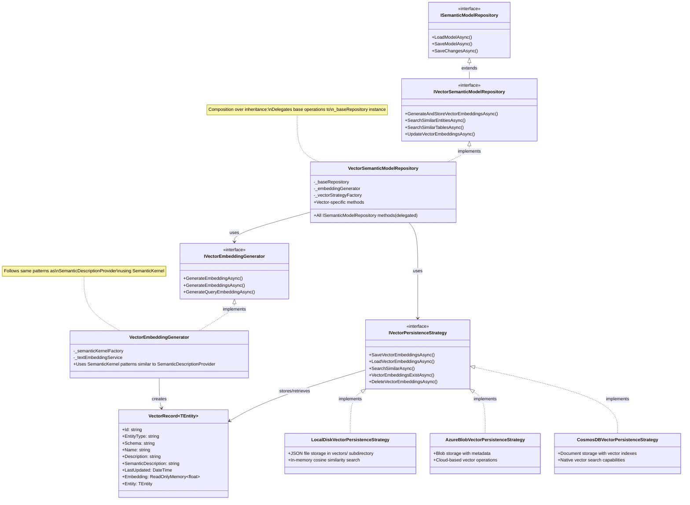
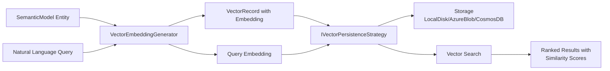

# Vector Embedding Repository Extension Strategy

A comprehensive specification for extending the existing SemanticModelRepository architecture with vector embedding capabilities to enable natural language search across database entities (tables, views, stored procedures) using AI-generated embeddings.

## 1. Purpose & Scope

This specification defines the extension of the existing SemanticModelRepository pattern to support vector embeddings for database entities. The purpose is to enable natural language querying and semantic search capabilities while maintaining the established architectural patterns, persistence strategies, and performance characteristics of the existing system.

**Intended Audience**: AI agents, developers implementing vector search functionality, and maintainers of the GenAI Database Explorer system.

**Scope**: This specification covers vector embedding generation, storage, retrieval, and search functionality as an extension to the existing repository pattern, not a replacement.

## 2. Definitions

- **Vector Embedding**: A numerical representation of text content in high-dimensional space (typically 1536 dimensions) generated by AI models
- **Semantic Search**: Search functionality that finds conceptually similar content rather than exact text matches
- **Strategy Pattern Extension**: Extending existing persistence strategies to handle vector operations while maintaining the same architectural approach
- **Embedding Service**: A service responsible for generating vector embeddings using AI models (similar to SemanticDescriptionProvider)
- **Vector Store**: Storage mechanism for vector embeddings with similarity search capabilities
- **Cosine Similarity**: Distance metric used to measure similarity between vector embeddings
- **Entity Vector Record**: A data structure containing both entity metadata and its corresponding vector embedding

## 3. Requirements, Constraints & Guidelines

### Vector Embedding Requirements

- **REQ-VE-001**: The system shall generate vector embeddings with configurable dimensions (default: 1536) for tables, views, and stored procedures
- **REQ-VE-002**: The system shall support multiple embedding models:
  - `text-embedding-ada-002` (1536 dimensions) - default
  - `text-embedding-3-small` (1536 dimensions)
  - `text-embedding-3-large` (3072 dimensions)
- **REQ-VE-003**: Vector embeddings shall be generated from entity metadata (name, description, semantic description, column information)
- **REQ-VE-004**: Vector embeddings shall be persistable using the same strategy pattern as semantic models (LocalDisk, AzureBlob, CosmosDB)
- **REQ-VE-005**: The system shall support incremental vector embedding updates without regenerating all embeddings
- **REQ-VE-006**: Vector dimension and embedding model information shall be stored with each embedding for validation during search operations

### Search & Retrieval Requirements

- **REQ-SR-001**: The system shall support natural language search queries against vector embeddings
- **REQ-SR-002**: Search results shall be ranked by cosine similarity with configurable similarity thresholds
- **REQ-SR-003**: Search operations shall complete within 5 seconds for datasets containing up to 1000 entities
- **REQ-SR-004**: The system shall support type-specific searches (tables only, views only, stored procedures only)

### Architecture & Integration Requirements

- **REQ-AI-001**: Vector embedding functionality shall extend existing repository interfaces without breaking compatibility
- **REQ-AI-002**: Vector operations shall use the same concurrency protection and performance monitoring as existing repository operations
- **REQ-AI-003**: Vector embeddings shall be generated using the SemanticKernel framework through an embedding service
- **REQ-AI-004**: The system shall support both synchronous and asynchronous vector generation workflows

### Performance & Scalability Requirements

- **REQ-PS-001**: Vector embedding generation shall support parallel processing with configurable concurrency limits
- **REQ-PS-002**: Vector storage shall be optimized for similarity search operations
- **REQ-PS-003**: Memory usage during vector operations shall not exceed 2GB for datasets with 10,000+ entities

### Data Integrity & Consistency Requirements

- **REQ-DI-001**: Vector embeddings shall be versioned and synchronized with their corresponding semantic model entities
- **REQ-DI-002**: Stale vector embeddings shall be automatically detected and marked for regeneration
- **REQ-DI-003**: Vector operations shall maintain transactional consistency with semantic model operations

### Security Requirements

- **SEC-VE-001**: Vector embeddings shall not contain sensitive data from the original database schema
- **SEC-VE-002**: Vector search operations shall respect the same access controls as semantic model operations

### Strategy Pattern Constraints

- **CON-SP-001**: Vector persistence strategies shall follow the same factory pattern as existing persistence strategies
- **CON-SP-002**: Vector operations shall be atomic and support rollback capabilities
- **CON-SP-003**: Each persistence strategy shall handle vector-specific storage requirements independently

### Extension Guidelines

- **GUD-EX-001**: Vector functionality shall be implemented as optional extensions to maintain backward compatibility
- **GUD-EX-002**: Vector operations shall use similar logging, monitoring, and error handling patterns as existing repository operations
- **GUD-EX-003**: Vector embedding generation shall be configurable and deferrable to support different workflows

### Implementation Patterns

- **PAT-IM-001**: Use composition over inheritance to extend repository functionality
- **PAT-IM-002**: Apply the same builder pattern for vector operation configuration
- **PAT-IM-003**: Implement vector operations using the same async/await patterns as existing operations

## 4. Interfaces & Data Contracts

### Core Vector Interfaces

```csharp
/// <summary>Extension interface for semantic model repository with vector embedding capabilities.</summary>
public interface IVectorSemanticModelRepository : ISemanticModelRepository
{
    Task<VectorEmbeddingResult> GenerateAndStoreVectorEmbeddingsAsync(
        SemanticModel semanticModel, 
        VectorRepositoryOptions options,
        CancellationToken cancellationToken = default);
        
    Task<IEnumerable<VectorSearchResult<T>>> SearchSimilarEntitiesAsync<T>(
        string query, 
        VectorSearchOptions options,
        CancellationToken cancellationToken = default) 
        where T : SemanticModelEntity;
        
    Task<IEnumerable<VectorSearchResult<SemanticModelTable>>> SearchSimilarTablesAsync(
        string query, 
        VectorSearchOptions options,
        CancellationToken cancellationToken = default);
        
    Task<IEnumerable<VectorSearchResult<SemanticModelView>>> SearchSimilarViewsAsync(
        string query, 
        VectorSearchOptions options,
        CancellationToken cancellationToken = default);
        
    Task<IEnumerable<VectorSearchResult<SemanticModelStoredProcedure>>> SearchSimilarStoredProceduresAsync(
        string query, 
        VectorSearchOptions options,
        CancellationToken cancellationToken = default);
        
    Task<bool> HasVectorEmbeddingsAsync(DirectoryInfo modelPath, string? strategyName = null);
    
    Task DeleteVectorEmbeddingsAsync(DirectoryInfo modelPath, string? strategyName = null);
}

/// <summary>Configuration options for vector repository operations.</summary>
public class VectorRepositoryOptions
{
    /// <summary>The embedding model to use for generating vectors.</summary>
    /// <remarks>
    /// Supported models:
    /// - text-embedding-ada-002: 1536 dimensions (default)
    /// - text-embedding-3-small: 1536 dimensions
    /// - text-embedding-3-large: 3072 dimensions
    /// </remarks>
    public string EmbeddingModel { get; set; } = "text-embedding-ada-002";
    
    /// <summary>Vector dimensions for the embedding model. Defaults to 1536 for ada-002 compatibility.</summary>
    public int Dimensions { get; set; } = 1536;
    
    /// <summary>Batch size for processing embeddings to manage API rate limits.</summary>
    public int BatchSize { get; set; } = 100;
    
    /// <summary>Whether to overwrite existing embeddings.</summary>
    public bool OverwriteExisting { get; set; } = false;
    
    /// <summary>Types of entities to process (Tables, Views, StoredProcedures, etc.).</summary>
    public EntityTypes EntityTypes { get; set; } = EntityTypes.All;
}

/// <summary>Search options for vector similarity operations.</summary>
public class VectorSearchOptions
{
    /// <summary>Maximum number of results to return.</summary>
    public int MaxResults { get; set; } = 10;
    
    /// <summary>Minimum similarity threshold (0.0 to 1.0).</summary>
    public double MinimumSimilarity { get; set; } = 0.7;
    
    /// <summary>The embedding model used for the search query. Must match stored embeddings.</summary>
    public string EmbeddingModel { get; set; } = "text-embedding-ada-002";
    
    /// <summary>Vector dimensions for the embedding model. Must match stored embeddings.</summary>
    public int Dimensions { get; set; } = 1536;
    
    /// <summary>Entity types to search within.</summary>
    public EntityTypes EntityTypes { get; set; } = EntityTypes.All;
}
    
    Task<VectorEmbeddingResult> UpdateVectorEmbeddingsAsync(
        SemanticModel semanticModel,
        VectorRepositoryOptions options,
        CancellationToken cancellationToken = default);
}

/// <summary>Service interface for generating vector embeddings from semantic model entities.</summary>
public interface IVectorEmbeddingGenerator
{
    Task<ReadOnlyMemory<float>> GenerateEmbeddingAsync(
        SemanticModelEntity entity,
        CancellationToken cancellationToken = default);
        
    Task<IEnumerable<VectorRecord<T>>> GenerateEmbeddingsAsync<T>(
        IEnumerable<T> entities,
        CancellationToken cancellationToken = default) 
        where T : SemanticModelEntity;
        
    Task<ReadOnlyMemory<float>> GenerateQueryEmbeddingAsync(
        string query,
        CancellationToken cancellationToken = default);
}

/// <summary>Persistence strategy interface for vector embedding operations.</summary>
public interface IVectorPersistenceStrategy
{
    Task SaveVectorEmbeddingsAsync<T>(
        IEnumerable<VectorRecord<T>> vectorRecords,
        DirectoryInfo modelPath,
        CancellationToken cancellationToken = default) 
        where T : SemanticModelEntity;
        
    Task<IEnumerable<VectorRecord<T>>> LoadVectorEmbeddingsAsync<T>(
        DirectoryInfo modelPath,
        CancellationToken cancellationToken = default) 
        where T : SemanticModelEntity;
        
    Task<IEnumerable<VectorSearchResult<T>>> SearchSimilarAsync<T>(
        ReadOnlyMemory<float> queryEmbedding,
        VectorSearchOptions options,
        DirectoryInfo modelPath,
        CancellationToken cancellationToken = default) 
        where T : SemanticModelEntity;
        
    Task<bool> VectorEmbeddingsExistAsync<T>(
        DirectoryInfo modelPath,
        CancellationToken cancellationToken = default) 
        where T : SemanticModelEntity;
        
    Task DeleteVectorEmbeddingsAsync<T>(
        DirectoryInfo modelPath,
        CancellationToken cancellationToken = default) 
        where T : SemanticModelEntity;
}
```

### Vector Data Models

```csharp
/// <summary>Vector record containing entity data and embedding for Semantic Kernel Vector Store.</summary>
/// <remarks>
/// Uses Semantic Kernel Vector Store annotations as defined in:
/// https://learn.microsoft.com/en-us/semantic-kernel/concepts/vector-store-connectors/defining-your-data-model
/// Supports configurable vector dimensions for different embedding models:
/// - text-embedding-ada-002: 1536 dimensions (default)
/// - text-embedding-3-small: 1536 dimensions  
/// - text-embedding-3-large: 3072 dimensions
/// </remarks>
[VectorStoreRecord]
public class VectorRecord<TEntity> where TEntity : SemanticModelEntity
{
    [VectorStoreKey]
    public string Id { get; init; } = string.Empty;
    
    [VectorStoreData]
    public string EntityType { get; init; } = string.Empty;
    
    [VectorStoreData]
    public string Schema { get; init; } = string.Empty;
    
    [VectorStoreData]
    public string Name { get; init; } = string.Empty;
    
    [VectorStoreData]
    public string? Description { get; init; }
    
    [VectorStoreData]
    public string? SemanticDescription { get; init; }
    
    [VectorStoreData]
    public DateTime LastUpdated { get; init; }
    
    [VectorStoreData]
    public int EmbeddingDimensions { get; init; } = 1536;
    
    [VectorStoreData]
    public string EmbeddingModel { get; init; } = "text-embedding-ada-002";
    
    /// <summary>
    /// Vector embedding with configurable dimensions based on embedding model.
    /// Dimensions determined by EmbeddingDimensions property, defaults to 1536.
    /// See: https://learn.microsoft.com/en-us/semantic-kernel/concepts/vector-store-connectors/embedding-generation#embedding-dimensions
    /// </summary>
    [VectorStoreVector(DistanceFunction.CosineSimilarity, IndexKind.Hnsw)]
    public ReadOnlyMemory<float> Embedding { get; init; }
    
    public TEntity Entity { get; init; } = default!;
}

/// <summary>Configuration options for vector repository operations.</summary>
public record VectorRepositoryOptions
{
    public bool RegenerateExisting { get; init; } = false;
    public bool IncludeTables { get; init; } = true;
    public bool IncludeViews { get; init; } = true;
    public bool IncludeStoredProcedures { get; init; } = true;
    public int MaxDegreeOfParallelism { get; init; } = 4;
    public string? StrategyName { get; init; }
    public TimeSpan? Timeout { get; init; } = TimeSpan.FromMinutes(30);
}

/// <summary>Configuration options for vector search operations.</summary>
public record VectorSearchOptions
{
    public int MaxResults { get; init; } = 10;
    public float MinimumSimilarity { get; init; } = 0.7f;
    public bool IncludeEmbeddings { get; init; } = false;
    public string? StrategyName { get; init; }
}

/// <summary>Result of vector embedding generation operation.</summary>
public record VectorEmbeddingResult
{
    public int TablesProcessed { get; init; }
    public int ViewsProcessed { get; init; }
    public int StoredProceduresProcessed { get; init; }
    public TimeSpan Duration { get; init; }
    public int TokensUsed { get; init; }
    public IReadOnlyList<string> Errors { get; init; } = [];
}

/// <summary>Search result with similarity score.</summary>
public record VectorSearchResult<TEntity> where TEntity : SemanticModelEntity
{
    public TEntity Entity { get; init; } = default!;
    public float SimilarityScore { get; init; }
    public ReadOnlyMemory<float>? Embedding { get; init; }
}
```

## 5. Acceptance Criteria

### Vector Embedding Generation

- **AC-VE-001**: Given a semantic model with tables, views, and stored procedures, When GenerateAndStoreVectorEmbeddingsAsync is called, Then vector embeddings shall be generated for all specified entity types
- **AC-VE-002**: Given existing vector embeddings, When RegenerateExisting is false, Then only entities without embeddings shall be processed
- **AC-VE-003**: Given a semantic model entity, When generating embeddings, Then the embedding shall be based on entity name, description, semantic description, and column metadata

### Vector Search Functionality

- **AC-VS-001**: Given stored vector embeddings, When SearchSimilarEntitiesAsync is called with a natural language query, Then results shall be returned ranked by cosine similarity
- **AC-VS-002**: Given a similarity threshold of 0.7, When search results have lower similarity scores, Then those results shall be excluded
- **AC-VS-003**: Given a MaxResults limit of 5, When search returns more than 5 matches, Then only the top 5 most similar results shall be returned

### Persistence Strategy Integration

- **AC-PS-001**: Given LocalDisk strategy, When vector embeddings are saved, Then embeddings shall be stored as JSON files in a vectors subdirectory
- **AC-PS-002**: Given AzureBlob strategy, When vector embeddings are saved, Then embeddings shall be stored as blob objects with appropriate metadata
- **AC-PS-003**: Given CosmosDB strategy, When vector embeddings are saved, Then embeddings shall be stored as documents with vector search indexes

### Performance Requirements

- **AC-PR-001**: Given 100 database entities, When generating vector embeddings with MaxDegreeOfParallelism=4, Then operation shall complete within 5 minutes
- **AC-PR-002**: Given 1000 stored vector embeddings, When performing similarity search, Then search shall complete within 5 seconds
- **AC-PR-003**: Given concurrent vector operations, When multiple requests are processed, Then operations shall not exceed configured concurrency limits

### Error Handling & Recovery

- **AC-EH-001**: Given a failed embedding generation, When the operation encounters an error, Then partial results shall be preserved and errors shall be logged
- **AC-EH-002**: Given network connectivity issues, When using cloud-based strategies, Then operations shall retry with exponential backoff
- **AC-EH-003**: Given corrupted vector data, When loading embeddings, Then the system shall detect corruption and trigger regeneration

## 6. Test Automation Strategy

### Test Levels

- **Unit Tests**: Individual components (VectorEmbeddingGenerator, persistence strategies, search algorithms)
- **Integration Tests**: Repository integration with different persistence strategies
- **End-to-End Tests**: Complete workflows from embedding generation through search operations
- **Performance Tests**: Load testing for large datasets and concurrent operations

### Testing Frameworks

- **MSTest**: Primary testing framework for .NET components
- **FluentAssertions**: Expressive assertions for test readability
- **Moq**: Mocking framework for dependency isolation
- **TestContainers**: Integration testing with real storage systems

### Test Data Management

- **Synthetic Data**: Generated semantic models with known entity relationships
- **Vector Test Data**: Pre-computed embeddings for deterministic similarity testing
- **Performance Datasets**: Large-scale test data for performance validation

### CI/CD Integration

- **GitHub Actions**: Automated testing on pull requests and main branch commits
- **Test Isolation**: Each test run uses isolated storage to prevent interference
- **Performance Baselines**: Automated performance regression detection

### Coverage Requirements

- **Unit Test Coverage**: Minimum 90% code coverage for all vector-related components
- **Integration Coverage**: All persistence strategies must have integration tests
- **Scenario Coverage**: All major user workflows must have end-to-end tests

## 7. Rationale & Context

### Why Strategy Pattern Extension?

The vector embedding functionality is designed as an extension of the existing SemanticModelRepository strategy pattern for several architectural reasons:

1. **Consistency**: Maintains the established architectural patterns that developers are familiar with
2. **Flexibility**: Allows different persistence strategies to handle vector storage according to their capabilities
3. **Separation of Concerns**: Vector operations are logically separate from basic semantic model persistence
4. **Backward Compatibility**: Existing code continues to work without modification
5. **Testability**: Each strategy can be tested independently with different vector storage implementations

### Architectural Decision: Composition over Inheritance

The IVectorSemanticModelRepository extends ISemanticModelRepository through interface inheritance but uses composition in implementation. This approach:

- Allows mixing vector and non-vector repository implementations
- Enables gradual feature rollout without breaking existing functionality
- Supports dependency injection patterns already established in the codebase
- Facilitates independent testing and mocking of vector-specific functionality

### Why Semantic Kernel Vector Store?

The integration with Semantic Kernel's Vector Store abstractions provides:

- **Standardization**: Uses Microsoft's established patterns for vector operations as defined in the [Vector Store Abstractions](https://learn.microsoft.com/en-us/semantic-kernel/concepts/vector-store-connectors/?pivots=programming-language-csharp#the-vector-store-abstraction)
- **Interoperability**: Compatible with various vector database providers through the unified `IVectorSearchable<TRecord>` interface
- **Performance**: Optimized implementations for different storage backends including [Azure AI Search](https://learn.microsoft.com/en-us/semantic-kernel/concepts/vector-store-connectors/out-of-the-box-connectors/azure-ai-search-connector?pivots=programming-language-csharp), [Azure Cosmos DB NoSQL](https://learn.microsoft.com/en-us/semantic-kernel/concepts/vector-store-connectors/out-of-the-box-connectors/azure-cosmosdb-nosql-connector?pivots=programming-language-csharp), and [In-Memory](https://learn.microsoft.com/en-us/semantic-kernel/concepts/vector-store-connectors/out-of-the-box-connectors/inmemory-connector?pivots=programming-language-csharp) connectors
- **Future-Proofing**: Aligned with Microsoft's AI development roadmap and the official .NET AI ecosystem
- **Embedding Integration**: Built-in support for [embedding generation](https://learn.microsoft.com/en-us/semantic-kernel/concepts/vector-store-connectors/embedding-generation?pivots=programming-language-csharp) with automatic vectorization capabilities
- **Flexible Dimensionality**: Support for multiple embedding models with different vector dimensions

### Supported Embedding Models

The vector repository supports configurable embedding models with different dimensions:

| Embedding Model | Dimensions | Use Case | Default |
|---|---|---|---|
| `text-embedding-ada-002` | 1536 | General purpose, cost-effective | ✅ |
| `text-embedding-3-small` | 1536 | Improved performance over ada-002 | |
| `text-embedding-3-large` | 3072 | Highest quality, larger vectors | |

**Configuration Examples:**

```csharp
// Default configuration (ada-002, 1536 dimensions)
var defaultOptions = new VectorRepositoryOptions();

// High-performance configuration (3-large, 3072 dimensions)  
var highPerformanceOptions = new VectorRepositoryOptions
{
    EmbeddingModel = "text-embedding-3-large",
    Dimensions = 3072
};
```

## 8. Dependencies & External Integrations

### External Systems

- **EXT-VE-001**: OpenAI/Azure OpenAI - Text embedding models with configurable dimensions:
  - `text-embedding-ada-002`: 1536 dimensions (default)
  - `text-embedding-3-small`: 1536 dimensions  
  - `text-embedding-3-large`: 3072 dimensions
  - As specified in the [Semantic Kernel embedding documentation](https://learn.microsoft.com/en-us/semantic-kernel/concepts/vector-store-connectors/embedding-generation?pivots=programming-language-csharp#embedding-dimensions)
- **EXT-VE-002**: [Azure Blob Storage](https://learn.microsoft.com/en-us/semantic-kernel/concepts/vector-store-connectors/out-of-the-box-connectors/azure-ai-search-connector?pivots=programming-language-csharp) - Cloud-based vector storage (for AzureBlob strategy) - Note: While the documentation shows Azure AI Search, the pattern applies to blob storage implementations
- **EXT-VE-003**: [Azure Cosmos DB NoSQL](https://learn.microsoft.com/en-us/semantic-kernel/concepts/vector-store-connectors/out-of-the-box-connectors/azure-cosmosdb-nosql-connector?pivots=programming-language-csharp) - Document and vector storage with native vector search capabilities supporting Flat, QuantizedFlat, and DiskAnn index types

### Third-Party Services

- **SVC-VE-001**: [Microsoft Semantic Kernel Framework](https://learn.microsoft.com/en-us/semantic-kernel/concepts/vector-store-connectors/?pivots=programming-language-csharp) - Vector store abstractions and AI model integration using the official Vector Store connectors
- **SVC-VE-002**: [Microsoft.Extensions.VectorData.Abstractions](https://www.nuget.org/packages/Microsoft.Extensions.VectorData.Abstractions/) - Core vector data abstractions providing VectorStore, VectorStoreCollection&lt;TKey,TRecord&gt;, and IVectorSearchable&lt;TRecord&gt; interfaces
- **SVC-VE-003**: System.Text.Json - JSON serialization for vector data structures with support for JsonPropertyNameAttribute for custom storage naming
- **SVC-VE-004**: [Embedding Generation Services](https://learn.microsoft.com/en-us/semantic-kernel/concepts/vector-store-connectors/embedding-generation?pivots=programming-language-csharp) - ITextEmbeddingGenerationService and Microsoft.Extensions.AI embedding generators for automatic vectorization

### Infrastructure Dependencies

- **INF-VE-001**: File System Access - Local storage for vector embeddings (LocalDisk strategy)
- **INF-VE-002**: Network Connectivity - Cloud service access for embedding generation and storage
- **INF-VE-003**: Memory Resources - Sufficient RAM for vector operations (minimum 4GB recommended)

### Data Dependencies

- **DAT-VE-001**: Semantic Model Entities - Source data for embedding generation
- **DAT-VE-002**: AI Model Access - Valid API keys and quotas for embedding services
- **DAT-VE-003**: Vector Dimensions - Consistent 1536-dimensional embedding format

### Technology Platform Dependencies

- **PLT-VE-001**: .NET 9.0+ - Required runtime for Semantic Kernel and vector operations
- **PLT-VE-002**: C# 13+ Language Features - Required for modern async patterns and record types
- **PLT-VE-003**: JSON.NET - Serialization support for vector data persistence

### Compliance Dependencies

- **COM-VE-001**: Data Privacy Regulations - Vector embeddings must not expose sensitive schema information
- **COM-VE-002**: API Rate Limits - Embedding generation must respect service quotas and throttling

## 9. Examples & Edge Cases

### Basic Vector Operations

```csharp
// Vector repository setup with dependency injection
var vectorRepository = serviceProvider.GetRequiredService<IVectorSemanticModelRepository>();
var semanticModel = await vectorRepository.LoadModelAsync(modelPath);

// Generate vector embeddings for all entities
var vectorOptions = new VectorRepositoryOptions
{
    IncludeTables = true,
    IncludeViews = true,
    IncludeStoredProcedures = false,
    MaxDegreeOfParallelism = 4,
    StrategyName = "LocalDisk"
};

var embeddingResult = await vectorRepository.GenerateAndStoreVectorEmbeddingsAsync(
    semanticModel, 
    vectorOptions);

Console.WriteLine($"Generated embeddings for {embeddingResult.TablesProcessed} tables and {embeddingResult.ViewsProcessed} views");
```

### Natural Language Search

```csharp
// Search for entities related to customer data
var searchOptions = new VectorSearchOptions
{
    MaxResults = 5,
    MinimumSimilarity = 0.75f,
    IncludeEmbeddings = false
};

var customerTables = await vectorRepository.SearchSimilarTablesAsync(
    "customer information and personal details", 
    searchOptions);

foreach (var result in customerTables)
{
    Console.WriteLine($"Table: {result.Entity.Schema}.{result.Entity.Name}");
    Console.WriteLine($"Similarity: {result.SimilarityScore:F3}");
    Console.WriteLine($"Description: {result.Entity.SemanticDescription}");
    Console.WriteLine();
}
```

### Strategy-Specific Configuration

```csharp
// LocalDisk strategy for development with default embedding model
var localOptions = new VectorRepositoryOptions
{
    StrategyName = "LocalDisk",
    EmbeddingModel = "text-embedding-ada-002",
    Dimensions = 1536,
    MaxDegreeOfParallelism = 2,
    Timeout = TimeSpan.FromMinutes(10)
};

// Azure Blob strategy for production with higher-dimension embeddings
var azureOptions = new VectorRepositoryOptions
{
    StrategyName = "AzureBlob",
    EmbeddingModel = "text-embedding-3-large",
    Dimensions = 3072,
    MaxDegreeOfParallelism = 8,
    Timeout = TimeSpan.FromMinutes(30)
};

// Generate embeddings using appropriate strategy
var result = await vectorRepository.GenerateAndStoreVectorEmbeddingsAsync(
    semanticModel, 
    Environment.IsDevelopment() ? localOptions : azureOptions);

// Search configuration with matching embedding model
var searchOptions = new VectorSearchOptions
{
    EmbeddingModel = azureOptions.EmbeddingModel,
    Dimensions = azureOptions.Dimensions,
    MaxResults = 5,
    MinimumSimilarity = 0.8
};
```

### Edge Cases and Error Handling

```csharp
// Handle partial failures during embedding generation
try
{
    var result = await vectorRepository.GenerateAndStoreVectorEmbeddingsAsync(
        semanticModel, vectorOptions);
    
    if (result.Errors.Count > 0)
    {
        logger.LogWarning("Embedding generation completed with {ErrorCount} errors", 
            result.Errors.Count);
        
        foreach (var error in result.Errors)
        {
            logger.LogError("Embedding error: {Error}", error);
        }
    }
}
catch (OperationCanceledException)
{
    logger.LogInformation("Embedding generation was cancelled");
}
catch (Exception ex)
{
    logger.LogError(ex, "Failed to generate vector embeddings");
    // Implement retry logic or fallback behavior
}

// Search with no results scenario
var searchResults = await vectorRepository.SearchSimilarTablesAsync(
    "nonexistent database concept", searchOptions);
    
if (!searchResults.Any())
{
    logger.LogInformation("No similar entities found for query");
    // Implement alternative search strategies or suggestions
}
```

## 10. Class Relationship Diagram



### Data Flow



## 11. Validation Criteria

### Functional Validation

- **VAL-FN-001**: All vector operations must complete successfully with sample semantic models
- **VAL-FN-002**: Search results must be reproducible and ranked correctly by similarity
- **VAL-FN-003**: All persistence strategies must handle vector operations without data loss

### Performance Validation

- **VAL-PF-001**: Embedding generation for 100 entities must complete within performance thresholds
- **VAL-PF-002**: Vector search operations must meet sub-5-second response time requirements
- **VAL-PF-003**: Memory usage must remain within specified limits during large dataset operations

### Integration Validation

- **VAL-IN-001**: Vector repository must integrate seamlessly with existing dependency injection configuration
- **VAL-IN-002**: All logging and monitoring patterns must be consistent with existing repository operations
- **VAL-IN-003**: Error handling must follow established patterns and provide meaningful diagnostics

### Backward Compatibility Validation

- **VAL-BC-001**: Existing ISemanticModelRepository implementations must continue to function without modification
- **VAL-BC-002**: Applications using only base repository functionality must show no performance regression
- **VAL-BC-003**: Configuration and setup procedures must remain unchanged for non-vector operations

## 12. Related Specifications / Further Reading

### Project Specifications

- [spec-data-semantic-model-repository.md](./spec-data-semantic-model-repository.md) - Base repository pattern and persistence strategies

### Official Microsoft Semantic Kernel Documentation

- [Semantic Kernel Vector Store Connectors Overview](https://learn.microsoft.com/en-us/semantic-kernel/concepts/vector-store-connectors/?pivots=programming-language-csharp) - Core abstractions and architecture patterns
- [Vector Store Embedding Generation](https://learn.microsoft.com/en-us/semantic-kernel/concepts/vector-store-connectors/embedding-generation?pivots=programming-language-csharp) - Automatic embedding generation and ITextEmbeddingGenerationService patterns
- [Azure AI Search Vector Store Connector](https://learn.microsoft.com/en-us/semantic-kernel/concepts/vector-store-connectors/out-of-the-box-connectors/azure-ai-search-connector?pivots=programming-language-csharp) - Production-ready cloud vector storage
- [Azure Cosmos DB NoSQL Vector Store Connector](https://learn.microsoft.com/en-us/semantic-kernel/concepts/vector-store-connectors/out-of-the-box-connectors/azure-cosmosdb-nosql-connector?pivots=programming-language-csharp) - Document database with native vector search capabilities
- [In-Memory Vector Store Connector](https://learn.microsoft.com/en-us/semantic-kernel/concepts/vector-store-connectors/out-of-the-box-connectors/inmemory-connector?pivots=programming-language-csharp) - Local development and prototyping scenarios

### External References

- [Azure OpenAI Embeddings Documentation](https://learn.microsoft.com/en-us/azure/ai-services/openai/concepts/understand-embeddings) - Understanding embedding models and dimensions
- [Cosine Similarity and Vector Search Best Practices](https://learn.microsoft.com/en-us/azure/search/vector-search-overview) - Mathematical foundations and optimization techniques
