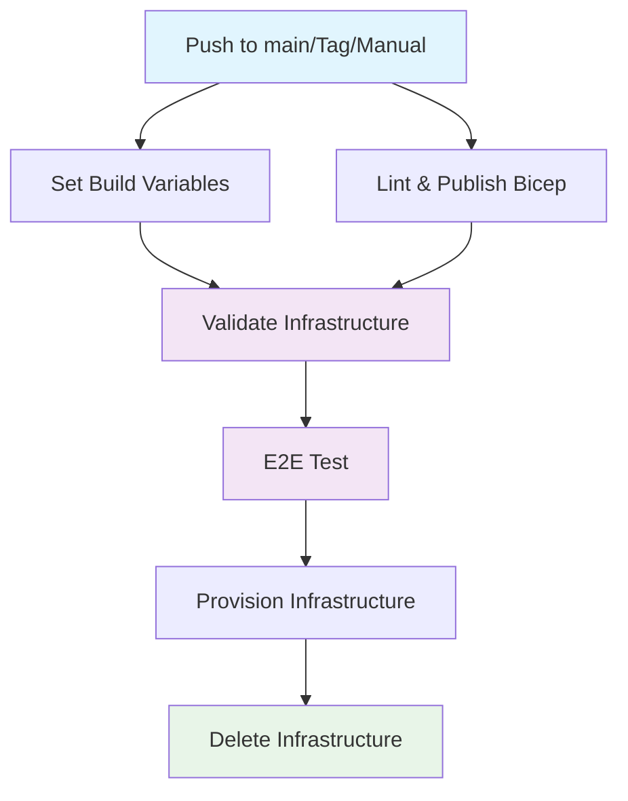

## Workflow Overview

**Purpose**: Orchestrates continuous delivery pipeline for GenAI Database Explorer application with Azure infrastructure validation and end-to-end testing  
**Trigger Events**: Push to main branch, version tags (v*), specific path changes (infra/**, src/**, tests/**), manual workflow dispatch  
**Target Environments**: Test environment with ephemeral Azure infrastructure

## Execution Flow Diagram



## Jobs & Dependencies

| Job Name | Purpose | Dependencies | Execution Context |
|----------|---------|--------------|-------------------|
| set-build-variables | Generate semantic versioning using GitVersion | None | ubuntu-latest |
| lint-and-publish-bicep | Validate Bicep templates and create artifacts | None | ubuntu-latest |
| validate-infrastructure | Perform Azure deployment validation (what-if) | set-build-variables, lint-and-publish-bicep | ubuntu-latest, Test environment |
| e2e-test | Execute end-to-end testing with infrastructure lifecycle | set-build-variables, validate-infrastructure | Delegates to sub-workflows |

## Requirements Matrix

### Functional Requirements

| ID | Requirement | Priority | Acceptance Criteria |
|----|-------------|----------|-------------------|
| REQ-001 | Generate consistent build versions across pipeline | High | GitVersion produces semantic version for all downstream jobs |
| REQ-002 | Validate Azure infrastructure before deployment | High | Bicep what-if analysis completes without errors |
| REQ-003 | Execute comprehensive end-to-end testing | High | E2E tests pass against provisioned Azure resources |
| REQ-004 | Ensure infrastructure cleanup after testing | Medium | Test infrastructure deleted regardless of test outcome |

### Security Requirements

| ID | Requirement | Implementation Constraint |
|----|-------------|---------------------------|
| SEC-001 | Use Azure service principal authentication | OIDC token-based authentication with federated credentials |
| SEC-002 | Protect sensitive deployment secrets | Store in GitHub secrets with environment-based access control |
| SEC-003 | Generate ephemeral environment names | Use GitHub run ID to create unique, temporary environments |

### Performance Requirements

| ID | Metric | Target | Measurement Method |
|----|-------|--------|-------------------|
| PERF-001 | Pipeline execution time | < 15 minutes | GitHub Actions workflow duration |
| PERF-002 | Infrastructure validation time | < 5 minutes | Azure what-if operation duration |
| PERF-003 | E2E test completion | < 10 minutes | Sub-workflow execution time |

## Input/Output Contracts

### Inputs

```yaml
# Trigger Events
push:
  branches: [main]
  tags: [v*]
  paths: [infra/**, src/**, tests/**]
workflow_dispatch: {}

# Repository Variables
vars.AZURE_LOCATION: string  # Purpose: Azure region for deployment
```

### Outputs

```yaml
# Build Variables (from set-build-variables)
BUILD_VERSION: string         # GitVersion FullSemVer
FullSemVer: string           # Complete semantic version
MajorMinorPatch: string      # Version without pre-release
SemVer: string               # Semantic version
NuGetVersion: string         # NuGet package version

# Artifacts
infrastructure_bicep: archive # Bicep templates and parameters
```

### Secrets & Variables

| Type | Name | Purpose | Scope |
|------|------|---------|-------|
| Secret | AZURE_TENANT_ID | Azure AD tenant authentication | Repository |
| Secret | AZURE_SUBSCRIPTION_ID | Azure subscription targeting | Repository |
| Secret | AZURE_CLIENT_ID | Service principal identification | Repository |
| Secret | SQL_SERVER_USERNAME | Database authentication | Repository |
| Secret | SQL_SERVER_PASSWORD | Database credentials | Repository |
| Variable | AZURE_LOCATION | Azure region configuration | Repository |

## Execution Constraints

### Runtime Constraints

- **Timeout**: 60 minutes maximum per workflow run
- **Concurrency**: Limited by GitHub Actions plan and Azure resource limits
- **Resource Limits**: Standard GitHub-hosted runner limitations

### Environmental Constraints

- **Runner Requirements**: ubuntu-latest for all jobs
- **Network Access**: Requires Azure API access and artifact storage
- **Permissions**: id-token write, contents read, checks write, pull-requests write

## Error Handling Strategy

| Error Type | Response | Recovery Action |
|------------|----------|-----------------|
| GitVersion Failure | Fail fast | Check GitVersion.yml configuration |
| Bicep Lint Error | Fail fast | Fix template syntax errors |
| Azure Authentication | Fail fast | Verify OIDC configuration and secrets |
| Infrastructure Validation | Fail fast | Review Bicep template and parameters |
| E2E Test Failure | Continue to cleanup | Infrastructure still deleted |

## Quality Gates

### Gate Definitions

| Gate | Criteria | Bypass Conditions |
|------|----------|-------------------|
| Bicep Linting | No syntax errors | None - mandatory |
| Infrastructure Validation | What-if analysis succeeds | None - mandatory |
| E2E Tests | All tests pass | None - but cleanup always runs |

## Monitoring & Observability

### Key Metrics

- **Success Rate**: Target 95% successful deployments
- **Execution Time**: Monitor pipeline duration trends
- **Resource Usage**: Track Azure consumption during testing

### Alerting

| Condition | Severity | Notification Target |
|-----------|----------|-------------------|
| Pipeline Failure | High | Repository maintainers |
| Infrastructure Validation Failure | Medium | DevOps team |
| Cleanup Failure | Medium | Azure resource alerts |

## Integration Points

### External Systems

| System | Integration Type | Data Exchange | SLA Requirements |
|--------|------------------|---------------|------------------|
| Azure Resource Manager | REST API | Bicep deployment validation | < 5min response |
| GitHub Actions | Workflow orchestration | YAML configuration | 99.9% availability |
| GitVersion | CLI tool | Version calculation | Local execution |

### Dependent Workflows

| Workflow | Relationship | Trigger Mechanism |
|----------|--------------|-------------------|
| set-build-variables.yml | Reusable | workflow_call |
| lint-and-publish-bicep.yml | Reusable | workflow_call |
| validate-infrastructure.yml | Reusable | workflow_call |
| e2e-test.yml | Reusable | workflow_call |

## Compliance & Governance

### Audit Requirements

- **Execution Logs**: Retained per GitHub Actions retention policy
- **Approval Gates**: None - automated pipeline
- **Change Control**: Git-based with branch protection

### Security Controls

- **Access Control**: Environment-based protection for secrets
- **Secret Management**: GitHub Secrets with OIDC tokens
- **Vulnerability Scanning**: Bicep template validation

## Edge Cases & Exceptions

### Scenario Matrix

| Scenario | Expected Behavior | Validation Method |
|----------|-------------------|-------------------|
| Tag push without code changes | Pipeline runs with infrastructure validation | Check workflow run logs |
| Manual dispatch | Pipeline executes with current branch state | Verify manual trigger works |
| Azure service outage | Graceful failure with clear error messages | Test with invalid credentials |
| Concurrent runs | GitHub prevents overlapping executions | Multiple simultaneous pushes |

## Validation Criteria

### Workflow Validation

- **VLD-001**: All jobs complete successfully on main branch push
- **VLD-002**: Infrastructure artifacts are properly generated and consumed
- **VLD-003**: Azure authentication succeeds with OIDC tokens
- **VLD-004**: Environment cleanup occurs regardless of test outcomes

### Performance Benchmarks

- **PERF-001**: Complete pipeline execution under 15 minutes
- **PERF-002**: Infrastructure validation completes under 5 minutes

## Change Management

### Update Process

1. **Specification Update**: Modify this document first
2. **Review & Approval**: Pull request review by repository maintainers
3. **Implementation**: Apply changes to workflow files
4. **Testing**: Validate with feature branch or manual dispatch
5. **Deployment**: Merge to main branch

### Version History

| Version | Date | Changes | Author |
|---------|------|---------|--------|
| 1.0 | 2025-01-20 | Initial specification | GitHub Copilot |

## Related Specifications

- [Infrastructure Deployment Bicep AVM Specification](./spec-infrastructure-deployment-bicep-avm.md)
- [Project Structure Specification](./spec-project-structure-genai-database-explorer.md)
- [Azure Application Insights Monitoring Specification](./spec-monitoring-azure-application-insights-opentelemetry.md)
