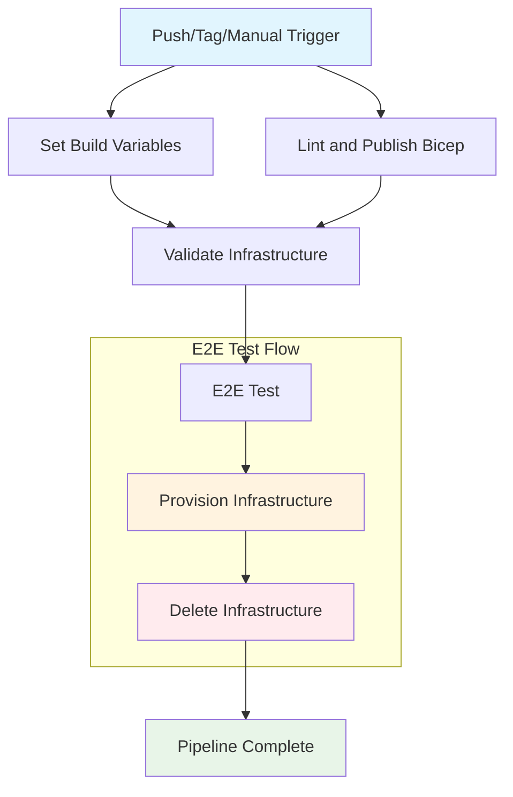

## Workflow Overview

**Purpose**: Orchestrate continuous delivery pipeline for GenAI Database Explorer, validating infrastructure changes and performing end-to-end testing on main branch commits and releases.

**Trigger Events**: Push to main branch, version tags (v*), manual dispatch, changes to infrastructure/source/test paths

**Target Environments**: Test environment with ephemeral Azure resources

## Execution Flow Diagram



## Jobs & Dependencies

| Job Name | Purpose | Dependencies | Execution Context |
|----------|---------|--------------|-------------------|
| set-build-variables | Generate semantic version using GitVersion | None | ubuntu-latest |
| lint-and-publish-bicep | Validate Bicep templates and create artifacts | None | ubuntu-latest |
| validate-infrastructure | Perform Azure infrastructure validation | set-build-variables, lint-and-publish-bicep | ubuntu-latest + Test environment |
| e2e-test | Execute end-to-end testing with infrastructure lifecycle | set-build-variables, validate-infrastructure | ubuntu-latest + Test environment |

## Requirements Matrix

### Functional Requirements

| ID | Requirement | Priority | Acceptance Criteria |
|----|-------------|----------|-------------------|
| REQ-001 | Version generation from Git history | High | GitVersion produces valid semantic version |
| REQ-002 | Bicep template validation | High | All templates pass linting without errors |
| REQ-003 | Infrastructure validation | High | Azure deployment validation succeeds |
| REQ-004 | End-to-end testing | High | E2E tests pass with ephemeral infrastructure |
| REQ-005 | Resource cleanup | High | All provisioned resources are deleted after testing |

### Security Requirements

| ID | Requirement | Implementation Constraint |
|----|-------------|---------------------------|
| SEC-001 | Azure OIDC authentication | Use workload identity, no long-lived secrets |
| SEC-002 | Least privilege access | Minimal permissions for infrastructure operations |
| SEC-003 | Secret management | Encrypted secrets for SQL credentials |
| SEC-004 | Environment isolation | Test environment isolated from production |

### Performance Requirements

| ID | Metric | Target | Measurement Method |
|----|-------|--------|-------------------|
| PERF-001 | Pipeline execution time | < 30 minutes | GitHub Actions duration |
| PERF-002 | Infrastructure provisioning | < 15 minutes | Azure deployment time |
| PERF-003 | Resource cleanup time | < 5 minutes | Deletion workflow duration |

## Input/Output Contracts

### Inputs

```yaml
# Trigger Conditions
branches: ["main"]
tags: ["v*"]
paths: ["infra/**", "src/**", "tests/**"]

# Manual Dispatch
workflow_dispatch: enabled

# Repository Variables
AZURE_LOCATION: string  # Target Azure region
```

### Outputs

```yaml
# Job Outputs
BUILD_VERSION: string  # Semantic version from GitVersion
infrastructure_bicep: artifact  # Validated Bicep templates
validation_results: status  # Infrastructure validation outcome
e2e_test_results: status  # End-to-end test results
```

### Secrets & Variables

| Type | Name | Purpose | Scope |
|------|------|---------|-------|
| Secret | AZURE_TENANT_ID | Azure authentication | Repository |
| Secret | AZURE_SUBSCRIPTION_ID | Azure subscription access | Repository |
| Secret | AZURE_CLIENT_ID | Azure service principal | Repository |
| Secret | SQL_SERVER_USERNAME | Database authentication | Repository |
| Secret | SQL_SERVER_PASSWORD | Database credentials | Repository |
| Variable | AZURE_LOCATION | Deployment region | Repository |

## Execution Constraints

### Runtime Constraints

- **Timeout**: 60 minutes (default GitHub Actions limit)
- **Concurrency**: Single execution per workflow (implicit)
- **Resource Limits**: Standard GitHub-hosted runner limits

### Environmental Constraints

- **Runner Requirements**: ubuntu-latest with Azure CLI
- **Network Access**: Azure API endpoints, GitHub APIs
- **Permissions**: id-token:write, contents:read, checks:write, pull-requests:write

## Error Handling Strategy

| Error Type | Response | Recovery Action |
|------------|----------|-----------------|
| Version Generation Failure | Fail pipeline | Check GitVersion configuration |
| Bicep Lint Failure | Fail pipeline | Fix template syntax errors |
| Infrastructure Validation Failure | Fail pipeline | Review Azure deployment errors |
| E2E Test Failure | Fail pipeline, cleanup resources | Investigate test failures |
| Resource Cleanup Failure | Continue, log warning | Manual cleanup required |

## Quality Gates

### Gate Definitions

| Gate | Criteria | Bypass Conditions |
|------|----------|-------------------|
| Bicep Linting | Zero linting errors | None |
| Infrastructure Validation | What-if deployment succeeds | None |
| E2E Test Execution | All tests pass | None |
| Resource Cleanup | Deletion completes successfully | Acceptable on failure (with logging) |

## Monitoring & Observability

### Key Metrics

- **Success Rate**: 95%+ pipeline success rate
- **Execution Time**: Average pipeline duration
- **Resource Usage**: Azure resource consumption during testing

### Alerting

| Condition | Severity | Notification Target |
|-----------|----------|-------------------|
| Pipeline Failure | High | Development team |
| Resource Cleanup Failure | Medium | DevOps team |
| Performance Degradation | Low | Monitoring dashboard |

## Integration Points

### External Systems

| System | Integration Type | Data Exchange | SLA Requirements |
|--------|------------------|---------------|------------------|
| Azure Resource Manager | REST API | Bicep templates, deployment status | 99.9% availability |
| GitHub Actions | Platform native | Workflow orchestration | Platform SLA |
| GitVersion | Tool integration | Version calculation | Local execution |

### Dependent Workflows

| Workflow | Relationship | Trigger Mechanism |
|----------|--------------|-------------------|
| set-build-variables.yml | Called workflow | Direct invocation |
| lint-and-publish-bicep.yml | Called workflow | Direct invocation |
| validate-infrastructure.yml | Called workflow | Direct invocation |
| e2e-test.yml | Called workflow | Direct invocation |

## Compliance & Governance

### Audit Requirements

- **Execution Logs**: 30-day retention in GitHub Actions
- **Approval Gates**: None (automated execution)
- **Change Control**: Git-based version control

### Security Controls

- **Access Control**: Repository write access required for manual triggers
- **Secret Management**: GitHub Secrets with Azure Key Vault integration
- **Vulnerability Scanning**: Implicit in GitHub Actions security model

## Edge Cases & Exceptions

### Scenario Matrix

| Scenario | Expected Behavior | Validation Method |
|----------|-------------------|-------------------|
| Concurrent push events | Queue executions sequentially | GitHub Actions concurrency control |
| Azure service outage | Pipeline failure with retry | Monitor Azure status page |
| Invalid Bicep syntax | Early failure at lint stage | Bicep CLI validation |
| Resource quota exceeded | Infrastructure validation failure | Azure error messages |
| Network connectivity issues | Timeout and failure | GitHub Actions logging |

## Validation Criteria

### Workflow Validation

- **VLD-001**: All reusable workflows execute successfully
- **VLD-002**: Build version is generated and propagated
- **VLD-003**: Infrastructure artifacts are created and validated
- **VLD-004**: Test environment is provisioned and cleaned up

### Performance Benchmarks

- **PERF-001**: Version generation completes within 2 minutes
- **PERF-002**: Bicep linting completes within 5 minutes
- **PERF-003**: Infrastructure validation completes within 10 minutes
- **PERF-004**: E2E test cycle completes within 20 minutes

## Change Management

### Update Process

1. **Specification Update**: Modify this document first
2. **Review & Approval**: Pull request review by DevOps team
3. **Implementation**: Apply changes to workflow files
4. **Testing**: Validate changes in feature branch
5. **Deployment**: Merge to main branch

### Version History

| Version | Date | Changes | Author |
|---------|------|---------|--------|
| 1.0 | 2025-07-20 | Initial specification | DevOps Team |

## Related Specifications

- [Infrastructure Deployment Bicep AVM Specification](spec-infrastructure-deployment-bicep-avm.md)
- [.NET Aspire Integration Specification](spec-infrastructure-dotnet-aspire-integration.md)
- [Continuous Integration Workflow Specification](spec-process-cicd-continuous-integration.md)
