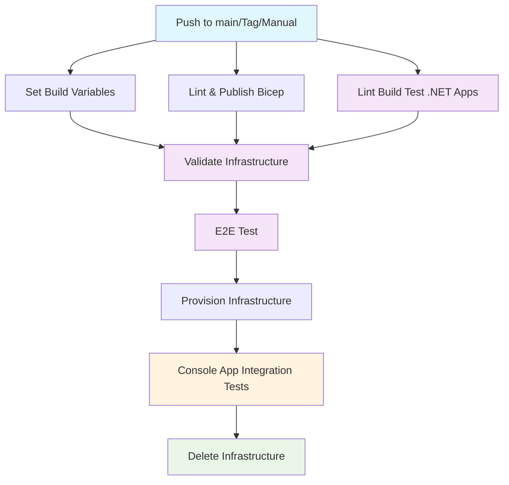

## Workflow Overview

**Purpose**: Orchestrates continuous delivery pipeline for GenAI Database Explorer application with Azure infrastructure validation and end-to-end testing  
**Trigger Events**: Push to main branch, version tags (v*), specific path changes (infra/**, src/**, tests/**), manual workflow dispatch  
**Target Environments**: Test environment with ephemeral Azure infrastructure

> [NOTE!]
> This specification includes the `lint-build-and-test-dotnet-apps` job that should be added to the continuous-delivery.yml workflow to ensure .NET application quality gates are enforced before deployment, consistent with the continuous-integration.yml workflow.
>
> **Implementation Note:** The console application integration testing should be implemented as a new job within the e2e-test workflow, executing after infrastructure provisioning but before cleanup. This ensures the CLI commands are tested against real Azure resources including SQL Database, AI Services, and optional Cosmos DB/AI Search services.
?
> **Testing Framework**: PowerShell Pester v5.5+ is the recommended framework for console integration testing, providing structured test output, rich assertions, and seamless GitHub Actions integration with test result visualization and artifact collection. All integration tests are consolidated in a single file (`src/tests/integration/Console.Integration.Tests.ps1`) for easier maintenance and execution.

## Execution Flow Diagram



## Jobs & Dependencies

| Job Name | Purpose | Dependencies | Execution Context |
|----------|---------|--------------|-------------------|
| set-build-variables | Generate semantic versioning using GitVersion | None | ubuntu-latest |
| lint-and-publish-bicep | Validate Bicep templates and create artifacts | None | ubuntu-latest |
| lint-build-and-test-dotnet-apps | Lint, build, and test .NET applications | None | ubuntu-latest, matrix strategy |
| validate-infrastructure | Perform Azure deployment validation (what-if) | set-build-variables, lint-and-publish-bicep, lint-build-and-test-dotnet-apps | ubuntu-latest, Test environment |
| e2e-test | Execute end-to-end testing with infrastructure lifecycle | set-build-variables, validate-infrastructure | Delegates to sub-workflows |
| console-app-integration-tests | Test console app against live infrastructure | provision-infrastructure (within e2e-test) | ubuntu-latest, Test environment |

## Requirements Matrix

### Functional Requirements

| ID | Requirement | Priority | Acceptance Criteria |
|----|-------------|----------|-------------------|
| REQ-001 | Generate consistent build versions across pipeline | High | GitVersion produces semantic version for all downstream jobs |
| REQ-002 | Validate Azure infrastructure before deployment | High | Bicep what-if analysis completes without errors |
| REQ-003 | Lint, build, and test .NET applications | High | All .NET projects pass formatting, build, and unit test validation |
| REQ-004 | Execute comprehensive end-to-end testing | High | E2E tests pass against provisioned Azure resources |
| REQ-005 | Test console application with real infrastructure | High | Integration tests validate database operations, model extraction, enrichment, and queries |
| REQ-006 | Ensure infrastructure cleanup after testing | Medium | Test infrastructure deleted regardless of test outcome |

### Security Requirements

| ID | Requirement | Implementation Constraint |
|----|-------------|---------------------------|
| SEC-001 | Use Azure service principal authentication | OIDC token-based authentication with federated credentials |
| SEC-002 | Protect sensitive deployment secrets | Store in GitHub secrets with environment-based access control |
| SEC-003 | Generate ephemeral environment names | Use GitHub run ID to create unique, temporary environments |

### Performance Requirements

| ID | Metric | Target | Measurement Method |
|----|-------|--------|-------------------|
| PERF-001 | Pipeline execution time | < 25 minutes | GitHub Actions workflow duration |
| PERF-002 | Infrastructure validation time | < 5 minutes | Azure what-if operation duration |
| PERF-003 | .NET build and test time | < 10 minutes | dotnet build/test execution duration |
| PERF-004 | Console integration tests | < 5 minutes | CLI command execution time |
| PERF-005 | E2E test completion | < 10 minutes | Sub-workflow execution time |

### Console App Integration Testing Requirements

| ID | Test Scenario | Implementation Method | Success Criteria |
|----|---------------|----------------------|------------------|
| INT-001 | Project Initialization | Pester test in `src/tests/integration/Console.Integration.Tests.ps1` | Creates project structure and settings.json, test passes |
| INT-002 | Database Model Extraction | Pester test in `src/tests/integration/Console.Integration.Tests.ps1` | Generates valid semanticmodel.json from AdventureWorksLT, test passes |
| INT-003 | Data Dictionary Application | Pester test in `src/tests/integration/Console.Integration.Tests.ps1` | Applies metadata to model successfully, test passes |
| INT-004 | AI Model Enrichment | Pester test in `src/tests/integration/Console.Integration.Tests.ps1` | Enriches model with AI-generated descriptions, test passes |
| INT-005 | Object Display | Pester test in `src/tests/integration/Console.Integration.Tests.ps1` | Displays detailed table/column information, test passes |
| INT-006 | Model Querying | Pester test in `src/tests/integration/Console.Integration.Tests.ps1` | Generates valid SQL and provides answers, test passes |
| INT-007 | Model Export | Pester test in `src/tests/integration/Console.Integration.Tests.ps1` | Exports model documentation successfully, test passes |

### Integration Test Framework Configuration

```yaml
# Test Environment Configuration
TEST_FRAMEWORK: PowerShell Pester v5.7+
TEST_FILE_PATH: src/tests/integration/Console.Integration.Tests.ps1
PROJECT_PATH: /tmp/integration-test
DATABASE_CONNECTION: AdventureWorksLT sample database
AI_SERVICES: Azure OpenAI GPT-4 model
TEMP_DIRECTORY: GitHub Actions runner temp space
TEST_OUTPUT_FORMAT: NUnitXml, JUnitXml for GitHub Actions integration
CONSOLE_APP_PATH: ./publish/GenAIDBExplorer.Console
PESTER_CONFIGURATION: PesterConfiguration object with detailed verbosity and error handling
```

### GitHub Actions Workflow Implementation

```yaml
# Example workflow step for running Pester integration tests
console-integration-tests:
  runs-on: ubuntu-latest
  needs: [provision-infrastructure]
  steps:
    - name: Checkout code
      uses: actions/checkout@v4
    
    - name: Download Console App Artifact
      uses: actions/download-artifact@v4
      with:
        name: console-app-published
        path: ./publish
    
    - name: Make Console App Executable
      run: chmod +x ./publish/GenAIDBExplorer.Console
    
    - name: Setup PowerShell and Pester
      shell: pwsh
      run: |
        Install-Module -Name Pester -Force -Scope CurrentUser -MinimumVersion 5.7.1
        Import-Module Pester -PassThru
    
    - name: Run Integration Tests
      shell: pwsh
      env:
        SQL_CONNECTION_STRING: ${{ secrets.SQL_CONNECTION_STRING }}
        AZURE_OPENAI_ENDPOINT: ${{ secrets.AZURE_OPENAI_ENDPOINT }}
        AZURE_OPENAI_API_KEY: ${{ secrets.AZURE_OPENAI_API_KEY }}
      run: |
        $config = [PesterConfiguration]::Default
        $config.Run.Path = './src/tests/integration/Console.Integration.Tests.ps1'
        $config.Output.Verbosity = 'Detailed'
        $config.TestResult.Enabled = $true
        $config.TestResult.OutputFormat = 'NUnitXml'
        $config.TestResult.OutputPath = './test-results/integration-tests.xml'
        $config.CodeCoverage.Enabled = $false
        $config.Should.ErrorAction = 'Continue'
        
        Invoke-Pester -Configuration $config
    
    - name: Publish Test Results
      uses: dorny/test-reporter@v1
      if: always()
      with:
        name: Integration Test Results
        path: './test-results/integration-tests.xml'
        reporter: dotnet-trx
    
    - name: Upload Integration Test Artifacts
      if: always()
      uses: actions/upload-artifact@v4
      with:
        name: integration-test-results
        path: |
          ./test-results/
          ./temp-workspaces/
          ./integration-test-logs/
```

### Consolidated Pester Test Structure

```powershell
# Complete Integration Test File: src/tests/integration/Console.Integration.Tests.ps1

BeforeAll {
    # Global test setup following Pester 5.5+ best practices
    $script:TestWorkspace = New-Item -ItemType Directory -Path (Join-Path ([System.IO.Path]::GetTempPath()) "genaidb-integration-test-$(Get-Random)") -Force
    $script:ConsoleApp = Resolve-Path "./publish/GenAIDBExplorer.Console" -ErrorAction Stop
    $script:BaseProjectPath = Join-Path $TestWorkspace "projects"
    New-Item -ItemType Directory -Path $script:BaseProjectPath -Force | Out-Null
    
    Write-Host "Integration test workspace: $($script:TestWorkspace.FullName)" -ForegroundColor Green
    Write-Host "Console app path: $($script:ConsoleApp)" -ForegroundColor Green
    
    # Validate console app exists and is executable
    if (-not (Test-Path $script:ConsoleApp)) {
        throw "Console application not found at: $($script:ConsoleApp)"
    }
}

Describe "GenAI Database Explorer Console Application" {
    
    Context "When managing projects" {
        It "Should initialize a new project with proper structure" {
            # Arrange
            $projectPath = Join-Path $script:BaseProjectPath "init-test"
            
            # Act
            $result = & $script:ConsoleApp init-project --project $projectPath 2>&1
            $exitCode = $LASTEXITCODE
            
            # Assert
            $exitCode | Should -Be 0 -Because "init-project command should succeed"
            $result | Should -Not -Match "ERROR|FAIL|Exception" -Because "No errors should be reported"
            Test-Path (Join-Path $projectPath "settings.json") | Should -Be $true -Because "settings.json should be created"
            
            # Validate settings.json structure
            $settingsPath = Join-Path $projectPath "settings.json"
            $settings = Get-Content $settingsPath | ConvertFrom-Json -ErrorAction Stop
            $settings | Should -Not -BeNullOrEmpty -Because "settings.json should contain valid configuration"
        }
    }
    
    Context "When working with database operations" {
        BeforeAll {
            # Setup project for database tests
            $script:DbProjectPath = Join-Path $script:BaseProjectPath "database-test"
            & $script:ConsoleApp init-project --project $script:DbProjectPath | Out-Null
            
            if ($LASTEXITCODE -ne 0) {
                throw "Failed to initialize database test project"
            }
        }
        
        It "Should extract database model and create semantic model file" {
            # Act
            $result = & $script:ConsoleApp extract-model --project $script:DbProjectPath --skip-tables --skip-views --skip-stored-procedures 2>&1
            $exitCode = $LASTEXITCODE
            
            # Assert
            $exitCode | Should -Be 0 -Because "extract-model command should succeed"
            
            $semanticModelPath = Join-Path $script:DbProjectPath "semanticmodel.json"
            Test-Path $semanticModelPath | Should -Be $true -Because "semanticmodel.json should be created"
            
            # Validate JSON structure
            { Get-Content $semanticModelPath | ConvertFrom-Json -ErrorAction Stop } | Should -Not -Throw -Because "semanticmodel.json should be valid JSON"
            
            $model = Get-Content $semanticModelPath | ConvertFrom-Json
            $model.Database | Should -Not -BeNullOrEmpty -Because "Model should contain database information"
            $model.Database.Name | Should -Be "AdventureWorksLT" -Because "Should connect to AdventureWorksLT sample database"
        }
        
        It "Should apply data dictionary without errors" {
            # Arrange - Create a sample data dictionary file
            $dictPath = Join-Path $script:DbProjectPath "test-dictionary.json"
            $sampleDict = @{
                objectType = "table"
                schemaName = "dbo"
                objectName = "Customer"
                description = "Customer information table"
            }
            $sampleDict | ConvertTo-Json | Set-Content $dictPath
            
            # Act
            $result = & $script:ConsoleApp data-dictionary --project $script:DbProjectPath --source-path-pattern "$dictPath" --objectType table 2>&1
            $exitCode = $LASTEXITCODE
            
            # Assert - Should not fail even if no matching objects
            $exitCode | Should -BeIn @(0, 1) -Because "Should succeed (0) or indicate no matches found (1)"
            $result | Should -Not -Match "Exception|Error.*Exception" -Because "Should not throw unhandled exceptions"
        }
    }
    
    Context "When using AI operations" {
        BeforeAll {
            # Setup project for AI tests
            $script:AiProjectPath = Join-Path $script:BaseProjectPath "ai-test"
            & $script:ConsoleApp init-project --project $script:AiProjectPath | Out-Null
            # Extract model first for AI operations
            & $script:ConsoleApp extract-model --project $script:AiProjectPath --skip-tables --skip-views --skip-stored-procedures | Out-Null
        }
        
        It "Should handle AI model enrichment gracefully when AI services are available or unavailable" {
            # Act
            $result = & $script:ConsoleApp enrich-model --project $script:AiProjectPath --objectType table --schema-name dbo 2>&1
            $exitCode = $LASTEXITCODE
            
            # Assert - May fail if AI service unavailable, but should handle gracefully
            if ($exitCode -eq 0) {
                $result | Should -Not -Match "Exception.*at.*" -Because "Successful execution should not show stack traces"
            } else {
                $result | Should -Match "AI|service|connection|authentication" -Because "Failed execution should provide meaningful error message"
            }
        }
        
        It "Should handle model querying interface gracefully" {
            # Act - Use help command to test query functionality
            $result = & $script:ConsoleApp query-model --project $script:AiProjectPath --help 2>&1
            $exitCode = $LASTEXITCODE
            
            # Assert - Should at least show help or handle the command
            $result | Should -Not -Match "Exception.*at.*" -Because "Help command should not show stack traces"
        }
    }
    
    Context "When displaying and exporting data" {
        BeforeAll {
            # Setup project for display tests
            $script:DisplayProjectPath = Join-Path $script:BaseProjectPath "display-test"
            & $script:ConsoleApp init-project --project $script:DisplayProjectPath | Out-Null
            & $script:ConsoleApp extract-model --project $script:DisplayProjectPath --skip-tables --skip-views --skip-stored-procedures | Out-Null
        }
        
        It "Should display database object information or handle missing objects gracefully" {
            # Act - Try to show any available table
            $result = & $script:ConsoleApp show-object table --project $script:DisplayProjectPath --schema-name dbo 2>&1
            $exitCode = $LASTEXITCODE
            
            # Assert
            if ($exitCode -eq 0) {
                $result | Should -Not -BeNullOrEmpty -Because "Successful execution should produce output"
                $result | Should -Not -Match "Exception.*at.*" -Because "Successful execution should not show stack traces"
            } else {
                # If no tables found or other issue, should fail gracefully
                $result | Should -Match "table|object|schema|not found" -Because "Should provide meaningful error message when objects not found"
            }
        }
        
        It "Should export semantic model to markdown format successfully" {
            # Act
            $exportPath = Join-Path $script:DisplayProjectPath "exported-model.md"
            $result = & $script:ConsoleApp export-model --project $script:DisplayProjectPath --outputPath $exportPath --file-type markdown 2>&1
            $exitCode = $LASTEXITCODE
            
            # Assert
            $exitCode | Should -Be 0 -Because "export-model command should succeed"
            Test-Path $exportPath | Should -Be $true -Because "Exported file should exist"
            
            $exportContent = Get-Content $exportPath -Raw
            $exportContent | Should -Not -BeNullOrEmpty -Because "Exported content should not be empty"
            $exportContent | Should -Match "Database|Model|Schema" -Because "Should contain expected database documentation content"
        }
    }
}

AfterAll {
    # Global cleanup following Pester 5.5+ best practices
    if ($script:TestWorkspace -and (Test-Path $script:TestWorkspace)) {
        Write-Host "Cleaning up test workspace: $($script:TestWorkspace.FullName)" -ForegroundColor Yellow
        try {
            Remove-Item $script:TestWorkspace -Recurse -Force -ErrorAction Stop
            Write-Host "Test workspace cleaned up successfully" -ForegroundColor Green
        } catch {
            Write-Warning "Failed to clean up test workspace: $($_.Exception.Message)"
        }
    }
}
```

### Test Result Integration Benefits

1. **Pester 5.5+ Best Practices**: Uses latest `[PesterConfiguration]` object with proper error handling and detailed verbosity
1. **Descriptive Test Names**: Clear, business-focused test descriptions without technical prefixes
1. **Structured Context**: Logical grouping by functional areas (project management, database operations, AI operations, display/export)
1. **Proper BeforeAll/AfterAll**: Global setup and teardown with error handling and validation
1. **Enhanced Assertions**: Uses `-Because` parameter for clear assertion failures with meaningful context
1. **Robust Error Handling**: Proper exception handling and graceful failure scenarios
1. **Resource Validation**: Validates prerequisites and handles missing resources appropriately
1. **Output Suppression**: Uses `| Out-Null` for setup commands to reduce noise in test output
1. **Path Safety**: Proper path construction and existence validation throughout tests
1. **GitHub Actions Integration**: Compatible test result formats (NUnitXml) for CI/CD visualization

## Input/Output Contracts

### Inputs

```yaml
# Trigger Events
push:
  branches: [main]
  tags: [v*]
  paths: [infra/**, src/**, tests/**]
workflow_dispatch: {}

# Repository Variables
vars.AZURE_LOCATION: string  # Purpose: Azure region for deployment
```

### Outputs

```yaml
# Build Variables (from set-build-variables)
BUILD_VERSION: string         # GitVersion FullSemVer
FullSemVer: string           # Complete semantic version
MajorMinorPatch: string      # Version without pre-release
SemVer: string               # Semantic version
NuGetVersion: string         # NuGet package version

# Artifacts
infrastructure_bicep: archive # Bicep templates and parameters
dotnet_test_results: archive  # Test results (.trx files) from .NET projects
console_integration_results: archive # Pester test results (NUnitXml format)
semantic_model_samples: archive # Generated semantic models and exports
pester_test_logs: archive # Detailed Pester execution logs and console outputs
```

### Secrets & Variables

| Type | Name | Purpose | Scope |
|------|------|---------|-------|
| Secret | AZURE_TENANT_ID | Azure AD tenant authentication | Repository |
| Secret | AZURE_SUBSCRIPTION_ID | Azure subscription targeting | Repository |
| Secret | AZURE_CLIENT_ID | Service principal identification | Repository |
| Secret | SQL_SERVER_USERNAME | Database authentication | Repository |
| Secret | SQL_SERVER_PASSWORD | Database credentials | Repository |
| Variable | AZURE_LOCATION | Azure region configuration | Repository |

## Execution Constraints

### Runtime Constraints

- **Timeout**: 60 minutes maximum per workflow run
- **Concurrency**: Limited by GitHub Actions plan and Azure resource limits
- **Resource Limits**: Standard GitHub-hosted runner limitations

### Environmental Constraints

- **Runner Requirements**: ubuntu-latest for all jobs
- **Network Access**: Requires Azure API access and artifact storage
- **Permissions**: id-token write, contents read, checks write, pull-requests write

## Error Handling Strategy

| Error Type | Response | Recovery Action |
|------------|----------|-----------------|
| GitVersion Failure | Fail fast | Check GitVersion.yml configuration |
| Bicep Lint Error | Fail fast | Fix template syntax errors |
| .NET Lint/Build/Test Failure | Fail fast | Fix code formatting, compilation, or test issues |
| Azure Authentication | Fail fast | Verify OIDC configuration and secrets |
| Infrastructure Validation | Fail fast | Review Bicep template and parameters |
| Console Integration Test Failure | Continue to cleanup | Log detailed CLI output for debugging |
| E2E Test Failure | Continue to cleanup | Infrastructure still deleted |

## Quality Gates

### Gate Definitions

| Gate | Criteria | Bypass Conditions |
|------|----------|-------------------|
| Bicep Linting | No syntax errors | None - mandatory |
| .NET Code Quality | dotnet format passes, builds succeed, unit tests pass | None - mandatory |
| Infrastructure Validation | What-if analysis succeeds | None - mandatory |
| Console Integration Tests | All CLI commands execute successfully with expected outputs | None - mandatory |
| E2E Tests | All tests pass | None - but cleanup always runs |

## Monitoring & Observability

### Key Metrics

- **Success Rate**: Target 95% successful deployments
- **Execution Time**: Monitor pipeline duration trends
- **Resource Usage**: Track Azure consumption during testing

### Alerting

| Condition | Severity | Notification Target |
|-----------|----------|-------------------|
| Pipeline Failure | High | Repository maintainers |
| Infrastructure Validation Failure | Medium | DevOps team |
| Cleanup Failure | Medium | Azure resource alerts |

## Integration Points

### External Systems

| System | Integration Type | Data Exchange | SLA Requirements |
|--------|------------------|---------------|------------------|
| Azure Resource Manager | REST API | Bicep deployment validation | < 5min response |
| GitHub Actions | Workflow orchestration | YAML configuration | 99.9% availability |
| GitVersion | CLI tool | Version calculation | Local execution |

### Dependent Workflows

| Workflow | Relationship | Trigger Mechanism |
|----------|--------------|-------------------|
| set-build-variables.yml | Reusable | workflow_call |
| lint-and-publish-bicep.yml | Reusable | workflow_call |
| lint-build-test-and-publish-dotnet-apps.yml | Reusable | workflow_call |
| validate-infrastructure.yml | Reusable | workflow_call |
| e2e-test.yml | Reusable | workflow_call |

## Compliance & Governance

### Audit Requirements

- **Execution Logs**: Retained per GitHub Actions retention policy
- **Approval Gates**: None - automated pipeline
- **Change Control**: Git-based with branch protection

### Security Controls

- **Access Control**: Environment-based protection for secrets
- **Secret Management**: GitHub Secrets with OIDC tokens
- **Vulnerability Scanning**: Bicep template validation

## Edge Cases & Exceptions

### Scenario Matrix

| Scenario | Expected Behavior | Validation Method |
|----------|-------------------|-------------------|
| Tag push without code changes | Pipeline runs with infrastructure validation | Check workflow run logs |
| Manual dispatch | Pipeline executes with current branch state | Verify manual trigger works |
| Azure service outage | Graceful failure with clear error messages | Test with invalid credentials |
| Concurrent runs | GitHub prevents overlapping executions | Multiple simultaneous pushes |
| AI Service unavailable | Console integration tests fail gracefully | Mock AI responses or skip enrichment |
| Database connection timeout | CLI commands timeout with clear error messages | Test with invalid connection strings |
| Large semantic model generation | Console tests handle timeouts appropriately | Test with complex database schemas |

## Validation Criteria

### Workflow Validation

- **VLD-001**: All jobs complete successfully on main branch push
- **VLD-002**: Infrastructure artifacts are properly generated and consumed
- **VLD-003**: .NET applications pass all formatting, build, and test validations
- **VLD-004**: Azure authentication succeeds with OIDC tokens
- **VLD-005**: Console integration tests validate all CLI commands against live infrastructure
- **VLD-006**: Environment cleanup occurs regardless of test outcomes

### Performance Benchmarks

- **PERF-001**: Complete pipeline execution under 25 minutes
- **PERF-002**: Infrastructure validation completes under 5 minutes
- **PERF-003**: .NET build and test execution under 10 minutes
- **PERF-004**: Console integration tests complete under 5 minutes

## Change Management

### Update Process

1. **Specification Update**: Modify this document first
1. **Review & Approval**: Pull request review by repository maintainers
1. **Implementation**: Apply changes to workflow files
1. **Testing**: Validate with feature branch or manual dispatch
1. **Deployment**: Merge to main branch

### Version History

| Version | Date | Changes | Author |
|---------|------|---------|--------|
| 1.0 | 2025-01-20 | Initial specification | GitHub Copilot |
| 1.1 | 2025-01-20 | Added lint-build-and-test-dotnet-apps job requirement | GitHub Copilot |
| 1.2 | 2025-01-20 | Added console app integration testing after infrastructure provisioning | GitHub Copilot |
| 1.3 | 2025-01-20 | Enhanced integration testing with PowerShell Pester framework | GitHub Copilot |
| 1.4 | 2025-01-20 | Consolidated all integration tests into single file in src/tests/integration | GitHub Copilot |
| 1.5 | 2025-01-20 | Updated to Pester 5.5+ best practices with enhanced assertions and error handling | GitHub Copilot |

## Related Specifications

- [Infrastructure Deployment Bicep AVM Specification](./spec-infrastructure-deployment-bicep-avm.md)
- [Project Structure Specification](./spec-project-structure-genai-database-explorer.md)
- [Azure Application Insights Monitoring Specification](./spec-monitoring-azure-application-insights-opentelemetry.md)
